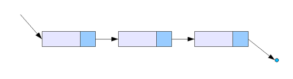
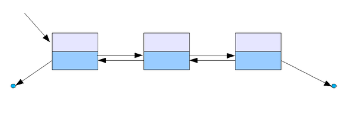

# Linked list

- 연속적인 메모리 위치에 저장되지 않는 선형데이터 구조
- 포인터를 사용해서 연결된다.
- 각 노드는 **Data field**와 **다음 노드에 대한 참조**를 포함하는 노드로 구성

**장점**

- 크기가 고정된 배열과 달리 동적인 크기를 가진다
- 삽입 및 삭제가 용이하다
- 빈 공간이 없다.

**단점**

- 임의로 액세스를 허용할 수 없다. 배열의 인덱스 접근 방식과 다르게 첫 번째 노드부터 순차적으로 액세스 해야한다.
- 포인터의 여분의 메모리 공간이 목록의 각 요소에 필요하다.

### 종류

- **단일 연결리스트**
  가장 기본적인 연결리스트의 구조이다.

- **이중 연결 리스트**
  포인터가 앞뒤 노드를 모두 가르킨다.
  역순으로 접근하기 용이하다.

- **원형 연결리스트**
  처음과 마지막 노드를 연결해서 순회할 수 있다. \*\*\*\*

