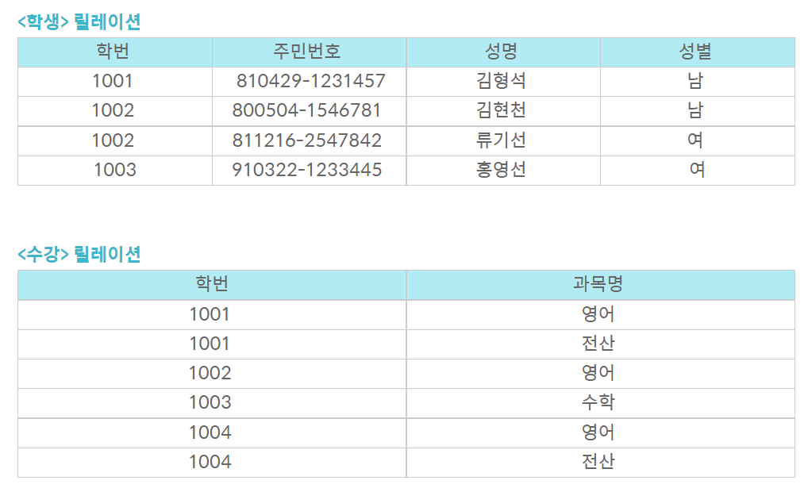

# 키(Key)

키(Key)는 데이터베이스에서 조건에 만족하는 튜플을 찾거나 순서대로 정렬할 때 다른 튜플들과 구별할 수 있는 유일한 기준이 되는 Attribute(속성)입니다.

> 유일성

- 하나의 키 값으로 하나의 튜플만을 유일하게 식별할 수 있어야 함

> 최소성

- 키를 구성하는 속성 하나를 제거하면 유일하게 식별할 수 없도록 꼭 필요한 최소의 속성으로 구성되어야 함

**1. 후보키 (Candidate Key)**

- 릴레이션을 구성하는 속성들 중에서 튜플을 **유일하게 식별할 수 있는 속성들의 부분집합을 의미**합니다.
- **모든 릴레이션은 반드시 하나 이상의 후보키를 가져야**합니다.
- 릴레이션에 있는 모든 튜플에 대해서 **유일성과 최소성을 만족**시켜야합니다.
- 슈퍼키 중에서 유일성과 최소성을 만족시키는 것.

**2. 기본키 (Primary Key)**

- 후보키 중에서 선택한 주키(Main Key)
- 한 릴레이션에서 **특정 튜플을 유일하게 구별할 수 있는 속성**
- **Null 값을 가질 수 없습니다**. (개체 무결성의 첫번째 조건)
- 기본키로 정의된 속성에는 **동일한 값이 중복되어 저장될 수 없습니다.**(개체 무결성의 두번째 조건)

ex) <학생> 릴레이션에는 '학번'이나 '주민번호'가 기본키가 될 수 있고, <수강> 릴레이션에는 '학번'+'과목명'으로 조합해야 기본키가 만들어 질 수 있습니다. 왜냐면 <수강> 릴레이션에서는 '학번' 속성과 '과목명' 속성은 개별적으로 기본키로 사용할 수 없습니다. 다른 튜플들과 구별되지 않기 때문이지요..

ex) <학생> 릴레이션에서 '학번'을 기본키로 정의되면 이미 입력된 '1001'은 다른 튜플의 '학번' 속성 값으로 입력할 수 없습니다.

**3. 대체키 (Alternate Key)**

- **후보키가 둘 이상일 때 기본키를 제외한 나머지 후보키들을 말합니다.**
- 보조키라고도 합니다.

ex) <학생> 릴레이션에서 '학번'을 기본키로 정의하면 '주민번호'는 대체키가 됩니다.

<수강> 릴레이션에서는 대체키가 존재하지 않는 것인가?

**4. 슈퍼키 (Super Key)**

- **슈퍼키는 한 릴레이션 내에 있는 속성들의 집합으로 구성된 키**로서 릴레이션을 구성하는 모든 튜플 중 슈퍼키로 구성된 속성의 집합과 동일한 값은 나타내지 않습니다.
- 릴레이션을 구성하는 모든 튜플에 대해 **유일성은 만족하지만, 최소성은 만족시키지 못합니다.**

ex) <학생> 릴레이션에서는 '학번', '주민번호', '학번'+'주민번호', '학번'+'주민번호'+'성명' 등으로 슈퍼키를 구성할 수 있습니다. 또한 여기서 최소성을 만족시키지 못한다는 말은 '학번'+'주민번호'+'성명' 가 슈퍼기인 경우 3개의 속성 조합을 통해 다른 튜플과 구별이 가능하지만, '성명' 단독적으로 슈퍼키를 사용했을 때는 구별이 가능하지 않기 때문에 최소성을 만족시키지 못합니다. 즉 뭉쳤을 경우 유일성이 생기고, 흩어지면 몇몇 속성들은 독단적으로 유일성있는 키로 사용할 수 없습니다. 이것을 최소성을 만족하지 못한다고 합니다.

**5. 외래키 (Foreign Key)**

- 관계(Relation)를 맺고 있는 릴레이션 R1, R2에서 릴레이션 R1이 참조하고 있는 릴레이션 R2의 기본키와 같은 R1 릴레이션의 속성
- 외래키는 **참조되는 릴레이션의 기본키와 대응되어 릴레이션 간에 참조 관계를 표현하는데 중요한 도구**로 사용됩니다.
- **외래키로 지정되면 참조 테이블의 기본키에 없는 값은 입력할 수 없습니다.** (참조 무결성 조건)

ex) <수강> 릴레이션이 <학생> 릴레이션을 참조하고 있으므로 <학생> 릴레이션의 '학번'은 기본키이고, <수강> 릴레이션의 '학번'은 외래키입니다.

즉 각 릴레이션의 입장에서 속성은 기본키가 되기도하고, 외래키가 되기도 합니다.

ex) <수강> 릴레이션의 '학번'에는 <학생> 릴레이션의 '학번'에 없는 값은 입력할 수 없습니다.
