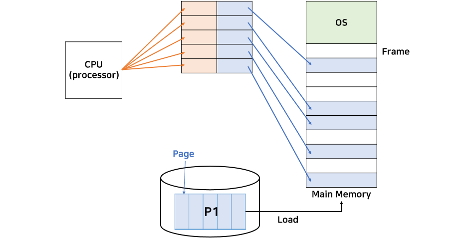

# 페이징 & 세그먼테이션

## 페이징(Paging)

- 프로세스를 일정한 작은 크기(물리적인 페이지 크기)로 나눠서 메인 메모리에 비어있는 공간에 할당한다.
- 실제 메모리는 연속적이지 않지만 페이지 테이블(page table)을 이용해 CPU에게 연속적인 주솟값의 명령을 내려서 연속적인 메모리로 인식시킨다.

**페이지 테이블 할당법**

CPU는 논리 주소로 프로그램이 설정한대로 연속적인 주소값으로 명령을 내리고

이는 메모리로 가기전에 각 페이지의 실제 메모리 주소가 저장되어 있는 테이블에서 물리 주소로 변경되어야 한다.

### 단점

- 프로세스 크기가 페이지 크기의 배수가 아닐 경우 마지막 페이지는 모든 프레임을 다 채울 수 없다.

ex) 13bytes의 프로세스가 있을때, 페이지 크기를 4로 나누면 4, 4, 4, 1 총 4개의 페이지가 만들어지는데 이때 마지막 1byte 페이지는 프레임 크기보다 3bytes 작으므로, 그만큼의 메모리 공간이 비게되는 **내부단편화** 문제가 발생한다.

## 세그멘테이션(Segmentation)

- 프로세스를 물리적인 페이지 크기로 나누는 것이 아닌,
  논리적 내용 단위인 세그먼트(Segment)로 나눈다.
  → 일반적으로 세그먼트의 크기는 제각각이다.
- 세그멘테이션 기법은 보호와 공유면에서 페이징과 비교해서 서로 다른 code영역이 섞이지 않기 때문에 보호와 공유가 더 용이하다.

**세그먼트 페이지 할당법**

세그먼트 페이지는 Base와 limit으로 구성된다

페이징과 다른점으론 논리적 내용단위로 프로세스를 나누기 때문에 limit값을 설정한다.

- 논리주소 (2, 100) => 물리주소 4400번지
- 논리주소 (1, 500) => 인터럽트로 인해 프로세스 강제 종료(범위를 벗어남)

### 단점

세그먼테이션은 논리적인 단위로 나누기 때문에 세그먼트의 크기가 다양하다.

이로 인해 다양한 크기의 hole이 발생하므로 **외부단편화** 문제가 발생한다.

### 페이징과 세그멘테이션의 장점을 융합 : Paged segmentation

- 세그먼테이션은 보호와 공유에서 효율적이고, 페이징은 외부 단편화 문제를 해결할 수 있다.
  그러므로 두 가지를 합쳐서 사용하는 방법

But, 세그먼트 테이블과 페이지 테이블 두 곳 모두에서 주소변환을 해야하는 단점이 있다.
