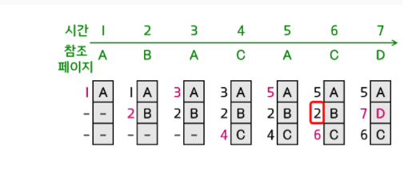
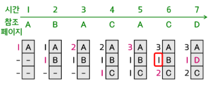

# 페이지 교체 알고리즘

모든 페이지가 사용중일때, 새로 들어올 페이지를 어디에 할당할지 결정해야한다.

이에 여러가지 페이지 교체 알고리즘이 존재한다.

1.  FIFO
    가장 먼저 올라온, 가장 오래된 페이지를 교체하는 방식이다.
    페이지가 올라온 시간이나 순서를 큐에 저장하는 방식으로 이용한다.
    **단점 :** 오래됬다는 이유만으로 반복적으로 자주 사용되는 페이지가 교체될 수 있다.

2.  LRU(Least Recently Used)
    가장 오랫동안 사용되지 않은 페이지를 교체.
    참조시간을 기록하거나 이를 기록할 리스트를 따로 구현한다.
    **단점 :** 경험적 판단이 맞지않는 상황도 존재, 막대한 오버헤드 발생

    

3.  LFU(Least Frequently Used)
    참조된 횟수가 가장 적은 페이지를 교체
    LRU방식과 비슷하게 참조횟수나 이를 기록할 리스트를 따로 구현한다.
    **단점:** 가장 최근에 메모리에 옮겨진 페이지가 교체될 가능성이 높다.
    초기에 많이 사용되고 더 이상 사용되지 않는 페이지를 처리할 수 없다, 막대한 오버헤드 발생

    

4.  MFU(Most Frequently Used)
    LFU와 반대로 참조 횟수가 가장 많은 페이지를 교체한다.
    참조 횟수가 적을 수록 최근에 사용했기에 앞으로 사용될 가능성이 높다는 확률적 판단에 근거함

5.  NRU(Not Recently Used)
    최근에 사용하지 않은 페이지를 교체
    LRU 방식의 단점인 막대한 오버헤드를 극복할 수 있다.

6.  Optimal
    앞으로 가장 오랫동안 사용되지 않을 페이지를 교체한다.
    **한계 :** 앞으로 사용할 페이지를 미리 알아야 하기 때문에 실전에선 알 방법이 없어 현실적인 구현이 힘들다.
