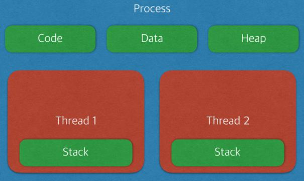

# 프로세스 vs 스레드

프로그램(Program) 이란?

→ 어떤 작업을 위해 실행할 수 있는 파일

## 프로세스(Process)

- **프로그램을 메모리 상에서 실행중인 작업 (독립적인 개체)**
- OS 로부터 시스템 자원을 할당받는 작업의 **단위**

[특징]

- 프로세스는 각각 독립된 메모리 영역 **(Code, Data, Stack, Heap의 구조)**을 할당받는다.
- 프로세스는 최소 1개의 스레드(Main thread)를 가지고 있다.
- 각 프로세스는 별도의 주소 공간에서 실행되며, 한 프로세스는 다른 프로세스의 변수나 자료구조에 접근 불가
- 다른 프로세스의 자원에 접근하려면 프로세스 간의 통신 (IPC, Inter-process communication)을 사용해야한다.

## 스레드(Thread)

- **프로세스 안에서 실행되는 여러 흐름의 단위**
- 프로세스의 특정한 수행 경로
- 프로세스가 할당받은 자원을 이용하는 실행의 단위

[특징]

- 스레드는 프로세스 내에서 각각 **Stack**만 따로 **할당**받고
  **Code, Data, Heap영역**은 **공유**한다.
- 스레드는 한 프로세스 내에서 주소 공간이나 자원들을 같은 스레드끼리 공유하면서 실행
- 같은 프로세스 내에서 여러 스레드들은 같은 힙 공간을 공유. (프로세스간 메모리 접근이 불가능 한것과 차이점을 가진다)
- 스레드마다 별도의 레지스터와 스택을 갖고 있지만, 힙 메모리는 서로 읽고 쓸 수 있다.

### 프로세스는 자신만의 고유 공간과 자원을 할당받아 사용하는데 반해,

스레드는 다른 스레드와 공간, 자원을 공유하면서 사용하는 차이가 존재함

## 멀티 프로세스 VS 멀티 스레드

### 멀티 프로세스

- 하나의 컴퓨터에 여러 CPU를 장착하여 하나 이상의 프로세스들을 동시에 병렬 처리한다.

장점

- 안정성 (메모리 침범 문제를 OS 차원에서 해결)

단점

- 각각 독립된 메모리 영역을 갖고 있어, 작업량이 많을 수록 오버헤드가 발생.
- **Context Switching으로 인한 성능 저하**

\*Context Switching : 프로세스의 상태 정보를 저장하고 복원하는 일련의 과정 = 동작 중인 프로세스의 상태를 보관 → 다음 순번 프로세스의 이전 저장상태에서부터 동작을 반복하는 과정

단점: 캐쉬 메모리 초기화 등 많은 시간이 소모되는 등 오버헤드 발생

## 멀티 스레드

- 하나의 응용 프로그램에서 여러 스레드를 구성해 각 스레드가 하나의 작업을 처리하는것

장점

- 독립적인 프로세스에 비해 공유 메모리만큼의 시간, 자원 손실이 감소한다.
- 전역 변수와 정적 변수에 대한 자료 공유 가능
- 스레드간 작업량이 작아 빠른 Context switching이 가능하다. (Stack 영역만 처리하기 때문)

단점

- 안정성 문제가 발생. 하나의 스레드가 데이터 공간에서 문제를 일으키면 다른 모든 스레드들이 작동이 불가능하다 (공유 메모리로 인한 문제)
- 단일 프로세스 시스템의 경우 효과 미비
- 멀티스레드의 안정성에 대한 단점은 **Critical Section** 기법을 통해 대비한다.

\*Critical Section : 하나의 스레드가 공유 데이터 값을 변경하는 시점에 다른 스레드가 그 값을 읽으려 할 때 발생하는 문제를 해결하기 위한 동기화 과정

### 일반적으로 멀티 프로세스보다 멀티 스레드 방식을 선호한다.

Critical Section 기법을 이용하여 동기화 문제를 해결할 경우라는 전제하에!
