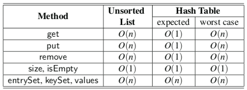

# Hash

## **해싱이란? (Hashing)**

- 해싱이란 임의의 길이의 값을 **해시함수(Hash Function)**를 사용하여 고정된 크기의 값으로 변환하는 작업을 말한다.

- 위 그림에서 `dog` 라는 문자열을 해시함수를 이용해 새로운 값으로 변환한 것을 볼 수 있는데 이 경우엔 암호화에 쓰이는 해시 알고리즘인 MD5를 사용한 것이다.
- 하지만 여기서 다룰 것은 암호화에 쓰인 방식이 아닌 자료구조로 사용하고자 하는 해시 테이블을 다루기 때문에 정수값으로 변환되는 해시 알고리즘을 사용한다.
- 해싱을 사용하여 데이터를 저장하는 자료구조를 **해시 테이블(Hash Table)**이라고 하며 이는 기존 자료구조인 이진탐색트리나 배열에 비해서 굉장히 빠른 속도로 탐색, 삽입, 삭제를 할 수 있다

## 해시 테이블(Hash Table)

- 해시 테이블은 연관배열 구조를 이용하여 키(key)에 결과 값(value)을 저장하는 자료구조이다.
- 연관배열 구조(associative array)란,
    - 키(key) 1개와 값(value) 1개가 1:1로 연관되어 있는 자료구조이다. 따라서 키(key)를 이용하여 값(value)을 도출할 수 있다.
- **연관배열 구조는 다음의 명령을 지원**
    - 키(key)와 값(value)이 주어졌을 때, 연관 배열에 그 두 값(key & value)을 저장하는 명령
    - 키(key)가 주어졌을 때, 연관되는 값(value)을 얻는 명령
    - 키(key)와 새로운 값(value)이 주어졌을 때, 원래 키에 연관된 값(value)을 새로운 값(value)으로 교체하는 명령
    - 키(key)가 주어졌을 때, 그 키(key)에 연관된 값(value)을 제거하는 명령
- 위의 명령은 해시테이블에서도 동일하게 적용이 된다.

