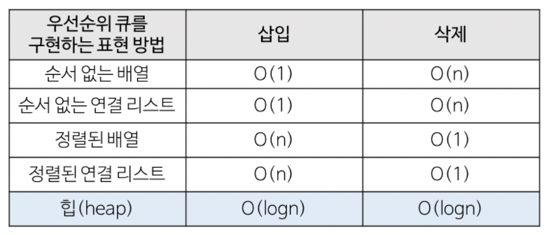
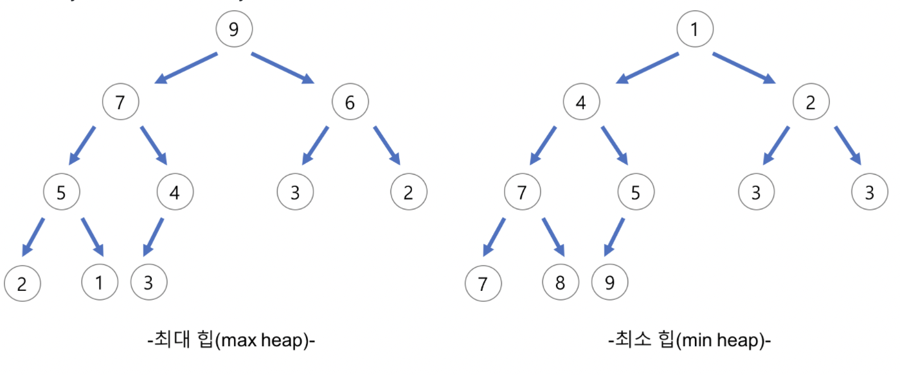
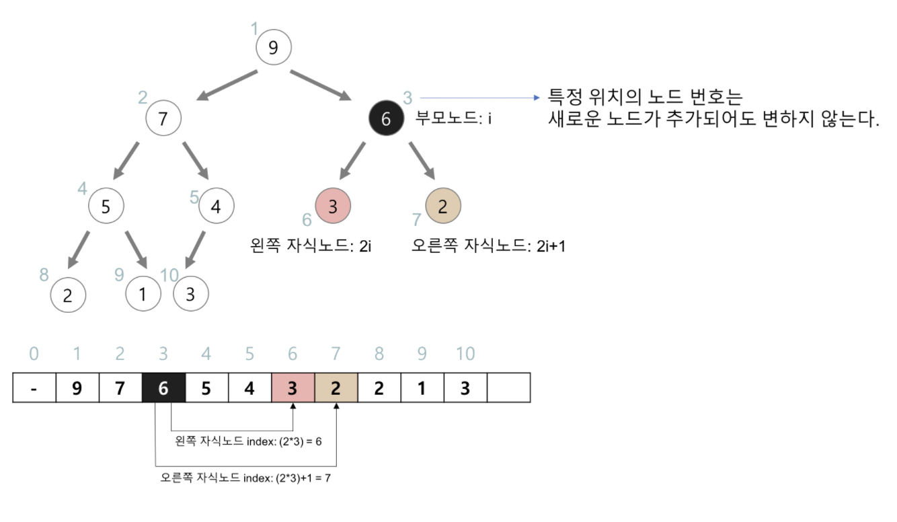

# Heap

### 한 문장 정리

- 힙은 특정한 규칙을 가지는 트리로, 최댓값과 최솟값을 찾는 연산을 빠르게 하기 위해 고안된 완전이진트리를 기본으로 한다.
- 완전 이진 트리의 일종으로 우선순위 큐를 위하여 만들어진 자료구조이다.

### 우선순위 큐

- 우선순위의 개념을 큐에 도입한 자료 구조
- 시뮬레이션 시스템
- 네트워크 트래픽 제어
- 운영 체제에서의 작업 스케쥴링
- 수치 해석적인 계산
- 배열, 연결리스트, 힙 으로 구현이 가능하다. 이 중에서 힙(heap)으로 구현하는 것이 가장 효율적이다.
- 힙 → 삽입 : O(logn) , 삭제 : O(logn)



### 힙

- 완전 이진 트리의 일종으로 우선순위 큐를 위하여 만들어진 자료구조이다.
- 여러 개의 값들 중에서 최댓값이나 최솟값을 빠르게 찾아내도록 만들어진 자료구조이다.
- 힙은 일종의 반정렬 상태(느슨한 정렬 상태) 를 유지한다.
    - 큰 값이 상위 레벨에 있고 작은 값이 하위 레벨에 있다는 정도
    - 간단히 말하면 부모 노드의 키 값이 자식 노드의 키 값보다 항상 큰(작은) 이진 트리를 말한다.
- 힙 트리에서는 중복된 값을 허용한다. (이진 탐색 트리에서는 중복된 값을 허용하지 않는다.)

### 힙(heap)의 종류

- 최대 힙(max heap)
    - 부모 노드의 키 값이 자식 노드의 키 값보다 크거나 같은 완전 이진 트리
    - key(부모 노드) >= key(자식 노드)
- 최소 힙(min heap)
    - 부모 노드의 키 값이 자식 노드의 키 값보다 작거나 같은 완전 이진 트리
    - key(부모 노드) <= key(자식 노드)



### 힙의 삽입 삭제

- 삽입
    1. 새로운 노드를 히프의 마지막에 노드에 삽입
    2. 힙의 성질(최소/최대힙)에 맞게 자리를 교환
- 삭제
    1. 루트 노드 삭제
    2. 가장 마지막 노드가 루트 노드로 이동
    3. 힙의 성질에 맞게 자리 교환  

### 힙의 구현

- 힙을 저장하는 표준적인 자료구조는 배열 이다.
- 구현을 쉽게 하기 위하여 배열의 첫 번째 인덱스인 0은 사용되지 않는다.
- 특정 위치의 노드 번호는 새로운 노드가 추가되어도 변하지 않는다.
    - 예를 들어 루트 노드의 오른쪽 노드의 번호는 항상 3이다.
- 힙에서의 부모 노드와 자식 노드의 관계
    - 왼쪽 자식의 인덱스 = (부모의 인덱스) * 2
    - 오른쪽 자식의 인덱스 = (부모의 인덱스) * 2 + 1
    - 부모의 인덱스 = (자식의 인덱스) / 2



### 파이썬 heapq 모듈

- 리스트를 min heap처럼 다룰 수 있게 해준다.

```python
    import heapq
    heap = []
    # 노드 추가
    heapq.heappush(heap, 1)

    # 노드 삭제 (root 노드 return)
    heapq.heappop(heap)

    # 기존 리스트를 힙으로 변환
    heapq.heapify(tmp)
```

- 최대힙

```python
heap_items = [1,3,5,7,9]
    max_heap = []

    for item in heap_items:
      heapq.heappush(max_heap, (-item, item))
    # 실제 원소값은 인덱싱 [1]로 접근 가능하다.
```

### 힙 구현 참고

- [https://gmlwjd9405.github.io/2018/05/10/data-structure-heap.html](https://gmlwjd9405.github.io/2018/05/10/data-structure-heap.html), 자바, c
- [https://velog.io/@seanlion/pythonmaxheap](https://velog.io/@seanlion/pythonmaxheap), python