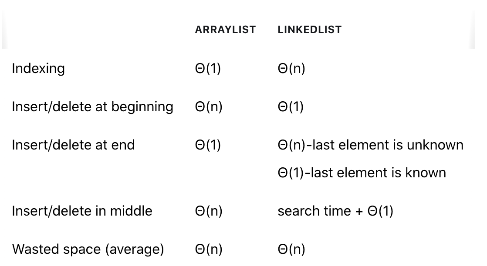

# Array&ArrayList&LinkedList

## 한문장 정의

- **Array**는 index로 빠르게 값을 찾는 것이 가능함
- **ArrayList**는 데이터를 찾는데 빠르지만, 삽입 및 삭제가 느림
- **LinkedList**는 데이터의 삽입 및 삭제가 빠름

## Array

### 특징

- **같은 타입**의 데이터를 나열한 **선형 자료구조 (sequence container)**
- **연속된 메모리 공간**에 **순차적**으로 저장, 논리적 저장 순서와 물리적 저장 순서가 일치
- 배열의 **크기는 고정**. 선언할 때에 배열의 크기를 정하고, 변경할 수 없다.
- 배열의 인덱스는 유일한 식별자, **random access** 가능

### 시간복잡도

- **삽입/삭제**
    - 배열의 맨 앞에 삽입/삭제하는 경우 : `O(n)`
    - 배열의 맨 뒤에 삽입/삭제하는 경우 : `O(1)`
    - 배열의 중간에 삽입/삭제하는 경우 : `O(n)`
- **탐색:** `O(1)`

- 장점
    - 인덱스를 이용한 접근성
- 단점
    - **삽입과 삭제가 어렵고 오래 걸린다.**
    - 배열의 **크기를 바꿀 수 없다**.
    - 연속된 메모리를 할당받아 **공간 낭비**가 발생할 수 있다.

## List

- 인덱스라는 장점을 버리고 대신 빈틈없는 데이터의 적재 라는 장점을 취한 데이터 스트럭쳐

      (즉 메모리 공간의 효율)

- 선형 자료구조, **순서**를 가진 항목들의 모임, 시퀀스라고도 한다.
- 중복된 데이터의 저장 허용
- ArrayList , LinkedList등 여러 인터페이스를 구현한 자료형이 있다
- 자바스크립트,파이썬 같은 경우에는 리스트를 따로 구현하지 않고 배열에 List의 기능 중 일부를 제공

### ArrayList

- 배열을 이용한 리스트
- **random access** 가능
- 장점: 빠른 데이터 조회
- 단점: 느린 삽입 삭제

### LinkedList

- element간 연결(link)을 통해서 리스트를 구현한 것
- 노드(node or vertex)가 사용됨
- head(첫번째 node)와 tail(마지막 node)
- 메모리 제한이 없다
- 자료의 순서를 유지한 채 삽입과 제거가 쉽다
- 장점: 삽입 삭제가 용이

- 단점: 탐색 시간이 많이 듬

### 시간복잡도

참고: python의 list는 dynamic array로 구현, high-level한 기능들이 존재

출처

[https://github.com/gyoogle/tech-interview-for-developer/blob/master/Computer Science/Data Structure/Array vs ArrayList vs LinkedList.md](https://github.com/gyoogle/tech-interview-for-developer/blob/master/Computer%20Science/Data%20Structure/Array%20vs%20ArrayList%20vs%20LinkedList.md)

[https://www.nextree.co.kr/p6506/](https://www.nextree.co.kr/p6506/)