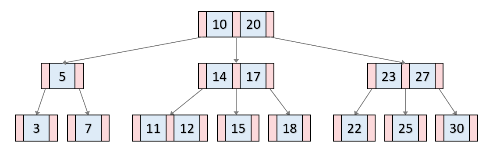

# B-트리, B+트리

### B-Tree

- 대용량 데이터를 위한 구조
- balanced tree
- B트리는 이진트리와 다르게 하나의 노드에 많은 수의 정보를 가지고 있을 수 있습니다. 노드내 최대 데이터 수가 2개라면 2차 B-Tree, 3개라면 3차 B-Tree 라고 말합니다. ‘1, 2, 3, … M차 B-Tree 라고 합니다.
    - 노드의 자료수가 N이면, 자식 수는 N+1이어야 함
    - 각 노드의 자료는 정렬된 상태여야함
    - 루트 노드는 적어도 2개 이상의 자식을 가져야함
    - 루트 노드를 제외한 모든 노드는 적어도 M/2개의 자료를 가지고 있어야함
    - 외부 노드로 가는 경로의 길이는 모두 같음.
    - 입력 자료는 중복 될 수 없음
- 삽입 삭제 조회
    - [https://velog.io/@emplam27/자료구조-그림으로-알아보는-B-Tree](https://velog.io/@emplam27/%EC%9E%90%EB%A3%8C%EA%B5%AC%EC%A1%B0-%EA%B7%B8%EB%A6%BC%EC%9C%BC%EB%A1%9C-%EC%95%8C%EC%95%84%EB%B3%B4%EB%8A%94-B-Tree)

### **[B+ Tree]**

- 데이터의 빠른 접근을 위한 인덱스 역할만 하는 비단말 노드가 추가로 있다.
- 기존의 B-Tree와 데이터의 연결리스트로 구현된 색인구조.
- B-Tree의 변형 구조로 index 부분과 leaf 노드로 구성된 순차 데이터 부분으로 이루어진다. 인덱스 부분의 key 값은 leaf에 있는 key 값을 직접 찾아가는데 사용한다.

**장점**

- 블럭 사이즈를 더 많이 이용할 수 있다. (Key 값에 대한 하드디스크 액세스 주소가 없기 때문)
- Leaf 노드끼리 연결 리스트로 연결되어 있어서 범위 탐색에 매우 유리하다.

**단점**

- B-Tree의 경우 최상 케이스에서는 루트에서 끝날 수 있지만, B+Tree는 무조건 leaf 노드까지 내려가봐야 한다.

삽입 삭제

- [https://velog.io/@emplam27/자료구조-그림으로-알아보는-B-Plus-Tree](https://velog.io/@emplam27/%EC%9E%90%EB%A3%8C%EA%B5%AC%EC%A1%B0-%EA%B7%B8%EB%A6%BC%EC%9C%BC%EB%A1%9C-%EC%95%8C%EC%95%84%EB%B3%B4%EB%8A%94-B-Plus-Tree)

### **[비교]**

- B-Tree : 각 노드에 데이터가 저장된다.
    - 각 노드에서 key와 data 모두 들어갈 수 있고, data는 disk block으로 포인터가 될 수 있다.
- B+ Tree : index 노드와 leaf 노드로 분리되어 저장된다.
    - 각 노드에서 key만 들어간다. 따라서 data는 leaf 노드에만 존재한다.
    - add, delete 연산 모두 leaf 노드에서만 이루어진다.
- 또한, leaf 노드는 서로 연결되어 있어서 임의 접근이나 순차 접근 모두 성능이 우수하다.