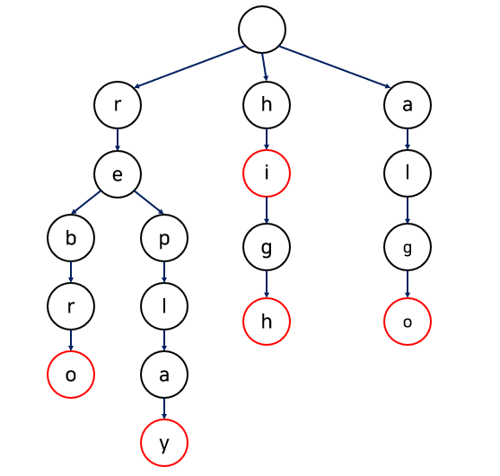
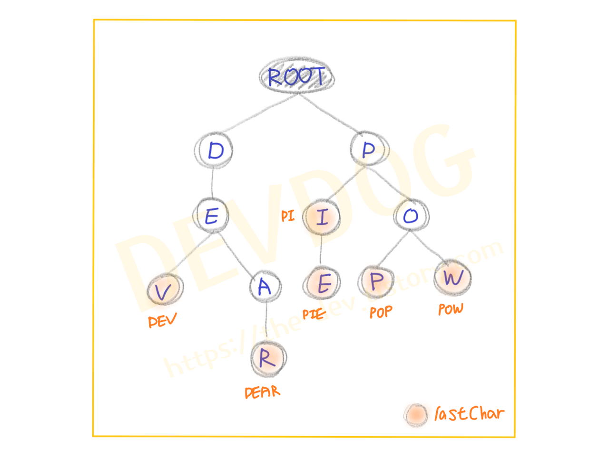
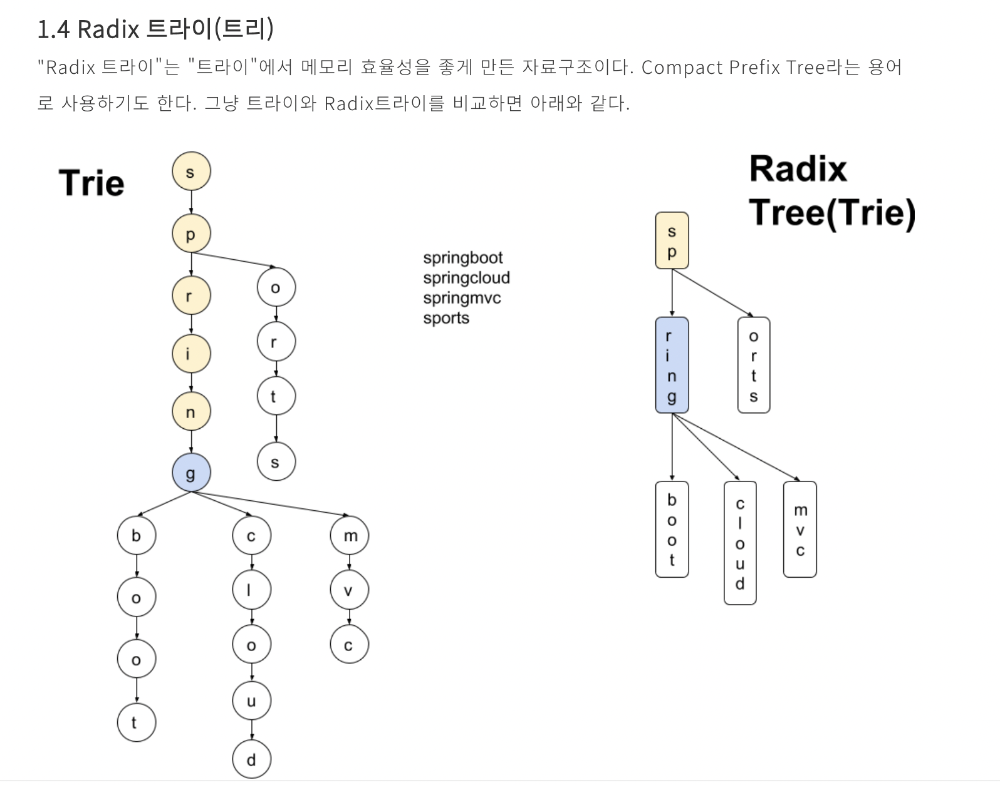

# 트라이

## **Trie(트라이)**

### **Trie 자료구조란?**

- 일반 트리 자료구조 중 하나로, Digital Tree, Radix Tree, Prefix Tree라고도 불린다.
- 텍스트 자동 완성 기능과 같이 문자열을 저장하고 탐색하는데 유용한 자료구조이다.

### **Trie 자료구조의 형태는?**

- 방법

    **1. 주어진 문자열에서 현재 문자를 가져온다.**

    **2. 현재 문자로 이루어진 노드가 존재한다면, 그 노드로 그 다음 문자열을 탐색하고, 노드가 없다면 그 노드를**

    **새로 할당 받은 후, 해당 노드를 통해 다음 문자열을 탐색한다.**

    **3. 문자열의 마지막이 될 때까지 위의 과정을 반복한다.**





### insert

- 입력받은 단어의 각 알파벳을 계층구조의 자식노드로 만들어 넣습니다.
- 이 때, 이미 같은 알파벳이 존재하면 공통 접두어 부분까지는 생성하지 않습니다.
- 즉, 해당 계층 문자의 자식노드가 존재하지 않을 때에만 자식 노드를 생성해줍니다

### contains

- 특정 단어가 Trie에 존재하는지를 확인하기 위해서는 다음 두 가지 조건을 만족시켜야 합니다.
    1. 루트노드부터 순서대로 알파벳이 일치하는 자식노드들이 존재 할 것
    2. 해당 단어의 마지막 글자에 해당하는 노드의 isLastChar가 true일 것(해당 글자를 마지막으로 하는 단어가 있다는 뜻)

### delete

- 마지막으로 Trie에 넣었던 단어를 삭제하는 과정입니다.
- contains 메서드처럼 주어진 단어를 찾아 하위 노드로 단어 길이만큼 내려갑니다.
- 주의할 점은 노드들이 부모노드의 정보를 가지고 있지 않기 때문에, 하위 노드로 내려가며 삭제 대상 단어를 탐색하고 다시 올라오며 삭제하는 과정이 콜백(callback) 형식으로 구현되어야 한다는 점입니다.
    - **탐색 진행방향** : 부모 노드 → 자식 노드
    - **삭제 진행방향** : 자식 노드 → 부모 노드
- 조건
    - 자식 노드를 가지고 있지 않아야 합니다.위 그림에서 'PI'를 지워버리면 'PIE'까지 삭제되어 버리기 때문입니다.
    - 삭제를 시작하는 첫 노드는 isLastChar==true여야 합니다.false인 경우는 Trie에 없는 단어란 뜻이기 때문입니다.예를 들어, 위 그림에서 'PO'이라는 글자를 지우라고 명령을 내려도 Trie가 가지고 있지 않는 단어라는 점입니다.
    - 삭제를 진행하던 중에는 isLastChar==false여야 합니다.삭제 과정 중에서 isLastChar가 true라는 것은 또다른 단어가 있다는 의미이므로 삭제 대상이 아닙니다.'PIE'를 삭제 대상으로 했을 때, '-E'를 삭제후 'PI'라는 단어의 'I'가 isLastChar==true이므로 또다른 단어가 있음을 알려줍니다.

### 자바 코드

```java
public class TrieNode { 
	// [ 변수 ] 
	// 자식 노드 맵 
	private Map<Character, TrieNode> childNodes = new HashMap<>(); 
	// 마지막 글자인지 여부 
	private boolean isLastChar; 
	
	// [ GETTER / SETTER 메서드 ] 
	// 자식 노드 맵 
	Getter Map<Character, TrieNode> getChildNodes() { 
			return this.childNodes; 
	} 
	// 마지막 글자인지 여부 
	Getter boolean isLastChar() { 
			return this.isLastChar; 
	} 
	// 마지막 글자인지 여부 
	Setter void setIsLastChar(boolean isLastChar) { 
			this.isLastChar = isLastChar; 
	} 
}

```

- 메서드
    - [https://the-dev.tistory.com/3](https://the-dev.tistory.com/3)

참고


