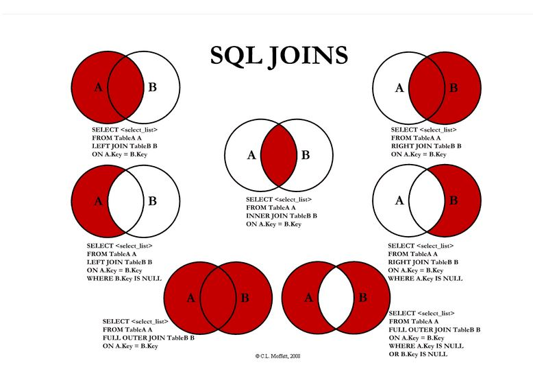

# SQL-JOIN

### 한문장 정리

- 두 개 이상의 테이블들을 연결 또는 결합하여 데이터를 나타내는 것

### 조인이란

- 한 데이터베이스 내의 여러 테이블의 레코드를 조합하여 하나의 열로 표현한 것이다.
- 테이블을 연결하려면, 적어도 하나의 칼럼을 서로 공유하고 있어야 하므로 이를 이용하여 데이터 검색에 활용한다.
- 따라서 조인은 테이블로서 저장되거나, 그 자체로 이용할 수 있는 결과 셋을 만들어 낸다

### 조인의 필요성

- 관계형 데이터베이스의 구조적 특징으로 정규화를 수행하면 의미 있는 데이터의 집합으로 테이블이 구성되고, 각 테이블끼리는 관계(Relationship)를 갖게 된다.
- 이와 같은 특징으로 관계형 데이터베이스는 저장 공간의 효율성과 확장성이 향상되게 된다.
- 다른 한편으로는 서로 관계있는 데이터가 여러 테이블로 나뉘어 저장되므로, 각 테이블에 저장된 데이터를 효과적으로 검색하기 위해 조인이 필요하다.

### 조인의 종류



### INNER JOIN

- 교집합으로, 기준 테이블과 join 테이블의 중복된 값을 보여준다.

```sql
SELECT A.NAME, B.AGE
FROM EX_TABLE A
INNER JOIN JOIN_TABLE B ON A.NO_EMP = B.NO_EMP
```

### left outer join

- 기준테이블값과 조인테이블과 중복된 값을 보여준다. 왼쪽테이블 기준으로 JOIN을 한다고 생각하면 편하다.

```sql
SELECT A.NAME, B.AGE
FROM EX_TABLE A
LEFT OUTER JOIN JOIN_TABLE B ON A.NO_EMP = B.NO_EMP
```

### right outer join

- LEFT OUTER JOIN과는 반대로 오른쪽 테이블 기준으로 JOIN하는 것이다.

```sql
SELECT A.NAME, B.AGE
FROM EX_TABLE A
RIGHT OUTER JOIN JOIN_TABLE B ON A.NO_EMP = B.NO_EMP
```

### full outer join

- 합집합을 말한다. A와 B 테이블의 모든 데이터가 검색된다.

```sql
SELECT A.NAME, B.AGE
FROM EX_TABLE A
FULL OUTER JOIN JOIN_TABLE B ON A.NO_EMP = B.NO_EMP
```

### cross join

- 모든 경우의 수를 전부 표현해주는 방식이다. 로우 수 = table1 row * table2 row
- cartesian product

```sql
SELECT A.NAME, B.AGE
FROM EX_TABLE A
CROSS JOIN JOIN_TABLE B
-----------------------------
SELECT A.NAME, B.AGE
FROM EX_TABLE A, JOIN_TABLE B
```

### self join

- 자기자신과 자기자신을 조인하는 것이다.
- 하나의 테이블을 여러번 복사해서 조인한다고 생각하면 편하다.
- 자신이 갖고 있는 칼럼을 다양하게 변형시켜 활용할 때 자주 사용한다.

```sql
SELECT A.NAME, B.AGE
FROM EX_TABLE A, EX_TABLE B
```