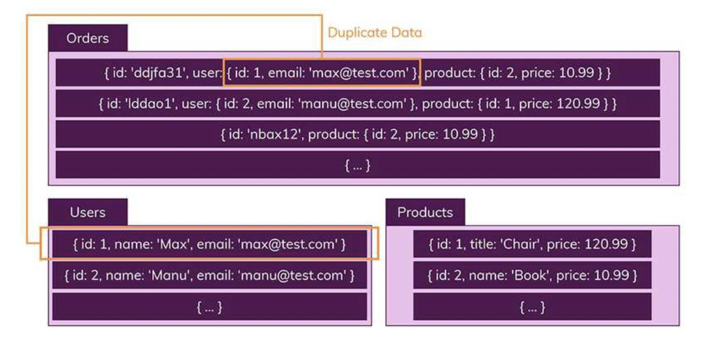
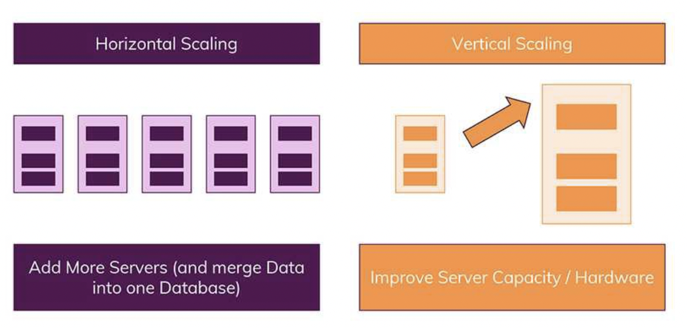

# SQL vs NoSQL

### SQL 데이터베이스

- SQL
    - 구조화 된 쿼리 언어 (Structured Query Language)
    - RDBMS의 데이터를 관리하기 위해 설계된 프로그래밍 언어
- SQL을 사용하면 관계형 데이터베이스 관리 시스템(RDBMS)에서 데이터를 저장, 수정, 삭제 및 검색 가능
- 두가지 특징
    - 데이터는 엄격한 데이터 스키마(structure)에 따라 데이터베이스 테이블에 저장
    - 관계를 통해서 연결된 여러 테이블에 분산됩니다.

### NoSQL 데이터베이스

- 관계형 데이터 모델을 지양 하며 대량의 분산된 데이터를 저장하고 조회하는 데 특화되었으며 스키마 없이 사용 가능하거나 느슨한 스키마를 제공하는 저장소를 말한다.
    - 스키마 없음
    - 관계 없음
- 테이블을 컬렉션, 레코드를 문서
- 다른 구조의 데이터를 같은 컬렉션에 추가가 가능하다.

### 조인하고 싶을 때 NoSQL은 어떻게 할까?

- 수동으로 외래키를 검색하여 사용할 수 있지만 일반적이지 않다
- 컬렉션마다 데이터를 복제하여 각 컬렉션 일부분에 속하는 데이터를 생성
- 하지만 이러면 데이터가 중복되어 서로 영향을 줄 위험이 있다. 따라서 조인을 잘 사용하지 않고 자주 변경되지 않는 데이터일 때 NoSQL을 쓰면 상당히 효율적

### **수직 및 수평 스케일링**

- 두 데이터베이스를 비교할 때 살펴 봐야할 또 하나의 중요한 개념은 스케일링(Scaling: 확장)입니다
- **수직 확장:** 이란 단순히 데이터베이스 서버의 성능을 향상시키는 것입니다. (예를 들어, CPU를 업그레이드)
- **수평 확장:** 더 많은 서버가 추가되고 데이터베이스가 전체적으로 분산됨을 의미합니다. 따라서 하나의 데이터베이스에서 작동하지만 여러 호스트에서 작동합니다.

### SQL의 장단점

- 장점
    - 명확하게 정의 된 스키마, 데이터 무결성 보장
    - 관계를 통해 각 데이터를 중복없이 한 번만 저장
- **단점**
    - 상대적으로 덜 유연하며, 데이터 스키마는 미리 알고 계획해야 한다.
    - JOIN문이 많은 매우 복잡한 쿼리가 만들어 질 수 있다.
    - 수평 확장이 어렵고, 보통 수직 확장만 가능하다. 즉 어느 시점에서 처리량/처리 능력과 관련하여 약간의 성장 한계에 직면하게 될 수 있다.

### **NoSQL의 장단점**

- 장점
    - 스키마가 없기때문에, 유연성이 높다. 즉, 저장된 데이터를 언제든지 조정하고 새로운 "필드"를 추가 가능
    - 데이터는 애플리케이션에 필요한 형식으로 저장되므로 데이터를 가져오는 속도가 빠르다
    - 수직 및 수평 확장이 가능하므로 데이터베이스가 애플리케이션에서 발생시키는 모든 읽기 / 쓰기 요청을 처리 가능
- 단점
    - 유연성 때문에, 데이터 구조 결정을 늦어질 수 있다. (바로 계획, 결정해야하는 것이 아니기 때문에)
    - 복사된 데이터가 변경되면 여러 콜렉션과 문서를 수정해야 한다.

### 언제 SQL이 가장 좋을까?

- 앱의 여러 부분에서 관련 데이터가 비교적 자주 변경되는 경우 (NoSQL이라면 항상 여러 컬렉션을 수정해야 함)
- 명확한 스키마가 중요하며, 데이터구조가 극적으로 변경되지 않을 때

### NoSQL은 언제 가장 좋을까?

- 정확한 데이터 요구사항을 알 수 없거나 관계를 맺고 있는 데이터가 자주 변경(수정)되는 경우
- 읽기(read)처리를 자주하지만, 데이터를 자주 변경하지 않는 경우 (즉, 한번의 변경으로 수십 개의 문서를 수정 할 필요가 없는 경우)
- 데이터베이스를 수평으로 확장해야 하는 경우 ( 즉, 막대한 양의 데이터를 다뤄야 하는 경우, 읽기/쓰기 처리량이 큰 경우)