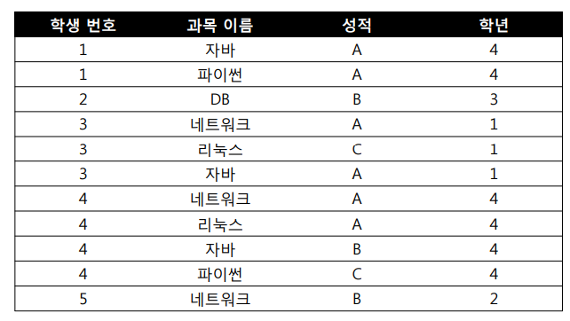

# 이상

### 이상이란

- 이상 현상이란? 테이블내의 데이터 중복성에 의해서 발생되는 데이터 불일치 현상이다.
- 관계형 데이터베이스에서 정규화가 필요한 배경이유

### 이상의 종류

- 삽입 이상(insertion anomalies)
    - 원하지 않는 자료가 삽입된다든지, 삽입하는데 자료가 부족해 삽입이 되지 않아 발생하는 문제점을 말한다.
- 삭제 이상(deletion anomalies)
    - 하나의 자료만 삭제하고 싶지만, 그 자료가 포함된 튜플 전체가 삭제됨으로 원하지 않는 정보 손실이 발생하는 문제점을 말한다.
- 수정(갱신)이상(modification anomalies)
    - 정확하지 않거나 일부의 튜플만 갱신되어 정보가 모호해지거나 일관성이 없어져 정확한 정보 파악이 되지 않는 문제점을 말한다.

### 예시

- 삽입 이상 : 신입 학생이 입학하여 학번과 학년 등을 입력하려 했으나 아직 과목이 정해지지 않았거나, 시험을 보지 않아 성적이 없는 상태이기 때문에 불필요한 정보(과목 이름, 성적)를 함께 삽입 해야 함
- 삭제 이상 : 학생 번호가 2번인 학생의 과목에 대한 성적을 삭제할 경우 학생 번호와 학년 등 모든 정보가 같이 삭제되어 학생의 정보 자체가 사라짐
- 갱신 이상 : 학생 번호가 3번인 학생이 2학년이 되어 학년 정보를 변경 하려 하는데 3개를 모두 하나씩 바꿔줘야 함, 하나라도 안바꿀 경우 한명의 학생에 대한 정보가 서로 달라지는 정보의 모순성이 발생

