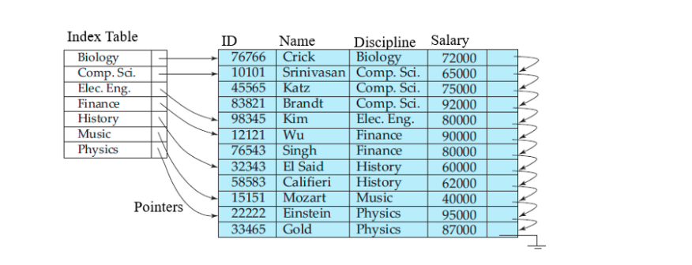
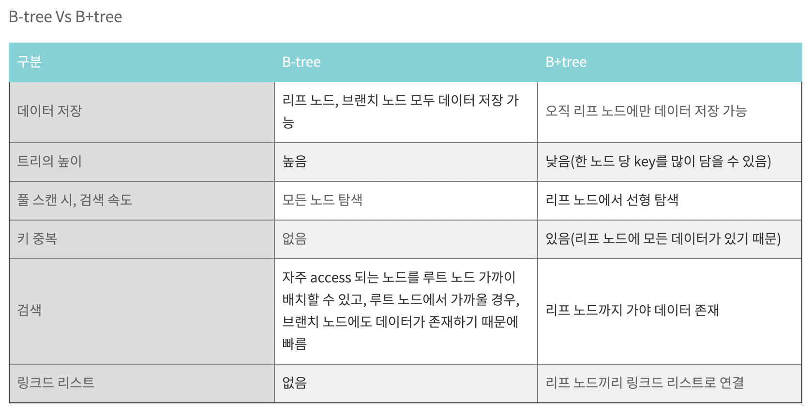

# 인덱스

### **인덱스(Index)란 무엇인가?**

- 인덱스는 테이블의 조회 동작 속도를 높여주는 자료 구조입니다.
    - 인덱스로 데이터의 위치를 빠르게 찾아주는 역할을 합니다.
- 인덱스는 말 그대로 책의 맨 처음 또는 맨 마지막에 있는 색인(목차)이라고 할 수 있다.
    - DBMS 의 인덱스는 항상 정렬된 상태를 유지하기 때문에 원하는 값을 탐색하는데는 빠르지만
    - 새로운 값을 추가하거나 삭제, 수정하는 경우에는 쿼리문 실행 속도가 느려진다.
    - 결론적으로 DBMS 에서 인덱스는 데이터의 저장 성능을 희생하고 그 대신 데이터의 읽기 속도를 높이는 기능이다.
    - 하지만 SELECT 쿼리 문장의 WHERE 조건절에 사용되는 칼럼이라고 전부 인덱스로 생성하면 데이터 저장 성능이 떨어지고 인덱스의 크기가 비대해져서 오히려 역효과만 불러올 수 있다.

### **INDEX 장점**

- 키 값을 기초로 하여 테이블에서 검색과 정렬 속도를 향상시킨다.
- 인덱스를 사용하면 테이블 행의 고유성을 강화시킬 수 있다.
- 테이블의 기본키는 자동으로 인덱스된다.
- 필드 중에는 데이터 형식 때문에 인덱스 될 수 없는 필드도 있다.
- 여러 필드로 이루어진(다중 필드)인덱스를 사용하면 첫 필드 값이 같은 레코드도 구분할 수 있다.

참고로 액세스에서 다중 필드 인덱스는 최대 10개의 필드를 포함할 수 있다.

### **INDEX 단점**

- 인덱스를 만들면 .mdb 파일 크기가 늘어난다.
- 사용자가 한 페이지를 동시에 수정할 수 있는 병행성이 줄어든다.
- 인덱스된 필드에서 데이터를 업데이트하거나 **레코드를 추가 또는 삭제할 때 성능이 떨어진다.**
- 인덱스가 데이터베이스 공간을 차지재 추가적인 공간이 필요해진다.(DB의 10% 내외의 공간이 추가로 필요하다.)
- 인덱스를 생성하는데 시간이 많이 소요될 수 있다.
- **데이터 변경 작업이 자주 일어날 경우에 인덱스를 재작성해야 할 필요가 있기에 성능에 영향을 끼칠 수 있다.**

### **DML에 취약**

1. `INSERT`
    - **index split** : 인덱스의 Block들이 하나에서 두개로 나누어지는 현상.
    - 인덱스는 데이터가 순서대로 정렬되어야 한다. 기존 블록에 여유 공간이 없는 상황에서 그 블록에 새로운 데이터가 입력되어야 할 경우, 오라클이 기존 블록의 내용 중 일부를 새 블록에다가 기록한 후, 기존 블록에 빈 공간을 만들어서 새로운 데이터를 추가하게 된다.
    - 성능면에서 매우 불리하다.
        - Index split은 새로운 블록을 할당받고 Key를 옮기는 복잡한 작업을 수행한다. 모든 수행 과정이 Redo에 기록되고 많은 양의 Redo를 유발한다.
        - Index split이 이루어지는 동안 해당 블록에 대해 키 값이 변경되면 안되므로 DML이 블로킹된다.
2. DELETE
    - 테이블에서 데이터가 Delete될 경우, 지워지고 다른 데이터가 그 공간을 사용할 수 있다.
    - **index에서 데이터가 delete될 경우, 데이터가 지워지지 않고 사용 안됨 표시만 해둔다.**
    - 즉, 테이블에 데이터가 1만건 있는 경우, 인덱스에는 2만건이 있을 수 있다는 뜻이다.
    - 인덱스를 사용해도 수행 속도를 기대하기 힘들다.
3. UPDATE
    - **인덱스에는 Update 개념이 없다.**
    - 테이블에 update가 발생할 경우, 인덱스에서는 delete가 먼저 발생한 후 새로운 작업의 insert 작업이 발생한다.

### 인덱스의 종류

1. B(Balanced)-tree Index
2. Bitmap Index
3. IOT Index
4. Clustered Index

### B-Tree

- 대용량 데이터를 위한 구조
- balanced tree
- 자식노드 두개만 가지는 이진 트리를 확장하여 더 많은 자식 노드를 갖게 함.
- 노드수가 N이면, 자식수는 N+1
- 각 노드의 자료는 **정렬된 상태**이며 왼쪽 서브트리는 부모보다 작은 값, 오른쪽 서브트리는 부모보다 큰값.
- 삽입시 중간의 키를 기준으로 두가지 노드로 나눠진다. 가운데 키를 부모로 올린다.
- 대량의 데이터는 메모리보다 하드디스크 혹은 SSD에 저장되어야 하는데 외부 기억 장치들은 블럭 단위로 입출력 한다.(1 블럭 1024바이트을 꽉 채우는게 효율적). 따라서 B-tree는 데이터베이스 시스템의 인덱스 저장 방법으로 애용된다.
- 같은 노드 공간의 데이터들을 참조 포인트로 접근할 필요가 없이 실제 메모리 디스크에서 바로 다음 인덱스를 빠르게 접근 가능하다.

**최악의 경우에도 O(logN)** => DB Index에서 사용하는 이유

결론적으로 DB 인덱스로 B-Tree가 가장 적합한 이유들을 정리하면 아래와 같다.

1. 항상 정렬된 상태로 특정 값보다 크고 작은 부등호 연산에 문제가 없다.
2. 참조 포인터가 적어 방대한 데이터 양에도 빠른 메모리 접근이 가능하다.
3. 데이터 탐색뿐 아니라, 저장, 수정, 삭제에도 항상 O(logN)의 시간 복잡도를 가진다.

