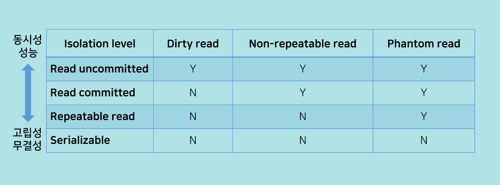

# 트랜잭션 격리 수준(Transaction Isolation Level)

### **Isolation level**

- 동시에 여러 트랜잭션이 처리될 때, 특정 트랜잭션이 다른 트랜잭션에서 변경하거나 조회하는 데이터를 볼 수 있도록 허용할지 말지를 결정하는 것.

### **Isolation level의 필요성**

- 데이터베이스는 ACID 특징과 같이 트랜잭션이 독립적인 수행을 하도록 한다.
- 따라서 Locking을 통해, 트랜잭션이 DB를 다루는 동안 다른 트랜잭션이 관여하지 못하도록 막는 것이 필요하다.
- 하지만 무조건 Locking으로 동시에 수행되는 수많은 트랜잭션들을 순서대로 처리하는 방식으로 구현하게 되면 데이터베이스의 성능은 떨어지게 될 것이다.
- 그렇다고 해서, 성능을 높이기 위해 Locking의 범위를 줄인다면, 잘못된 값이 처리될 문제가 발생하게 된다.
    - 따라서 최대한 효율적인 Locking 방법이 필요함!

### **낮은 단계 Isolation Level을 활용할 때 발생하는 현상들**

- Dirty Read
    - 커밋되지 않은 수정중인 데이터를 다른 트랜잭션에서 읽을 수 있도록 허용할 때 발생하는 현상
    - 어떤 트랜잭션에서 아직 실행이 끝나지 않은 다른 트랜잭션에 의한 변경사항을 보게되는 경우
- Non-Repeatable Read
    - 한 트랜잭션에서 같은 쿼리를 두 번 수행할 때 그 사이에 다른 트랜잭션 값을 수정 또는 삭제하면서 두 쿼리의 결과가 상이하게 나타나는 일관성이 깨진 현상
    - update
- Phantom Read
    - 한 트랜잭션 안에서 일정 범위의 레코드를 두 번 이상 읽었을 때, 첫번째 쿼리에서 없던 레코드가 두번째 쿼리에서 나타나는 현상
    - 트랜잭션 도중 새로운 레코드 삽입을 허용하기 때문에 나타나는 현상임
    - insert or delete

***선택 시 고려사항***

- Isolation Level에 대한 조정은, 동시성과 데이터 무결성에 연관되어 있음
- 동시성을 증가시키면 데이터 무결성에 문제가 발생하고, 데이터 무결성을 유지하면 동시성이 떨어지게 됨
- 레벨을 높게 조정할 수록 발생하는 비용이 증가함

### **Isolation level 종류**

- **Read Uncommitted (레벨 0)**

    - READ UNCOMMITTED 격리수준에서는 어떤 트랜잭션의 변경내용이 COMMIT이나 ROLLBACK과 상관없이 다른 트랜잭션에서 보여진다.
    - 트랜잭션에 처리중이거나, 아직 Commit되지 않은 데이터를 다른 트랜잭션이 읽는 것을 허용함
        - `사용자1이 A라는 데이터를 B라는 데이터로 변경하는 동안 사용자2는 아직 완료되지 않은(Uncommitted) 트랜잭션이지만 데이터B를 읽을 수 있다`
    - 데이터베이스의 일관성을 유지하는 것이 불가능함
        - Dirty Read, Non-repeatable Read, Phantom Read 현상 발생
- **Read Committed (레벨 1)**

    - Commit이 이루어진 트랜잭션만 조회 가능
    - 다른 트랜잭션에서 일어난 변경사항이 커밋되지 않았다면, 실제 테이블의 값을 가져오는 게 아니라 Undo 영역에 백업된 레코드에서 값을 가져오게 되는 격리수준이다
        - 하지만 현재 트랜잭션이 아직 진행중인데 다른 트랜잭션이 커밋을 해버렸다면, 그 변경결과가 트랜잭션 중에 반영되게 된다.
    - SQL 서버가 Default로 사용하는 Isolation Level임
        - Non-Repeatable Read, Phantom Read 현상 발생
        - `사용자1이 A라는 데이터를 B라는 데이터로 변경하는 동안 사용자2는 해당 데이터에 접근이 불가능함`
- **Repeatable Read (레벨 2)**

    - 트랜잭션이 시작되기 전에 변경(UPDATE)된 내용에 대해서만 조회하도록 하는 격리수준이다. 먼저 일어난 트랜잭션인지 여부는 트랜잭션ID를 보고 알 수 있다.
        - 하지만 현재 트랜잭션 중간에 다른 트랜잭션에서 INSERT가 발생한 레코드는 조회가 될 수 있으며 이를 Phantom Read라고 한다.
    - Undo 공간에 백업해두고 실제 레코드 값을 변경한다.
        - 백업된 데이터는 불필요하다고 판단하는 시점에 주기적으로 삭제한다.
        - Undo에 백업된 레코드가 많아지면 dbms 서버의 처리 성능이 떨어질 수 있다.
    - 트랜잭션이 범위 내에서 조회한 데이터 내용이 항상 동일함을 보장함
    - 다른 사용자는 트랜잭션 영역에 해당되는 데이터에 대한 수정 불가능
    - Phantom Read 현상 발생

- **Serializable (레벨 3)**
    - 트랜잭션이 특정 테이블을 읽으면 다른 트랜잭션은 그 테이블의 데이터를 추가/변경/삭제할 수 없다.
    - Repeatable Read와 다른 점은, Repeatable Read의 경우 이미 있던 레코드에 대해서만 보장하는 반면, Serializable의 경우 새로 생길 레코드(INSERT되는 레코드)도 고려하여 격리성을 유지하는 것이다.
    - 완벽한 읽기 일관성 모드를 제공함
    - 이러한 특성 때문에 동시처리 능력이 다른 격리수준보다 떨어지고, 성능저하가 발생하게 된다.
    - SERIALIZABLE에서는 PHANTOM READ가 발생하지 않는다.하지만.. 데이터베이스에서 거의 사용되지 않는다.

