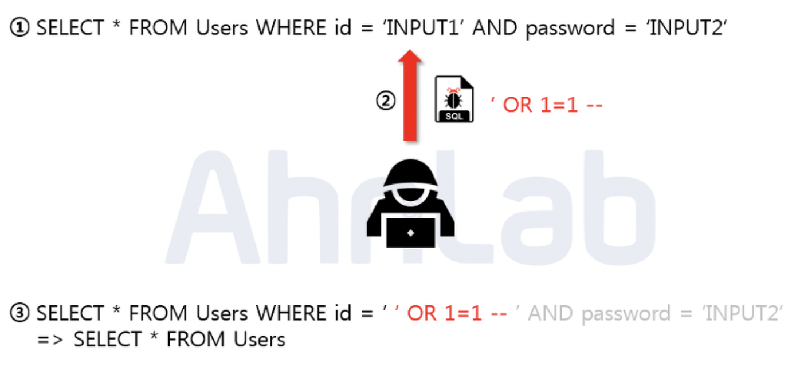
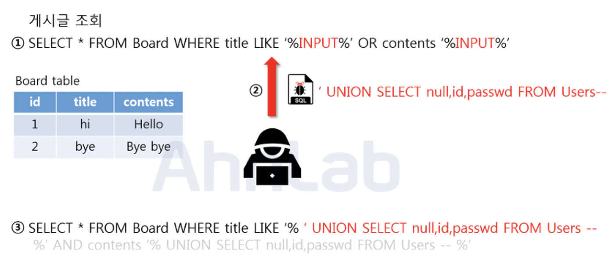
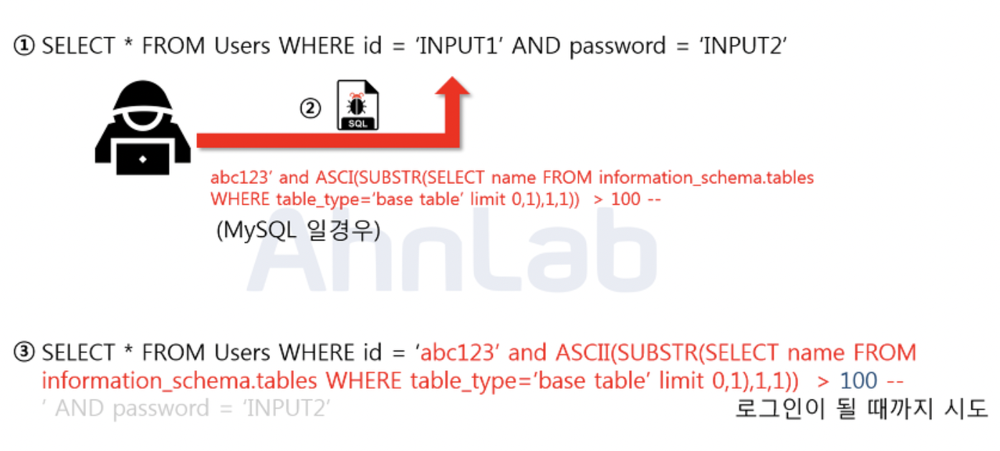
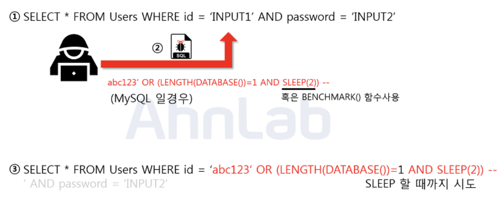

# SQL Injection

### 한 문장 정리

- SQL Injection은 웹 어플리케이션에서 DB에 Query시 입력된 데이터의 유효성 검증을 하지 않아, 의도하지 않는 동적 쿼리(Dynamic Query) 를 생성하여 DB정보를 열람하거나 조작할 수 있는 보안 취약점

### 논리적 에러를 이용한 공격

Union based SQL Injection

Blind SQL Injection

- Boolean based

- Time based SQL

### 대응방안

- 입력 값에 대한 검증
    - 서버단 화이트리스트 기반으로 검증해서 위험할 수 있다
- 에러 메시지 노출 금지
    - 에러가 발생한 쿼리문과 함께 에러에 관한 내용을 반환헤 줍니다. 여기서 테이블명 및 컬럼명 그리고 쿼리문이 노출이 될 수 있기 때문에, 데이터 베이스에 대한 오류발생 시 사용자에게 보여줄 수 있는 페이지를 제작 혹은 메시지박스를 띄우도록 해야 한다
- 웹 방화벽 사용
    - 웹 공격 방어에 특화되어있는 웹 방화벽을 사용하는 것도 하나의 방법입니다. 웹 방화벽은 소프트웨어 형, 하드웨어 형, 프록시 형 이렇게 세가지 종류로 나눌 수 있는데
    - 소프트웨어 형은 서버 내에 직접 설치하는 방법
    - 하드웨어 형은 네트워크 상에서 서버 앞 단에 직접 하드웨어 장비로 구성하는 방법
    - 프록시 형은 DNS 서버 주소를 웹 방화벽으로 바꾸고 서버로 가는 트래픽이 웹 방화벽을 먼저 거치도록 하는 방법
- Prepared Statement 구문사용
    - 사용자의 입력 값이 데이터베이스의 파라미터로 들어가기 전에 DBMS가 미리 컴파일 하여 실행하지 않고 대기
    - 그 후 사용자의 입력 값을 문자열로 인식하게 하여 공격쿼리가 들어간다고 하더라도, 사용자의 입력은 이미 의미 없는 단순 문자열 이기 때문에 전체 쿼리문도 공격자의 의도대로 작동 x