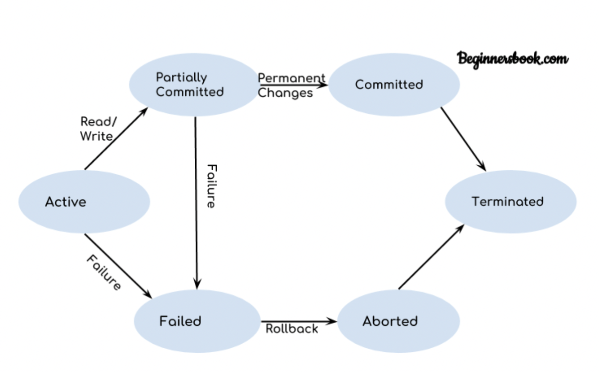

# 트랜잭션(Transaction)

### **트렌잭션이란?**

- 하나의 작업을 수행하기 위해 필요한 데이터베이스의 연산들을 모아놓은 것
- 데이터베이스에서 논리적인 작업의 단위이며 장애가 발생했을 때 데이터를 복구하는 작업의 단위

### **트랜잭션 특징**

---

- 원자성(Atomicity)
    - 트랜잭션을 구성하는 연산들이 모두 정상적으로 실행되거나 하나도 실행되지 않아야 한다는 방식을 의미
- 일관성(Consistency)
    - 트랜잭션이 성공적으로 수행된 후에도 데이터베이스가 일관성 있는 상태를 유지해야 함을 의미
- 독립성(Isolation)
    - 현재 수행중인 트랜잭션이 완료될 때까지 트랜잭션이 생성한 중간 연산 결과에 다른 트랜잭션들이 접근할 수 없을 의미
- 지속성(Durability)
    - 트랜잭션이 성공적으로 완료된 후 데이터베이스에 반영한 수행 결과는 어떠한 경우에도 손실되지 않고 영구적이어야 함을 의미

트랜잭션의 연산

- db에 반영되는 시점은 트랜잭션 연산이 성공적으로 완료되는 시점에 실제 데이터베이스에 반영된다.
- 연산의 종류는 크게 두가지 과정
    - commit 연산

        - 하나의 트랜잭션이 성공적으로 끝났고, DB가 일관성있는 상태일 때 이를 알려주기 위해 사용하는 연산이며 결과를 최종데이터베이스에 반영
        - 커밋 연산이 실행된 후에야 트랜잭션의 수행결과가 데이터베이스에 반영되어 일관된 상태를 지속적으로 유지
    - **Rollback 연산**

        - 하나의 트랜잭션 처리가 비정상적으로 종료되어 트랜잭션 원자성이 깨진 경우
        - transaction이 정상적으로 종료되지 않았을 때, last consistent state (예) Transaction의 시작 상태) 로 roll back 할 수 있음.

### 트랜잭션의 상태

- 트랜잭션의 연산을 수행할 때의 크게 5가지 상태가 존재하고 상태 처리 과정은 아래 그림과 같다.

- 활동 상태 : 트랜잭션이 수행을 시작하여 현재 수행 중인 상태
- 부분 완료 상태: 마지막 연산이 실행된 직후의 상태를 부분 완료 상태, 연산은 모두 처리한 상태이지만 수행한 최종 결과를 데이터베이스에 아직 반영하지 않은 상태
- 완료 상태: 트랜잭션이 성공적으로 완료되어 커밋 연산을 실행한 완료 상태
- 실패 상태 : 장애가 발생하여 트랜잭션의 수행이 중단된 상태
- 철회 상태: 수행이 실패하여 rollback 연산을 실행한 상태

### 장애와 회복

- 장애의 3가지 유형
    - 트랜잭션 장애
    - 시스템 장애 - 하드웨어의 결함, 수행을 할 수 없는 상태
    - 미디어 장애 - 디스크 장치의 결함, 데이터베이스가 손상
- 회복이란 데이터베이스를 장애가 발생하기 전의 일관된 상태로 복귀시키는 것
    - 즉시 갱신
        - 로그 기반 회복 기법
        - 트랜잭션 수행 도중 변경하면 변경 정보를 로그파일에 저장하고, 트랜잭션이 부분완료되기 전이라도 모든 변경 내용을 즉시 데이터베이스의 반영하는 기법
        - 로그 파일을 참조하여 REDO & UNDO 연산 모두 실행
    - 지연 갱신
        - 로그 기반 회복 기법
        - 트랜잭션이 부분 완료 상태에 이르기까지 발생한 모든 변경 내용을 로그파일에만 저장하고 데이터베이스에는 커밋이 발생할 때까지 저장하는 기법
        - 회복 과정에서 UNDO가 필요 없음
        - 이를 통해 트랜잭션의 원자성 보장
    - checkpoint 리커버리
        - 이전은 신경 쓰지 않고 체크포인트 이후만 즉시 갱신 혹은 지연 갱신을 수행
        - 가장 최근 체크포인트 지점을 찾아 그 시점 이후의 로그만을 회복 대상으로 함

    - media recovery
        - 말 그대로 디스크와 같이 비휘발성의 저장 장치의 내용이 손상되는 장애가 발생했을 시에 회복을 위한 기법이며 백업, 미러링 등을 이용해 복구