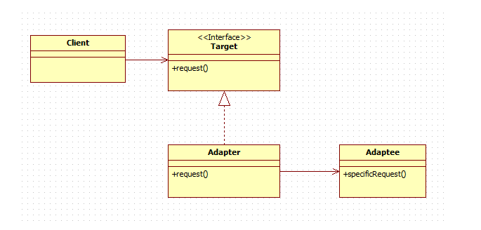
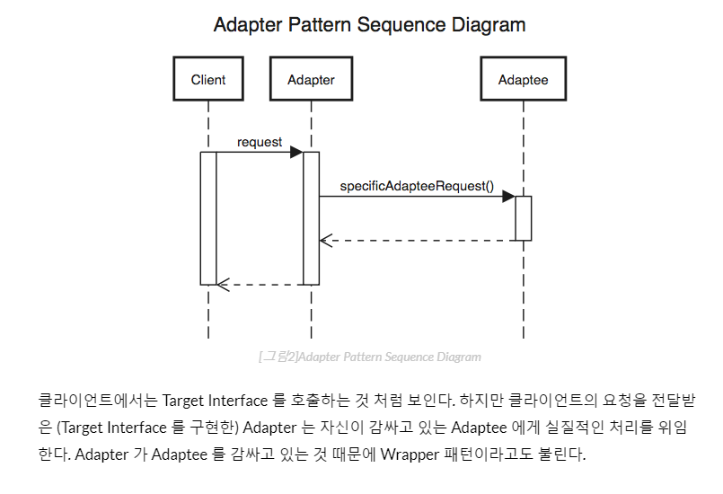
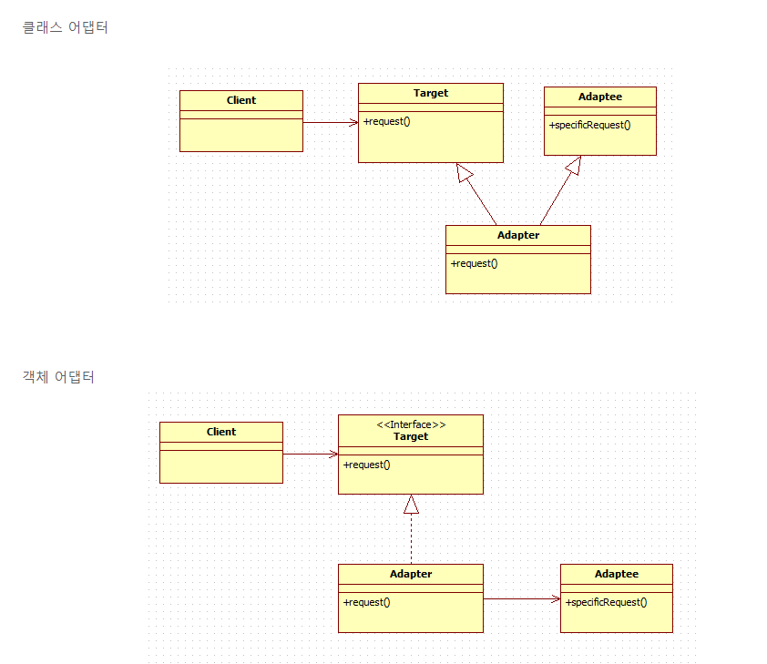
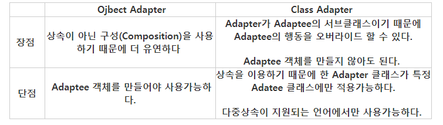

# 어댑터 패턴

### 한문장 정리

- 어댑터 패턴은 클래스의 인터페이스를 사용자가 기대하는 인터페이스 형태로 변환시키는 패턴입니다.

### 어댑터 패턴

- 한 클래스의 인터페이스를 클라이언트에서 사용하고자하는 다른 인터페이스로 변환한다.
- 어댑터를 이용하면 인터페이스 호환성 문제 때문에 같이 쓸 수 없는 클래스들을 연결해서 쓸 수 있다

    - **Client:** 써드파티 라이브러리나 외부시스템을 사용하려는 쪽이다.
    - **Adaptee:** 써드파티 라이브러리나 외부시스템을 의미한다.
    - **Target Interface:** Adapter 가 구현(implements) 하는 인터페이스이다. 클라이언트는 Target Interface 를 통해 Adaptee 인 써드파티 라이브러리를 사용하게 된다.
    - **Adapter:** Client 와 Adaptee 중간에서 호환성이 없는 둘을 연결시켜주는 역할을 담당한다. Target Interface 를 구현하며, 클라이언트는 Target Interface 를 통해 어댑터에 요청을 보낸다. 어댑터는 클라이언트의 요청을 Adaptee 가 이해할 수 있는 방법으로 전달하고, 처리는 Adaptee 에서 이루어진다.

    ### 어댑터 패턴 호출 과정

    ### 구현의 두가지 방법

    - 클래스 어댑터: 자바의 상속 이용
    - 객체 어댑터: 자바의 합성 이용

      

    ### 장단비교

    ### **어댑터 패턴 정리**

    - Adaptee 를 감싸고, Target Interface 만을 클라이언트에게 드러낸다.
    - Target Interface 를 구현하여 클라이언트가 예상하는 인터페이스가 되도록 Adaptee 의 인터페이스를  변경한다.

        간접적으로

    - Adaptee 가 기대하는 방식으로 클라이언트의 요청을 간접적으로 변경한다.
    - 호환되지 않는 우리의 인터페이스와 Adaptee 를 함께 사용할 수 있다.

    ### 예제 코드

    - [https://blog.seotory.com/post/2017/09/java-adapter-pattern](https://blog.seotory.com/post/2017/09/java-adapter-pattern)