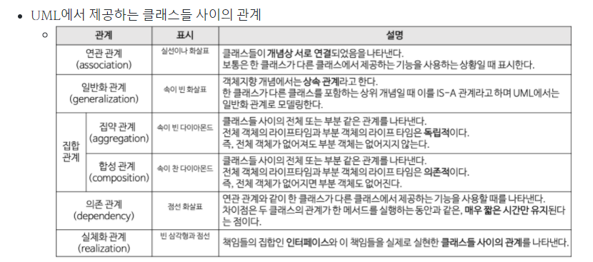

# 디자인 패턴 개요

### 한 문장 정리

- 소프트웨어 공학에서 디자인 패턴(Design pattern)은 프로그램 개발 시에 자주 부닥치는 애로 상황에 대한 일반적이고 재사용 가능한 추상화된 해결책

### 디자인패턴

- 소프트웨어 공학에서 디자인 패턴(Design pattern)은 프로그램 개발 시에 자주 부닥치는 애로 상황에 대한 일반적이고 재사용 가능한 추상화된 해결책.
- 소프트웨어 공학론 안의 좋은 코드를 설계하기 위한 일종의 설계 디자인 방법론이다
- 패러다임 혹은 알고리즘과는 다르다. ( 하지만 대부분 oop 패러다임에 국한된 내용)
    - 패러다임: 객체지향, 함수지향, 절차지향
    - 알고리즘: 문제 해결 방식

### 객체지향 3대 특징

- 캡슐화
- 상속
- 다형성

### 객체지향 solid 원칙

  

### 디자인패턴 표현

- UML
- [https://blog.naver.com/PostView.nhn?blogId=1ilsang&logNo=221104669002&parentCategoryNo=&categoryNo=59&viewDate=&isShowPopularPosts=true&from=search](https://blog.naver.com/PostView.nhn?blogId=1ilsang&logNo=221104669002&parentCategoryNo=&categoryNo=59&viewDate=&isShowPopularPosts=true&from=search)

  

### 디자인 패턴 종류

- 생성 패턴 : 객체 생성에 관련된 패턴
    - 싱글톤
    - 팩토리 메서드
    - 추상 팩토리
    - 빌더
    - 프로토타입
- 구조 패턴:  클래스나 객체를 조합해 더 큰 구조를 만드는 패턴
    - 어댑터
    - 브리지
    - 컴퍼지트
    - 데코레이터
    - 퍼사드
    - 플라이웨이트
    - 프록시
- 행위 패턴: 객체나 클래스 사이의 알고리즘이나 책임 분배에 관련된 패턴
    - 책임 연쇄
    - 커맨드
    - 인터프리터
    - 이터레이터
    - 미디에이터
    - 메멘토
    - 옵서버
    - 테이트
    - 스트래티지
    - 탬플릿 메서드
    - 비지터