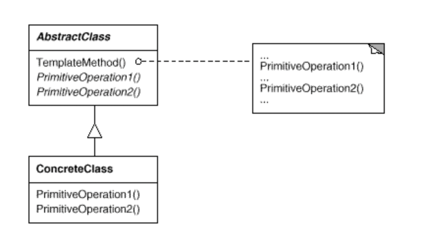

# 템플릿 메서드 패턴

### 의도

- 행동 패턴중 하나
- 객체의 연산에는 알고리즘의 뼈대(템플릿 메서드)만을 정의하고 각 단계에서 수행할 구체적 처리는 서브클래스쪽으로 미룬다.
- 그래서 알고리즘의 구조 자체는 그대로 놔둔 채 알고리즘 각 단계 처리를 서브클래스에서 재정의할 수 있게 하는 것
- 템플릿 메서드
    - 필수 처리 절차를 정의한 메서드

### 활용성

- 주로 다음과 같은 경우에 사용한다
1. 어떤 한 알고리즘을 이루는 부분 중 변하지 않는 부분을 한 번 정의해 놓고 다양해질 수 있는 부분은 서브클래스에서 정의할 수 있도록 남겨두고자 할 때
2. 서브클래스 사이의 공통적인 행동을 추출하여 하나의 공통 클래스에 몰아둠으로써 코드 중복을 피하고 싶을 때
    - 일반화를 위한 리팩토링 개념
    - 기존 코드에서 나타나는 차이점을 뽑아 이를 별도의 새로운 연산들로 구분
    - 그런 뒤 달라진 코드 부분을 이 새로운 연산을 호출하는 템플릿 메서드로 대체하는 것
3. 서브클래스의 확장을 제어할 수 있다. 템플릿 메서드가 어떤 특정한 시점에 훅(hook) 연산을 호출하도록 정의함으로써, 그 특정 시점에서만 확장되도록 한다.

### 구조



- AbstractClass
    - 서브클래스들이 재정의를 통해 구현해야 하는 알고리즘 처리 단계 내의 기본 연산을 정의
    - 그리고 알고리즘의 뼈대를 정의하는 템플릿 메서드 구현
    - 템플릿 메서드는 AbstractClass에 정의된 연산 또는 다른 객체 연산뿐만 아니라 기본 연산도 호출
- ConcreteClass
    - 서브클래스마다 달라진 알고리즘 처리 단계를 수행하기 위한 기본 연산을 구현
- Concreteclass는 AbstractClass를 통하여 알고리즘의 변하지 않는 처리 단계를 구현한다.

### 결과

- 템플릿 메서드는 코드 재사용을 위한 기본 기술
- 할리우드 원칙이라는 역전된 제어 구조를 끌어낸다.
    - Don't call, we'll call you
    - 부모 클래스는 서브클래스에 정의된 연산을 호출 할 수 있지만 반대 방향의 호출은 안된다.
- 템플릿 메서드는 여러 종류의 연산 중 하나를 호출한다.
    - 구체 연산
        - ConcreteClass나 사용자 클래스에 정의된 연산
    - AbstractClass 구체 연산
        - 서브클래스에서 일반적으로 유용한 연산
    - 기본 연산
        - 추상화된 연산
    - 팩토리 메서드
    - 훅 연산
        - 필요하다면 서브클래스에서 확장할 수 있는 기본 행동을 제공하는 연산
        - 기본적으로는 아무 내용도 정의하지 않는다.

### 구현 팁

- 접근 제한을 사용한다
    - 템플릿 메서드에서 호출 하는 기본 연산들은 템플릿 메서드만 호출할 수 있게
    - 오버라이드해야 하는 기본 연산은 순수 가상 함수로 정의
    - 템플릿 메서드 재정의 되면 안된다.
- 구현해야 하는 abstract 메소드의 수가 너무 많아지지 않도록 주의한다.
- 재정의할 abstract 메소드는 식별하기 쉽도록 접두사를 붙여주자.
    - 예를 들어 메소드 이름이 `Do`로 시작하도록 한다.
- 종종 팩토리 메서드와 같은 개념으로 볼 수 있다.

### 예제

- 추상 클래스

    ```java
    public abstract class CaffeineBeverage {
        // 알고리즘을 갖고 있는 이 메소드를 '템플릿 메소드'라 부른다
        final void prepareRecipe() {
            boilWater();
            brew();
            pourInCup();
            addCondiments();
        }

        abstract void brew();           // 서브클래스에서 구현
        abstract void addCondiments();  // 서브클래스에서 구현

        void boilWater() {
            System.out.println("물 끓이는 중");
        }
        void pourInCup() {
            System.out.println("컵에 따르는 중");
        }
    }
    ```

- 구체 클래스 - 커피

    ```java
    public class Coffee extends CaffeineBeverage {
        public void brew() {
            System.out.println("필터로 커피를 우려내는 중");
        }
        public void addCondiments() {
            System.out.println("설탕과 커피를 추가하는 중");
        }
    }
    ```

- 구체 클래스 - 티

    ```java
    public class Tea extends CaffeineBeverage {
        public void brew() {
            System.out.println("차를 우려내는 중");
        }
        public void addCondiments() {
            System.out.println("레몬을 추가하는 중");
        }
    }
    ```

- hook 메서드
    - 서브클래스 구현시 융통성을 발휘하기 위한 메소드.
    - 추상 클래스에서 선언하지만 기본적인 내용만 구현되어 있거나 내용이 비어 있는 메소드.

    ```java
    public abstract class CaffeineBeverage {
        // 알고리즘을 갖고 있는 이 메소드를 '템플릿 메소드'라 부른다
        final void prepareRecipe() {
            boilWater();
            brew();
            pourInCup();
            // 고객이 원하는 경우에만 첨가물을 넣는다
            if (customerWantsCondiments()) {
                addCondiments();
            }
        }

        abstract void brew();           // 서브클래스에서 구현
        abstract void addCondiments();  // 서브클래스에서 구현

        void boilWater() {
            System.out.println("물 끓이는 중");
        }
        void pourInCup() {
            System.out.println("컵에 따르는 중");
        }

        // 이 메소드가 hook 메소드
        boolean customerWantsCondiments() {
            return true;
        }
    }
    ```