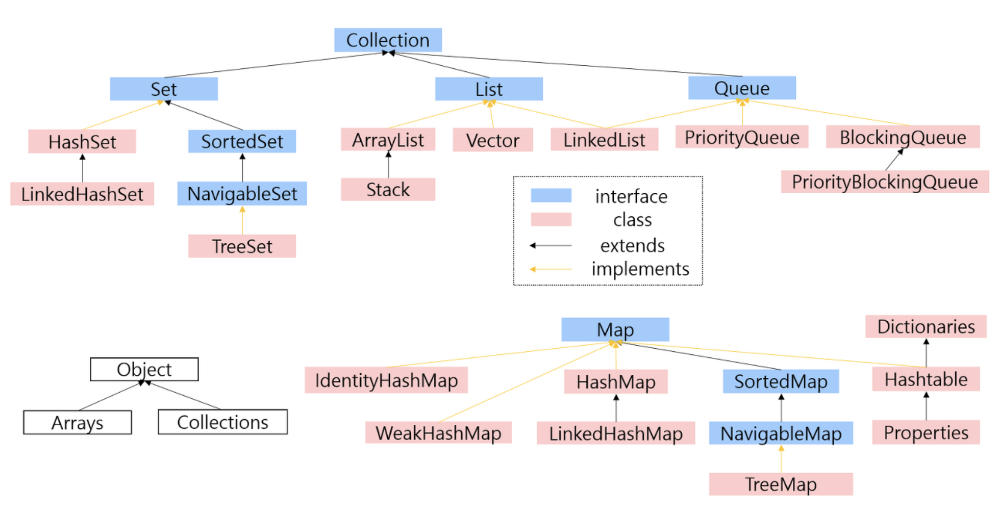
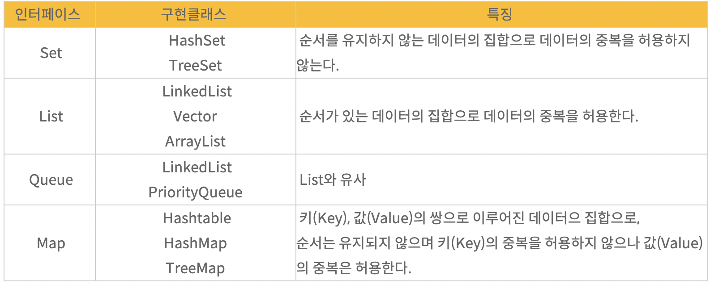
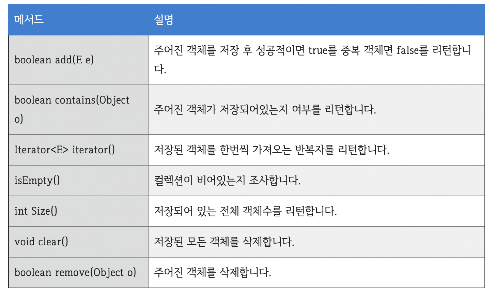
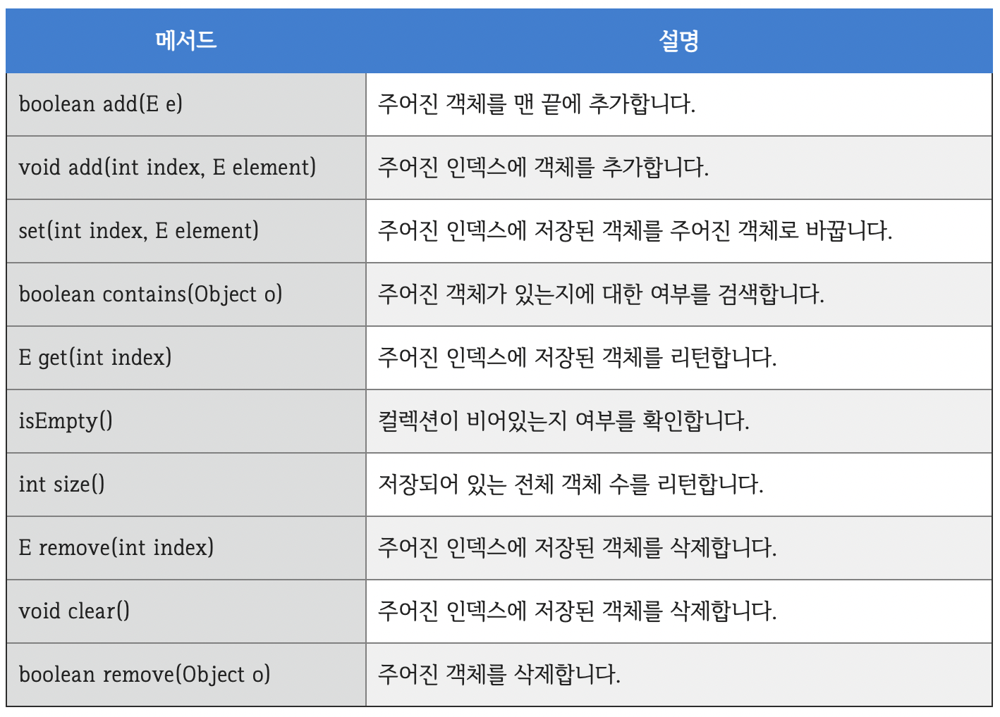
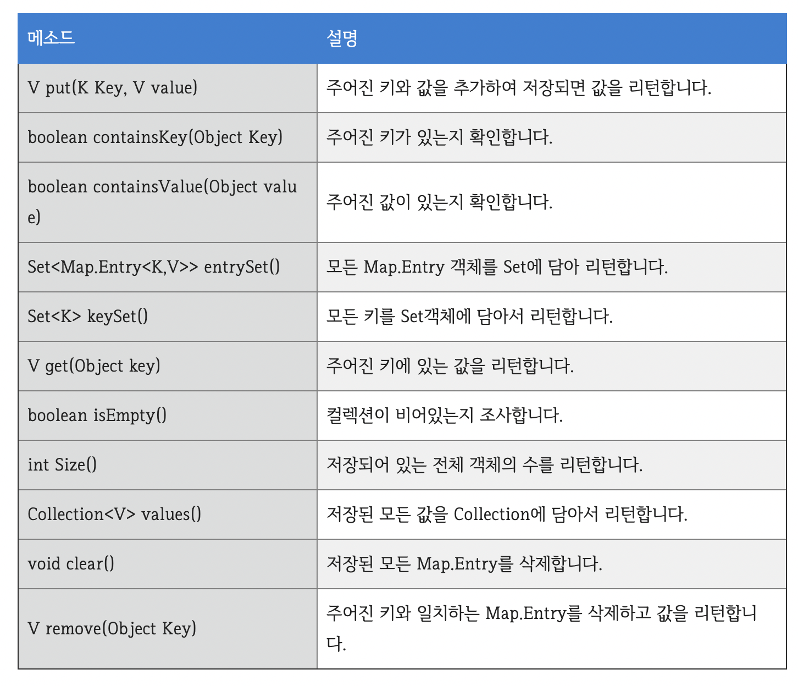

# Collection

한문장 정리

- 데이터의 집합, 그룹 즉 자료구조를 의미하여 자바에서는 컬렉션 프레임워크을 컬렉션들을 제공한다.

### 컬렉션 프레임워크(collection framework)란?

- 자바에서 컬렉션 프레임워크(collection framework)란 다수의 데이터를 쉽고 효과적으로 처리할 수 있는 표준화된 방법을 제공하는 클래스의 집합을 의미합니다
- 즉, 데이터를 저장하는 자료 구조와 데이터를 처리하는 알고리즘을 구조화하여 클래스로 구현해 놓은 것입니다.
- 이러한 컬렉션 프레임워크는 자바의 인터페이스(interface)를 사용하여 구현됩니다.

### 컬렉션 프레임워크 주요 인터페이스

- 컬렉션 프레임워크에서는 데이터를 저장하는 자료 구조에 따라 다음과 같은 핵심이 되는 주요 인터페이스를 정의한다.

    1. List 인터페이스

    2. Set 인터페이스

    3. Map 인터페이스

- 이 중에서 List와 Set 인터페이스는 모두 Collection 인터페이스를 상속받지만, 구조상의 차이로 인해 Map 인터페이스는 별도로 정의된다.
- 따라서 List 인터페이스와 Set 인터페이스의 공통된 부분을 Collection 인터페이스에서 정의하고 있습니다.

### 주요 인터페이스 간의 상속 관계

- 자바에서 컬렉션 프레임워크를 구성하고 있는 인터페이스 간의 상속 관계는 다음 그림과 같다.
- 위의 그림에서 <E>나 <K, V>라는 것은 컬렉션 프레임워크를 구성하는 모든 클래스가 제네릭으로 표현되어 있다.
    - [http://tcpschool.com/java/java_generic_concept](http://tcpschool.com/java/java_generic_concept)

### 주요 인터페이스의 간략한 특징

- **Set 인터페이스**
    - 순서를 유지하지 않는 데이터의 집합으로 데이터의 중복을 허용하지 않는다.
    - **HashSet:** 가장빠른 임의 접근, 속도순서를 예측할 수 없음
    - **TreeSet:** 정렬방법을 지정할 수 있음

- **List 인터페이스**
    - 순서가 있는 데이터의 집합으로 데이터의 중복을 허용한다.
    - **LinkedList:** 양방향 포인터 구조로 데이터의 삽입, 삭제가 빈번할 경우 데이터의 위치정보만 수정하면 되기에 유용스택, 큐, 양방향 큐 등을 만들기 위한 용도로 쓰임
    - **Vector:** 과거에 대용량 처리를 위해 사용했으며, 내부에서 자동으로 동기화처리가 일어나 비교적 성능이 좋지 않고 무거워 잘 쓰이지 않음
    - **ArrayList:** 단방향 포인터 구조로 각 데이터에 대한 인덱스를 가지고 있어 조회 기능에 성능이 뛰어남

- **Map 인터페이스**
    - 키(Key), 값(Value)의 쌍으로 이루어진 데이터으 집합으로,
    - 순서는 유지되지 않으며 키(Key)의 중복을 허용하지 않으나 값(Value)의 중복은 허용한다.
    - **Hashtable:** HashMap보다는 느리지만 동기화 지원null불가
    - **HashMap:** 중복과 순서가 허용되지 않으며 null값이 올 수 있다.
    - **TreeMap:** 정렬된 순서대로 키(Key)와 값(Value)을 저장하여 검색이 빠름

