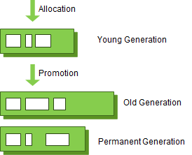
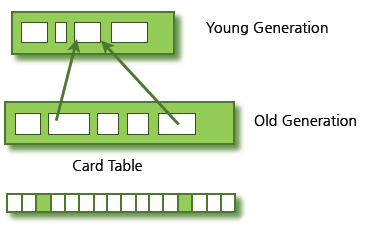
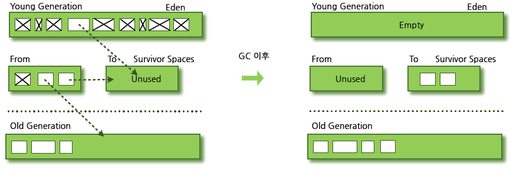
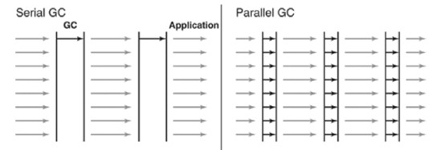
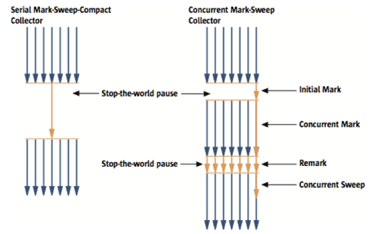
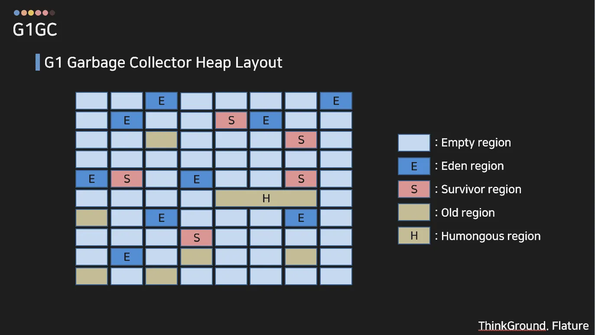

# GC

한문장 정리

- 동적 할당된 메모리 영역(heap) 중에서 더 이상 사용하지 않는 영역을 탐지하여 자동으로 해지하는 기법이다.

### **[ Minor GC와 Major GC ]**

- JVM의 Heap영역은 처음 설계될 때 다음의 2가지를 전제(Weak Generational Hypothesis)로 설계되었다.
    1. 대부분의 객체는 금방 접근 불가능한 상태(Unreachable)가 된다.
    2. 오래된 객체에서 젊은 객체로의 참조는 아주 적게 존재한다.
- 즉, 객체는 대부분 일회성되며, 메모리에 오랫동안 남아있는 경우는 드물다는 것이다. 그렇기 때문에 객체의 생존 기간에 따라 물리적인 Heap 영역을 나누게 되었는데, 이에 따라 Young, Old 총 2가지 영역으로 설계되었다. (초기에는 Perm 영역이 존재하였지만 Java8부터 제거되었다.)
    - Young 영역(Yong Generation 영역): 새롭게 생성한 객체의 대부분이 여기에 위치한다. 대부분의 객체가 금방 접근 불가능 상태가 되기 때문에 매우 많은 객체가 Young 영역에 생성되었다가 사라진다. 이 영역에서 객체가 사라질때 Minor GC가 발생한다고 말한다.
    - Old 영역(Old Generation 영역): 접근 불가능 상태로 되지 않아 Young 영역에서 살아남은 객체가 여기로 복사된다. 대부분 Young 영역보다 크게 할당하며, 크기가 큰 만큼 Young 영역보다 GC는 적게 발생한다. 이 영역에서 객체가 사라질 때 Major GC(혹은 Full GC)가 발생한다고 말한다.

- 예외적인 상황으로 Old 영역에 있는 객체가 Young 영역의 객체를 참조하는 경우도 존재할 것이다. 이러한 경우를 대비하여 Old 영역에는 512 bytes의 덩어리(Chunk)로 되어 있는 카드 테이블(Card Table)이 존재한다.
    - 카드 테이블에는 Old 영역에 있는 객체가 Young 영역의 객체를 참조할 때 마다 그에 대한 정보가 표시된다.
    - 카드 테이블이 도입된 이유는 간단한다. Young 영역에서 가비지 컬렉션(Minor GC)가 실행될 때 모든 Old 영역에 존재하는 객체를 검사하여 참조되지 않는 Young 영역의 객체를 식별하는 것이 비효율적이기 때문이다.
    - 그렇기 때문에 Young 영역에서 가비지 컬렉션이 진행될 때 카드 테이블만 조회하여 GC의 대상인지 식별할 수 있도록 하고 있다.

## **Garbage Collection(가비지 컬렉션)의 동작 방식**

- Young 영역과 Old 영역은 서로 다른 메모리 구조로 되어 있기 때문에, 세부적인 동작 방식은 다르다. 하지만 기본적으로 가비지 컬렉션이 실행된다고 하면 다음의 2가지 공통적인 단계를 따르게 된다.
    1. Stop The World
    2. Mark and Sweep
- **Stop The World**
    - Stop The World는 가비지 컬렉션을 실행하기 위해 JVM이 애플리케이션의 실행을 멈추는 작업이다.
    - GC가 실행될 때는 GC를 실행하는 쓰레드를 제외한 모든 쓰레드들의 작업이 중단되고, GC가 완료되면 작업이 재개된다.
    - 당연히 모든 쓰레드들의 작업이 중단되면 애플리케이션이 멈추기 때문에, GC의 성능 개선을 위해 튜닝을 한다고 하면 보통 stop-the-world의 시간을 줄이는 작업을 하는 것이다. 또한 JVM에서도 이러한 문제를 해결하기 위해 다양한 실행 옵션을 제공하고 있다.
- **Mark and Sweep**
    - Mark: 사용되는 메모리와 사용되지 않는 메모리를 식별하는 작업
    - Sweep: Mark 단계에서 사용되지 않음으로 식별된 메모리를 해제하는 작업
    - Stop The World를 통해 모든 작업을 중단시키면, GC는 스택의 모든 변수 또는 Reachable 객체를 스캔하면서 각각이 어떤 객체를 참고하고 있는지를 탐색하게 된다. 그리고 사용되고 있는 메모리를 식별하는데, 이러한 과정을 Mark라고 한다. 이후에 Mark가 되지 않은 객체들을 메모리에서 제거하는데, 이러한 과정을 Sweep라고 한다

### **[ Minor GC의 동작 방식 ]**

- Minor GC를 정확히 이해하기 위해서는 Young 영역의 구조에 대해 이해를 해야 한다.
- Young 영역은 1개의 Eden 영역과 2개의 Survivor 영역, 총 3가지로 나뉘어진다.
    - Eden 영역: 새로 생성된 객체가 할당(Allocation)되는 영역
    - Survivor 영역: 최소 1번의 GC 이상 살아남은 객체가 존재하는 영역
- 객체가 새롭게 생성되면 Young 영역 중에서도 Eden 영역에 할당(Allocation)이 된다.
- 그리고 Eden 영역이 꽉 차면 Minor GC가 발생하게 되는데, 사용되지 않는 메모리는 해제되고 Eden 영역에 존재하는 객체는 (사용중인) Survivor 영역으로 옮겨지게 된다.
    - 에덴 영역의 메모리 단편화 문제 해결
- Survivor 영역은 총 2개이지만 반드시 1개의 영역에만 데이터가 존재해야 하는데, Young 영역의 동작 순서를 자세히 살펴보도록 하자.
    1. 새로 생성된 객체가 Eden 영역에 할당된다.
    2. 객체가 계속 생성되어 Eden 영역이 꽉차게 되고 Minor GC가 실행된다.
        1. Eden 영역에서 사용되지 않는 객체의 메모리가 해제된다.
        2. Eden 영역에서 살아남은 객체는 1개의 Survivor 영역으로 이동된다.
    3. 1~2번의 과정이 반복되다가 Survivor 영역이 가득 차게 되면 Survivor 영역의 살아남은 객체를 다른 Survivor 영역으로 이동시킨다.(1개의 Survivor 영역은 반드시 빈 상태가 된다.)
    4. 이러한 과정을 반복하여 계속해서 살아남은 객체는 Old 영역으로 이동(Promotion)된다.
- 객체의 생존 횟수를 카운트하기 위해 Minor GC에서 객체가 살아남은 횟수를 의미하는 age를 Object Header에 기록한다. 그리고 Minor GC 때 Object Header에 기록된 age를 보고 Promotion 여부를 결정한다.
- 또한 Survivor 영역 중 1개는 반드시 사용이 되어야 한다. 만약 두 Survivor 영역에 모두 데이터가 존재하거나, 모두 사용량이 0이라면 현재 시스템이 정상적인 상황이 아님을 파악할 수 있다.
- Survivor Space는 왜 2개일까?
    - Minor GC의 대상은 에덴뿐만 아니라 Survior 영역 포함이기 때문에 survior 영역의 메모리 단편화를 없애기 위해서

- HotSpot JVM에서는 Eden 영역에 객체를 빠르게 할당(Allocation)하기 위해 bump the pointer와 TLABs(Thread-Local Allocation Buffers)라는 기술을 사용하고 있다.
    - bump the pointer
        - bump the pointer란 Eden 영역에 마지막으로 할당된 객체의 주소를 캐싱해두는 것이다. bump the pointer를 통해 새로운 객체를 위해 유효한 메모리를 탐색할 필요 없이 마지막 주소의 다음 주소를 사용하게 함으로써 속도를 높이고 있다. 이를 통해 새로운 객체를 할당할 때 객체의 크기가 Eden 영역에 적합한지만 판별하면 되므로 빠르게 메모리 할당을 할 수 있다.
    - TLABs(Thread-Local Allocation Buffers)
        - 싱글 쓰레드 환경이라면 문제가 없겠지만 멀티쓰레드 환경이라면 객체를 Eden 영역에 할당할 때 락(Lock)을 걸어 동기화를 해주어야 한다. 멀티 쓰레드 환경에서의 성능 문제를 해결하기 위해 HotSpot JVM은 추가로 TLABs(Thread-Local Allocation Buffers)라는 기술을 도입하게 되었다.
        - TLABs(Thread-Local Allocation Buffers)란 각각의 쓰레드마다 Eden 영역에 객체를 할당하기 위한 주소를 부여함으로써 동기화 작업 없이 빠르게 메모리를 할당하도록 하는 기술이다. 각각의 쓰레드는 자신이 갖는 주소에만 객체를 할당함으로써 동기화 없이 bump the poitner를 통해 빠르게 객체를 할당하도록 하고 있다.

### **[ Major GC의 동작 방식 ]**

- Young 영역에서 오래 살아남은 객체는 Old 영역으로 Promotion됨을 확인할 수 있었다. 그리고 Major GC는 객체들이 계속 Promotion되어 Old 영역의 메모리가 부족해지면 발생하게 된다.
- Young 영역은 일반적으로 Old 영역보다 크키가 작기 때문에 GC가 보통 0.5초에서 1초 사이에 끝난다. 그렇기 때문에 Minor GC는 애플리케이션에 크게 영향을 주지 않는다.
- 하지만 Old 영역은 Young 영역보다 크며 Young 영역을 참조할 수도 있다. 그렇기 때문에 Major GC는 일반적으로 Minor GC보다 시간이 오래걸리며, 10배 이상의 시간을 사용한다.
- GC 방식에 따라서 처리 절차가 달라지므로 GC 방식은 JDK 7을 기준으로 5가지 방식이 있다.
    - Serial GC
    - Parallel GC
    - Parallel Old GC(Parallel Compacting GC)
    - Concurrent Mark & Sweep GC(이하 CMS)
    - G1(Garbage First) GC

### Serial GC (-XX:+UseSerialGC)

- Old 영역의 GC는 mark-sweep-compact이라는 알고리즘을 사용한다. 이 알고리즘의 첫 단계는 Old 영역에 살아 있는 객체를 식별(Mark)하는 것이다.
- 그 다음에는 힙(heap)의 앞 부분부터 확인하여 살아 있는 것만 남긴다(Sweep).
- 마지막 단계에서는 각 객체들이 연속되게 쌓이도록 힙의 가장 앞 부분부터 채워서 객체가 존재하는 부분과 객체가 없는 부분으로 나눈다(Compaction).
- Serial GC는 적은 메모리와 CPU 코어 개수가 적을 때 적합한 방식이다.

### Parallel GC (-XX:+UseParallelGC)

- Parallel GC는 Serial GC와 기본적인 알고리즘은 같다.
- 그러나 Serial GC는 GC를 처리하는 스레드가 하나인 것에 비해, Parallel GC는 GC를 처리하는 쓰레드가 여러 개이다.
- 그렇기 때문에 Serial GC보다 빠른게 객체를 처리할 수 있다.
- Parallel GC는 메모리가 충분하고 코어의 개수가 많을 때 유리하다. Parallel GC는 Throughput GC라고도 부른다.

### Parallel Old GC(-XX:+UseParallelOldGC)

- Parallel Old GC는 JDK 5 update 6부터 제공한 GC 방식이다.
- 앞서 설명한 Parallel GC와 비교하여 Old 영역의 GC 알고리즘만 다르다. 이 방식은 Mark-Summary-Compaction 단계를 거친다.
- Summary 단계는 앞서 GC를 수행한 영역에 대해서 별도로 살아 있는 객체를 식별한다는 점에서 Mark-Sweep-Compaction 알고리즘의 Sweep 단계와 다르며, 약간 더 복잡한 단계를 거친다.

### **[ CMS(Concurrent Mark Sweep) GC ]**

- STW(Stop-The-World) 시간을 최소화 하는데 초점을 맞춘 GC 방식이다.
- CMS(Concurrent Mark Sweep) GC는 Parallel GC와 마찬가지로 여러 개의 쓰레드를 이용한다. 하지만 기존의 Serial GC나 Parallel GC와는 다르게 Mark Sweep 알고리즘을 Concurrent하게 수행하게 된다.
- CMS GC는 Initial Mark -> Concurrent Mark -> Remark -> Concurrent Sweep 과정을 거친다.
    1. **Initial Mark**
        - GC 과정에서 살아남은 객체를 탐색하는 시작 객체(GC Root)에서 참조 Tree상 가까운 객체만 1차적으로 찾아가며 객체가 GC 대상(참조가 끊긴 객체)인지를 판단한다. 이 때는 STW 현상이 발생하게되지만, 탐색 깊이가 얕기 때문에 STW 발생 기간이 매우 짧다.
    2. **Concurrent Mark**
        - STW 현상없이 진행되며, Initial Mark 단계에서 GC 대상으로 판별된 객체들이 참조하는 다른 객체들을 따라가며 GC 대상인지를 추가적으로 확인한다.

    3. **Remark**

    - Concurrent Mark 단계의 결과를 검증한다. Concurrent Mark 단계에서 GC 대상으로 추가 확인되거나 참조가 제거되었는지 등등의 확인을 한다. 이 검증과정은 STW 를 유발하기 때문에 STW 지속시간을 최대한 줄이기 위해 멀티스레드로 검증 작업을 수행한다.

    4. **Concurrent Sweep**

    - STW 없이 Remark 단계에서 검증 완료된 GC 객체들을 메모리에서 제거한다.
- 이러한 단계로 진행되는 GC 방식이기 때문에 stop-the-world 시간이 매우 짧다. 모든 애플리케이션의 응답 속도가 매우 중요할 때 CMS GC를 사용하며, Low Latency GC라고도 부른다.
- 그런데 CMS GC는 stop-the-world 시간이 짧다는 장점에 반해 다음과 같은 단점이 존재한다.
    - 다른 GC 방식보다 메모리와 CPU를 더 많이 사용한다.
    - Compaction 단계가 기본적으로 제공되지 않는다.
- 따라서, CMS GC를 사용할 때에는 신중히 검토한 후에 사용해야 한다. 그리고 조각난 메모리가 많아 Compaction 작업을 실행하면 다른 GC 방식의 stop-the-world 시간보다 stop-the-world 시간이 더 길기 때문에 Compaction 작업이 얼마나 자주, 오랫동안 수행되는지 확인해야 한다

### [ G1(Garbage First GC]

- G1 GC는 Eden 영역에 할당하고, Survivor로 카피하는 등의 과정을 사용하지만 물리적으로 메모리 공간을 나누지 않는다.
- 대신 Region(지역)이라는 개념을 새로 도입하여 Heap을 균등하게 여러 개의 지역으로 나누고, 각 지역을 역할과 함께 논리적으로 구분하여(Eden 지역인지, Survivor 지역인지, Old 지역인지) 객체를 할당한다.
- G1 GC에서는 Eden, Survivor, Old 역할에 더해 Humongous와 Availabe/Unused라는 2가지 역할을 추가하였다.
    - Humonguous는 Region 크기의 50%를 초과하는 객체를 저장하는 Region을 의미하며,
    - Availabe/Unused는 사용되지 않은 Region을 의미한다.
- G1 GC의 핵심은 Heap을 동일한 크기의 Region으로 나누고, 가비지가 많은 Region에 대해 우선적으로 GC를 수행하는 것이다.
- 그리고 G1 GC도 다른 가비지 컬렉션과 마찬가지로 2가지 GC(Minor GC, Major GC)로 나누어 수행된다.

    **1. Minor GC** 

    - Young 영역에서 GC가 수행되면 Stop-The-World 현상이 발생하며, 이 시간을 줄이기 위해 멀티 스레드로 GC를 수행한다.
    - Young GC는 각 Region 중 GC대상 객체가 가장 많은 Region(Eden 또는 Survivor 역할) 에서 수행 되며, 이 Region 에서 살아남은 객체를 다른 Region(Survivor 역할) 으로 옮긴 후, 비워진 Region을 사용가능한 Region으로 돌리는 형태 로 동작한다.

    **2. Major GC(Full GC)**

    - Initial Mark -> Root Region Scan -> Concurrent Mark -> Remark -> Cleanup -> Copy 단계를 거치게된다.
        1. Initial Mark: Old Region에 존재하는 객체들이 참조하는 Survivor Region을 찾는다. 이 과정에서 Stop-The-World가 발생하게 된다.
        2. Root Region Scan: Initial Mark 에서 찾은 Survivor Region에서 GC 대상 객체를 탐색한다.
        3. Concurrent Mark: 전체 Region에 대해 스캔하여, GC 대상 객체가 존재하지 않는 Region은 이후 단계에서 제외된다.
        4. Remark: Stop-The-World 후, GC 대상에서 제외할 객체를 식별한다.
        5. Cleanup: Stop-The-World 후, 살아있는 객체가 가장 적은 Region에 대해서 참조되지 않는 객체를 제거한다. Stop-The-World 끝내고 완전히 비워진 Region을 Freelist에 추가하여 재사용한다.
        6. Copy: Root Region Scan 단계에서 찾은 GC 대상 Region이었지만 Cleanup 단계에서 살아남은 객체들을 Available/Unused Region에 복사하여 Compaction 작업을 수행한다.

