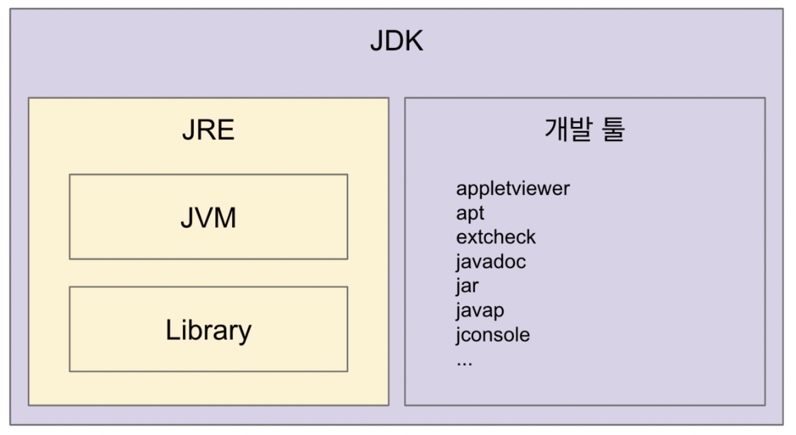
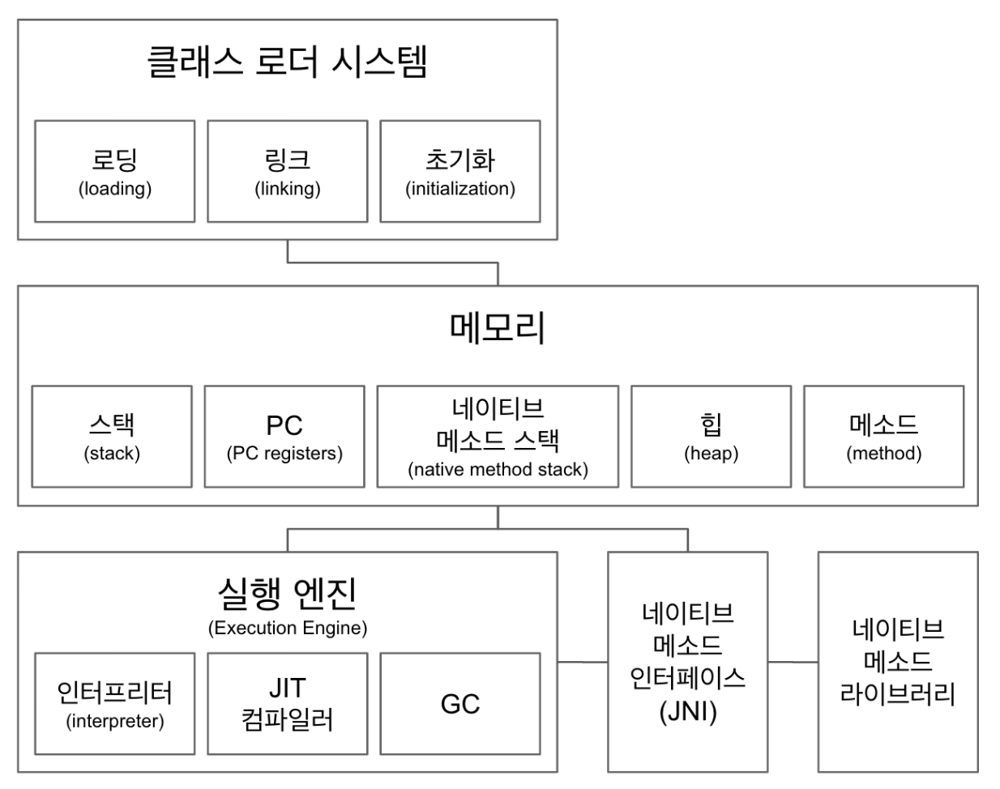
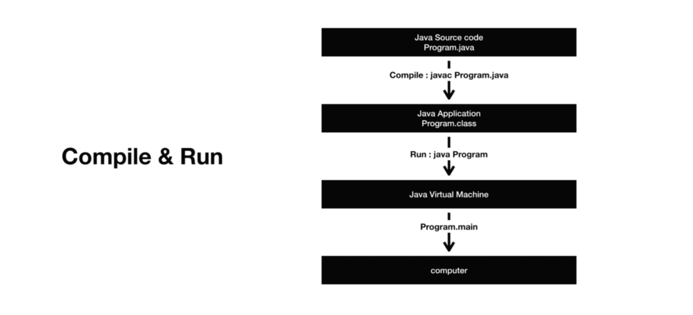

# JVM

### 한문장정리

- jvm이란 자바와 os사이의 중개자역할을 하며 자바 바이트코드를 실행할 수 있는 가상 머신

### 기본 개념 정리

- **JVM (Java Virtual Machine)**
    - `.class` 파일을 OS 에 맞는 machine code 로 변환 (인터프리터 & JIT 컴파일러)
    - 플랫폼(OS) 에 종속적
- **JRE (Java Runtime Environment)**
    - JVM + 핵심 라이브러리
    - 개발 관련 x. 실행 관련 o
    - java 는 보통 JRE 단위로 배포됨
- **JDK (Java Development Kit)**
    - JRE + 개발 툴(java c)
        - javac.exe : 컴파일러
        - java.exe : 인터프리터
        - javap.exe : 역어셈블러
        - javadoc.exe : 자동문서생성기 (소스 파일의 주석을 이용해 문서를 자동생성)
        - jar.exe : 압축 프로그램
    - 자바 11부터는 JDK 단위로 배포됨.
- **Java**
    - 소스 코드(java 언어) 자체는 플랫폼에 독립적
    - javac 에 의해 `.class` 로 만들어 짐.
    - JVM 자체 연관이 타이트하지 않음. (JVM 은 `.class` 만 다루므로...)
        - ex. Kotlin 과 kotlinc 로 `.class` 파일을 만들 수 있음.

### jvm

- 자바 가상 머신(JVM, Java Virtual Machine)이란 자바 바이트 코드를 실행시키기 위한 가상의 기계
- 자바로 작성된 모든 프로그램은 자바 가상 머신에서만 실행될 수 있으므로, 자바 프로그램을 실행하기 위해서는 반드시 자바 가상 머신이 설치되어 있어야 한다.
- 또한, 자바 프로그램은 일반 프로그램보다 자바 가상 머신이라는 한 단계를 더 거쳐야 하므로, 상대적으로 실행 속도가 느리다는 단점을 가지고 있지만 jit 컴파일러에 의해 많이 개선되었다.
- JVM의 역할
    - 자바 애플리케이션을 클래스 로더를 통해 읽어 들여 자바 API와 함께 실행하는 것
    - 자바 애플리케이션과 OS의 중개자 역할
    - 메모리 관리, 가비지 컬렉션 수행
- jvm 구조

    1. 자바 인터프리터(interpreter)

    2. 클래스 로더(class loader)

    3. JIT 컴파일러(Just-In-Time compiler)

    4. 가비지 컬렉터(garbage collector)

### **`.java` 가 프로세스가 되기까지의 과정**

1. 프로그램이 실행되면 JVM은 OS로부터 이 프로그램이 필요로 하는 메모리 할당받는다
2. 자바 컴파일러(javac)가 자바 소스코드(.java)를 읽어들여 자바 바이트코드(.class)로 변환
3. 클래스 로더를 통해 class 파일들을 jvm에 할당
4. 로딩된 클래스 파일들은 execution engine을 통해 해석된다
5. 해석돤 바이트 코드들은 Runtime Data Area에 배치되어 실질적인 수행이 이루어지게 된다.

이러한 실행과정 속에서 필요에 따라 쓰레드 동기화나 GC같은 관리작업을 수행한다.

### **Byte 코드와 Binary 코드의 차이**

- 바이트 코드
    - Byte 코드는 JVM 같은 가상 머신이 이해할 수 있는 코드( = `.class` )
    - 자바 컴파일러에 의해 변환되는 코드의 명령어 크기가 1바이트라서 자바 바이트 코드라고 불리며, 자바 바이트 코드의 확장자는 .class다.
    - 자바 바이트 코드는 자바 가상 머신만 설치되어 있으면, 어떤 운영체제에서라도 실행될 수 있다.
- 바이너리 코드
    - Binary 코드는 CPU 가 이해할 수 있는 코드

### 클래스 로더 시스템

바이트 코드를 읽어오며 메모리에 적절히 배치하는 역할.크게 다음과 같이 나눠서 살펴볼 수 있다.

- **로딩**
    - `.class` 파일을 읽어서 바이트 코드 -> 바이너리 코드로 만들고 **이를 "메소드" 영역에 저장**한다.
    - 저장하는 데이터는 다음과 같다.
        - Fully-Quailified Class Name
            - 클래스 로더, 클래스 패키지 경로, 패키지 이름, 클래스 이름을 모두 포함한 값
            - ex. `java.lang.Character$Subset`
        - 클래스 | 인터페이스 | 이넘 을 구분하여 저장
        - 메소드와 변수
    - 로딩이 끝나면 **해당 클래스 타입의 객체를 생성하여 "힙" 영역에 저장**
    - `BootStrap` -> `Extension` -> `Application` Loader 순으로, 앞의 Loader 가 로딩할 수 없으면 그 다음 Loader 가 읽어내는 식.사실상 `Application` Loader 가 읽어낸다고 함
- **링크**
    - 코드 내부의 레퍼런스를 연결함.
    - Verify
        - `.class` 파일 형식이 유효한지 검사한다.
    - Perpare
        - `static` 변수와 기본 값에 필요한 메모리를 준비한다.
    - Resolve (Optional)
        - 심볼릭 메모리 레퍼런스를 실제 메모리 레퍼런스로 교체한다.
        - Optional 인 이유는, 이 때 교체(binding) 될 수도 있고, 이후 사용이 일어날 때에 동적으로 교체될 수도 있다.
- **초기화**
    - 클래스에 있는 `static` 값들을 초기화 함.

### Runtime Data Area(메모리)

크게 다음과 같이 나눠서 살펴볼 수 있다.**(힙, 메소드)는 전체 공유자원**으로 분류되고, **(스택, PC, 네이티브 메소드 스택)은 쓰레드 단위**의 자원으로 분류된다.

- **메소드(class area = static area)**
    - **클래스 수준**의 정보를 저장
        - 클래스 이름, 부모 클래스 이름, 메소드, 변수 등
        - `static` 변수, 일반 변수 등
- **힙**
    - **객체(인스턴스) 수준**의 정보를 저장
- **스택**
    - 인스턴스 및 지역 변수의 **참조 주소 들을 저장.**
    - 쓰레드마다 런타임 스택을 만들고, 스택 프레임(메소드 call)을 쌓는다.
        - 에러 났을 때, 에러 메시지보면, 런타임 스택에 메시지 쌓여있는걸 확인할 수 있음.
- **PC**
    - 쓰레드마다 가지고 있는 Program Counter.
    - 현재 실행할 부분을 가르키고 있다.
- **네이티브 메소드 스택**
    - 네이티브(native) 메소드 호출할 때 사용하는 별도의 스택
    - 네이티브 메소드는 java 가 아닌 c와 같은 언어(low-level) 로 구현된 메소드임.
        - 대표적인 예시로, `Thread.currentThread()` 임.`public static native Thread currentThread()` 로 선언되어 있음.

### 3) 실행 엔진

- **인터프리터**
    - 바이트 코드를 한줄 한줄 읽어서 네이티브 코드로 변환
- **JIT (Just In Time) 컴파일러**
    - 인터프리터의 단점을 보완하기 위해 도입된 컴파일러
    - 바이트 코드에서 반복되는 코드 부분은 JIT 컴파일러가 미리 네이티브 코드로 변환 시켜놓음.
    - 반복되는 코드가 읽힐 순서가 왔을 때, 인터프리터로 읽지않고 바로 네이티브 코드를 바로 사용한다.
    - 인터프리터 읽을 때의 속도 효율성을 JIT 컴파일러가 보완하는 형태.
- **GC (Garbage Collector)**
    - 더 이상 참조되지 않는 객체를 모아서 메모리 정리를 한다.
    - 경우에 따라 성능 효율을 위해 커스터마이징을 해야함.
    - GC를 수행하는 모듈(쓰레드)가 있다.