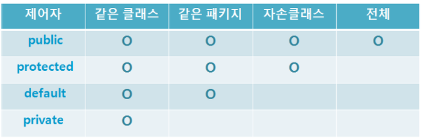

# Access Modifier

### 접근 제어자

- 접근 제어자가 사용될 수 있는 곳 - 클래스, 멤버변수, 메서드, 생성자
- 종류
    - private - 같은 클래스 내에서만 접근이 가능하다
    - protected - 같은 패키지 내에서, 그리고 다른 패키지의 자손클래스에서 접근이 가능하다.
    - default - 같은 패키지 내에서만 접근이 가능하다.
    - public - 접근 제한이 없다.
- 범위가 넓은 쪽에서 좁은 쪽의 순서
    - public > protected > (default) > private
- 사용가능한 접근 제어자
    - 클래스: public, default
    - 메서드, 멤버변수: public, protected, default, private
    - 지역변수: 없음
- cf) 하나의 소스파일에는 public 클래스가 단 하나만 존재할 수 있으며, 소스파일의 이름은 반드시 public 클래스의 이름과 같아야 한다



### 접근 제어자를 이용한 캡슐화

- 접근제어자 사용이유
    1. 외부로부터 데이터를 보호하기 위해서
        - 데이터를 유효한 값을 유지하도록 외부에서 변경하지 못하게
        - data hiding, 객체지향개념의 캡슐화
    2. 외부에는 불필요한, 내부적으로만 사용되는, 부분을 감추기 위해서

```java
public class Time {
		private int hour;
		private int minute;
		private int second;

		public int getHour() { return hour; }
		public void setHour() {
				if(hour < 0 || hour > 23) return;
				this.hour = hour;
		}
}
```

- 만약 상속을 통해 확장될 것이 예상되는 클래스라면 private 대신 protected

### 생성자의 접근 제어자

- 생성자에 접근 제어자를 사용함으로써 인스턴스의 생성을 제한 가능
- 보통 생성자의 접근 제어자는 클래스의 접근 제어자와 같지만 다르게 지정 가능
- 생성자가 private인 클래스는 다른 클래스의 조상이 될 수 없다.
    - 생성자의 접근 제어자가 private이므로 자손클래스에서 호출 불가능
    - 따라서 final을 더 추가하여 상속할 수 없는 클래스라는 것을 알리는 것이 좋다.
- ex) 싱글턴

```java
final class Singleton {
		private static Singleton s = new Sington();
		private Singleton() {}

		public static Singleton getInstance() {
				return s;
		}
}
```

### 제어자의 조합

- 클래스: public, default, final, abstract
- 메서드: 모든 접근 제어자, final, abstract, static
- 멤버변수: 모든 접근 제어자, final, static
- 지역변수: final
- 주의사항
    1. 메서드에 static과 abstract를 함께 사용 불가
        - static 메서드는 몸통이 있는 메서드에만 사용 가능
    2. 클래스에 abstract와 final 동시 사용 불가
    3. abstract 메서드의 접근 제어자가 private일 수 없다.
    4. 메서드에 private와 final을 같이 사용할 필요는 없다.
        - 오버라이딩될 수 없기 때문

## 참고 출처

- [https://github.com/castello/javajungsuk3](https://github.com/castello/javajungsuk3)