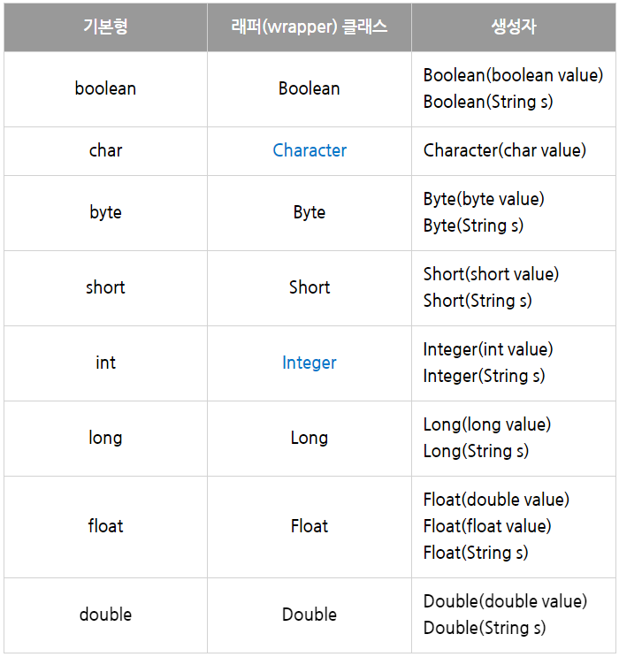
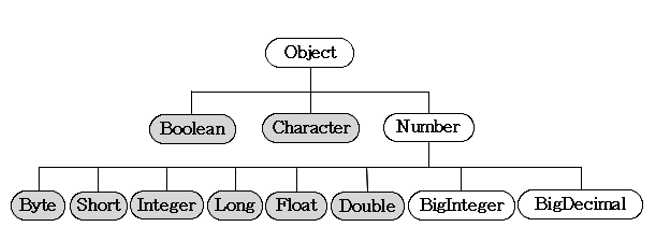

# Wrapper class

### 래퍼(wrapper) 클래스

- 객체지향 개념에서 모든 것은 객체로 다루어져야 하지만 자바에서는 8개의 기본형을 객체로 다루지 않는다
    - 파이썬과 대비, 대신 성능을 얻을 수 있었다.
- 때로는 기본형(primitive type) 변수도 객체로 다뤄야 하는 경우가 있다.
    - ex) 매개변수로 객체를 요구할 때, 기본형 값이 아닌 객체로 저장해야할 때, 객체간의 비교가 필요할 때 등등
    - 이런 경우에는 기본형 값들을 객체로 변환하여 작업을 수행해야 한다.
- 이 때 사용하는 것이 래퍼 클래스이다.
    - 8개의 래퍼클래스, 이 클래스들을 이용하면 기본형 값을 객체로 다룰 수 있다.
    - char, int형을 제외한 나머지는 자료형 이름의 첫 글자를 대문자로 한 것
- 래퍼 클래스의 생성자는 매개변수로 문자열이나 각 자료형의 값들을 인자로 받는다.
    - 문자열로 매개변수를 제공할 때, 자료형에 알맞은 문자열을 사용해야 한다.



```java
class WrapperEx1 {
	public static void main(String[] args) {
		Integer i  = new Integer(100);
		Integer i2 = new Integer(100);

		System.out.println("i==i2 ? "+(i==i2));
		System.out.println("i.equals(i2) ? "+i.equals(i2));
		System.out.println("i.compareTo(i2)="+i.compareTo(i2));
		System.out.println("i.toString()="+i.toString());

		System.out.println("MAX_VALUE="+Integer.MAX_VALUE);
		System.out.println("MIN_VALUE="+Integer.MIN_VALUE);
		System.out.println("SIZE=" +Integer.SIZE+" bits");
		System.out.println("BYTES="+Integer.BYTES+" bytes");
		System.out.println("TYPE=" +Integer.TYPE);
	}
}

실행결과
i==i2 ? false
i.equals(i2) ? true
i.compareTo(i2) = 0
i.toString()=100
MAX_VALUE=2147483647
MIN_VALUE=-2147483648
SIZE=32 bits
BYTE+4 bytes
TYPE=int
```

- 래퍼 클래스들은 모두 equals()가 오버라이딩되어 있어서 주소값이 아닌 객체가 가지고 있는 값을 비교
    - 오토박싱이 된다고 해도 Integer 객체에 비교연산자를 사용 x, 대신 compareTo() 사용
        - 오토박싱: 기본 타입이 래퍼클래스로 자동변환 되는 것
        - 오토언박싱: 반대로 자동 변환하는 것
- toString()도 오버라이딩 되어있다.
- 또 래퍼클래스들은  MAX_VALUE, MIN_VALUE, SIZE, BYTES, TYPE 등의 static 상수를 공통적으로 가지고 있다.

### Number 클래스

- 이 클래스는 추상클래스로 내부적으로 숫자를 멤버변수로 갖는 래퍼 클래스들의 조상이다.
- 기본형 중에서 숫자와 관련된 래퍼 클래스들은 모두 Number 클래스의 자손이다.



- BigInteger은 long으로도 다룰 수 없는 큰 범우의 정수를
- BigDecimal은 double로도 다룰 수 없는 큰 범위의 부동 소수점수를 처리하기 위한 것으로 연산자의 역할을 대신하는 다양한 메서드를 제공한다.

### 문자열을 숫자로 변환하기

- 문자열을 숫자로 변환하는 다양한 방법

    ```java
    int i = new Integer("100").intValue(); // floatValue(), longValue()..
    int i2 = Integer.parseInt("100");      // 주로 사용 방법
    Integer i3 = Integer.valueOf("100");
    ```

- 타입.parse타입(String s) 형식의 메서드는 기본형 반환
- 타입.valueOf() 메서드는 래퍼 클래스 타입 반환
- jdk 1.5부터 도입된 오토방식 기능 때문에 반환값이 기본형일 때와 래퍼 클래스일 때의 차이가 없어졌다.
    - valueOf()가 조금 더 느리다
- 문자열이 10진수가 아닌 다른 진법의 숫자일 때도 변환이 가능하다.

    ```java
    static int parseInt(String s, int radix) // 문자열 s를 radix 진법으로 인식
    static Integer valueOf(String s, int radix)
    ```

- exmaple

    ```java
    class WrapperEx2 {
    	public static void main(String[] args) {
    		int		 i  = new Integer("100").intValue();
    		int		 i2 = Integer.parseInt("100");
    		Integer  i3 = Integer.valueOf("100");

    		int i4 = Integer.parseInt("100",2);
    		int i5 = Integer.parseInt("100",8);
    		int i6 = Integer.parseInt("100",16);
    		int i7 = Integer.parseInt("FF", 16);
    //	int i8 = Integer.parseInt("FF");  // NumberFormatException 발생

    		Integer i9 = Integer.valueOf("100",2);
    		Integer i10 = Integer.valueOf("100",8);
    		Integer i11 = Integer.valueOf("100",16);
    		Integer i12 = Integer.valueOf("FF",16);
    //  Integer i13 = Integer.valueOf("FF"); // NumberFormatException 발생

    		System.out.println(i);
    		System.out.println(i2);
    		System.out.println(i3);
    		System.out.println("100(2) -> "+i4);
    		System.out.println("100(8) -> "+i5);
    		System.out.println("100(16)-> "+i6);
    		System.out.println("FF(16) -> "+i7);

    		System.out.println("100(2) -> "+i9);
    		System.out.println("100(8) -> "+i10);
    		System.out.println("100(16)-> "+i11);
    		System.out.println("FF(16) -> "+i12);
    	}
    }

    실행결과
    100
    100
    100
    100(2) -> 4
    100(8) -> 64
    100(16) -> 256
    FF(16) -> 255
    100(2) -> 4
    100(8) -> 64
    100(16) -> 256
    FF(16) -> 255
    ```

### 오토박싱 & 언박싱

- jdk 1.5 이전에는 기본형과 참조형 간의 연산이 불가능했기 때문에, 래퍼 클래스로 기본형을 객체로 만들어서 연산해야 했다.

    ```java
    컴파일 전의 코드

    int i = 5;
    Integer iObj = new Integer(7);
    int sum = i + iObj;  // error, jdk 1.5이전
    ```

- 그러나 이제는 가능하다. 컴파일러가 자동으로 변환하는 코드를 넣어주기 때문이다.

    ```java
    컴파일 후의 코드

    int i = 5;
    Integer iObj = new Integer(7);
    int sum = i + iObj.intValue();  // error, jdk 1.5이전
    ```

- 이 외에도 내부적으로 객체 배열을 가지고 있는 Vector 클래스나 ArrayList 클래스에 기본형 값을 저장해야할 때나 형변환이 필요할 때도 컴파일러가 자동으로 코드를 추가해 준다.
    - 기본형 값 → 래퍼 클래스의 객체로 자동변환 : 오토박싱
    - 반대 변환: 언박싱

    ```java
    ArrayList<Integer> list = new ArrayList<Integer>();
    list.add(10);  // 오토박싱, 10 -> new Integer(10)

    int value = list.get(0); // 언박싱, new Integer(10) -> 10
    ```

- example

    ```java
    class WrapperEx3 {
    	public static void main(String[] args) {
    		int i = 10;

            // 기본형을 참조형으로 형변환(형변환 생략가능)
    		Integer intg = (Integer)i; // Integer intg = Integer.valueOf(i);
    		Object   obj = (Object)i;  // Object obj = (Object)Integer.valueOf(i);

    		Long     lng = 100L;  // Long lng = new Long(100L);

    		int i2 = intg + 10;   // 참조형과 기본형간의 연산 가능
    		long l = intg + lng;  // 참조형 간의 덧셈도 가능

    		Integer intg2 = new Integer(20);
    		int i3 = (int)intg2;  // 참조형을 기본형으로 형변환도 가능(형변환 생략가능)

    		Integer intg3 = intg2 + i3; 

    		System.out.println("i     ="+i);
    		System.out.println("intg  ="+intg);
    		System.out.println("obj   ="+obj);
    		System.out.println("lng   ="+lng);
    		System.out.println("intg + 10  ="+i2);
    		System.out.println("intg + lng ="+l);
    		System.out.println("intg2 ="+intg2);
    		System.out.println("i3    ="+i3);
    		System.out.println("intg2 + i3 ="+intg3);
    	}
    }

    실행결과
    i = 10
    intg = 10
    obj = 10
    lng = 10
    intg + 10 = 20
    intg + lng = 110
    intg2 = 20
    i3 = 20
    intg2 + i3 = 40
    ```

    ```java
    컴파일러가 자동 코드 변경

    Integer intg = (Integer)i; -> Integer intg = Integer.valueOf(i);
    Object obj = (Object)i; -> Object obj = (Object)Intger.valueOf(i);
    Long lng = 100L; -> Long lng = new Long(100L);
    ```

## 참고 출처

- [https://github.com/castello/javajungsuk3](https://github.com/castello/javajungsuk3)