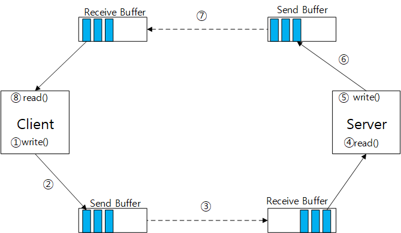
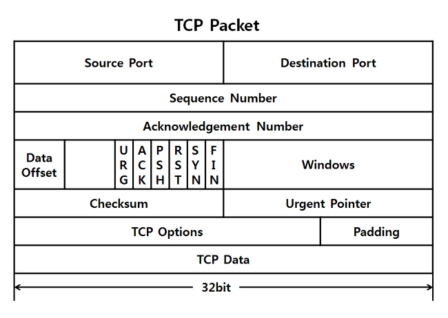

# TCP

### TCP 연결

- TCP는 애플리케이션 프로세스가 데이터를 다른 프로세스에게 보내기 전에, 두 프로세스가 서로 핸드셰이크를 먼저 해야 하므로 연결지향형(connection-oriented)이다.
    - 즉 데이터 전송을 보장하는 파라미터들을 각자 설정하기 위한 사전 세그먼트들을 보내야 한다
- TCP 프로토콜은 오직 종단 시스템에서만 동작하고 중간의 네트워크 요소(라우터와 브리지)에서는 동작하지 않으므로, 중간의 네트워크 요소들은 TCP 연결 상태를 유지하지 않는다. (감지 x)
- TCP 연결은 **전이중(full-duplex)** 서비스를 제공한다.
    - 만약 한 호스트 A의 프로세스와 다른 호스트 B의 프로세스 사이의 TCP 연결이 있다면, 애플리케이션 계층 데이터는 **B에서 A로 흐르는 동시에 A에서 B**로 흐를 수 있다.
- 항상 단일 송신자와 단일 수신자 사이의 점대점(point-to-point)
    - 단일 송신 동작으로 여러 수신자에게 데이터를 전송하는 멀티캐스팅은 불가능
- python example

    ```python
    clientSocket.connect((serverName, serverPort))
    ```

    1. 클라이언트의 트랜스포트 계층은 서버의 TCP와의 TCP 연결 설정 진행(특별한 세그먼트 전송)
    2. 서버는 두 번째 특별한 TCP 세그먼트로 응답
    3. 마지막으로 클라이언트가 세 번째 특별한 세그먼트로 다시 응답

    >> 처음 2개의 세그먼트에는 페이로드, 즉 애플리케이션 계층 데이터가 없다

    >> 총 3개의 세그먼트가 보내지므로, **3-way-handshake**라 부른다

- 연결이 진행되면 클라이언트 TCP는 세 방향 핸드셰이크 동안 준비된 버퍼의 하나인 연결의 송신 버퍼(send buffer)로 데이터를 보낸다
    - 세그먼트의 크기는 최대 세그먼트 크기(MSS)로 제한되며 MSS는 일반적으로 로컬 송신 호스트에 의해 전송될 수 있는 가장 큰 링크 계층 프레임의 길이(MTU)에 의해 일단 결정되고, 그런 후에 TCP 세그먼트와 TCP/IP 헤더 길이가 단일 링크 계층 프레임에 딱 맞도록 하여 정해진다.
- TCP는 TCP 헤더와 클라이언트 데이터를 하나로 만들어 TCP 세그먼트를 형성한다
- 세그먼트는 네트워크 계층에 전달되며, 네트워크 계층 IP 데이터그램 안에 각각 캡슐화 된다.
- TCP가 상대에게서 세그먼트를 수신했을 때, 세그먼트의 데이터는 TCP 연결의 수신 버퍼에 위치한다.



    ### TCP 세그먼트 구조

    - 헤더 필드와 데이터 필드로 구성
    - 데이터 필드는 한 줌의 애플리케이션 데이터를 담는다
        - MSS는 세그먼트 데이터 필드의 크기 제한
        - but 대화식 애플리케이션은 MSS보다 작은 데이터 덩어리를 전송
    - TCP 헤더는 일반적으로 20바이트
        - UDP 처럼 다중화와 역다중화에서 사용하는 **출발지 주소, 목적지 포트번호, 체크섬** 포함
        - **32비트 순서번호 필드**: 신뢰적인 데이터 전송 서비스 구현에서 TCP 송신,수신자에 의해 사용
        - 16비트 수신 윈도우: 흐름제어에 사용, 수신자가 받아들이려는 바이트의 크기
        - 4비트 헤더 길이: TCP 헤더의 길이
        - 옵션: 선택적이고 가변적인 길이, MSS 협상 및 고속 네트워크에서 사용하기 위한 요소
        - 플래그: 6비트 포함
            - **ACK 비트**: 확인응답 필드에 있는 값이 유용함을 가리키는데 사용
            - CWR과 ECE 비트: 명시적 혼합표시에서 사용
            - RST, SYN, FIN 비트: 연결 설정과 해제에 사용
            - PSH 비트: 수신자가 데이터를 상위 계층에 즉시 전달해야 한다는 것을 가리킨다
            - URG 비트: 송신 측 상위 계층 개체가 긴급으로 표시 하는 데이터를 가리킨다
        - 긴급 데이터 포인터 필드: 긴급 데이터의 마지막 바이트의 위치



    ### 순서번호와 확인응답 번호

    - TCP의 신뢰적인 데이터 전송 서비스의 중대한 부분
    - TCP는 데이터를 구조화되어 있지 않고, 단지 순서대로 정렬된 바이트 스트림으로 본다.
    - 순서번호
        - 따라서 **세그먼트에 대한 순서번호**는 **세그먼트에 있는 첫 번째 바이트의 바이트 스트림 번호**이다.
        - 실제로 시작 순서 번호는 **임의로** 선택한다
            - why? 두 호스트간의 나중연결 or 이전 연결과 같은 포트 번호 사용 같은 경우 유효한 세그먼트로 오인될 확률을 최소화 하기 위해
    - 확인응답 번호
        - 송신 호스트가 세그먼트의 삽입하는 확인응답 번호는 송신호스트가 수신 호스트로부터 기대하는 다음 바이트의 순서번호이다.
        - 전이중 방식임을 상기
        - ex) 호스트 a가 호스트 b로 부터 0~535의 바이트를 포함하는 세그먼트와 900~1000의 바이트를  포함하는 세그먼트를 수신했다고 가정
            - 그러므로 b에 대한 a의 다음 세그먼트는 확인응답 번호 필드에 536
        - 즉 TCP는 첫 번째 잃어버린 바이트까지의 바이트들까지만 확인 응답하기 때문에 TCP는 누적 확인응답(cummulative acknowledgement)를 제공한다고 한다.

        ### TODO: 왕복시간(RTT) 예측과 타임아웃

        ### 신뢰적인 데이터 전달