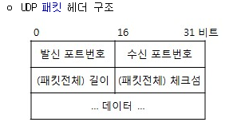

# UDP

### 개요

- UDP는 애플리케이션 프로세스로부터 메시지를 가져와서 다중화/역다중화 서비스에 대한 **출발지 포트 번호 필드**와 **목적지 포트 번호 필드**를 첨부하고 다른 두 필드들을 추가한 후에 최종 세그먼트를 네트워크 계층으로 넘겨준다
- 네트워크 계층은 트랜스포트 계층 세그먼트를 ip 데이터그램으로 캡슐화하고, 세그먼트를 수신 호스트에서 최선형 전달 서비스로 전달한다.
- 세그먼트가 수신 호스트에 도착한다면, UDP는 세그먼트의 데이터를 해당하는 애플리케이션 프로세스로 전달하기 위해서 **목적지 포트 번호**를 사용한다.
- DNS: UDP를 사용하는 애플리케이션 계층 프로토콜의 예

### UDP로 개발하는 이유

- 무슨 데이터를 언제 보낼지에 대해 애플리케이션 레벨에서 더 정교한 제어
    - UDP는 데이터를 UDP 세그먼트로 만들고, 즉시 그 세그먼트를 네트워크 계층으로 전달
    - TCP는 혼잡제어 메커니즘을 갖고있어서 어렵다
- 연결 설정이 없다
    - 따라서 연결을 설정하기 위한 어떤 지연도 없다, DNS를 UDP로 하는 이유
    - TCP는 3-way-handshake
- 연결 상태가 없다
    - 따라서 일반적으로 특정 애플리케이션에 할당된 서버는 애플리케이션이 UDP에서 동작할 때 좀 더 많은 클라이언트를 수용할 수 있다.
    - TCP는 종단 시스템에서 연결 상태를 유지한다
- 작은 패킷 헤더 오버헤드
    - TCP는 20바이트, UDP는 8바이트

### UDP 세그먼트 구조

- 2바이트씩 구성된 4개의 필드
- 체크섬: 세그먼트 오류 검사를 위해 수신 호스트에 의해서 사용
- 길이: 헤더를 포함하는 UDP 세그먼트의 길이(바이트 단위)를 나타낸다

