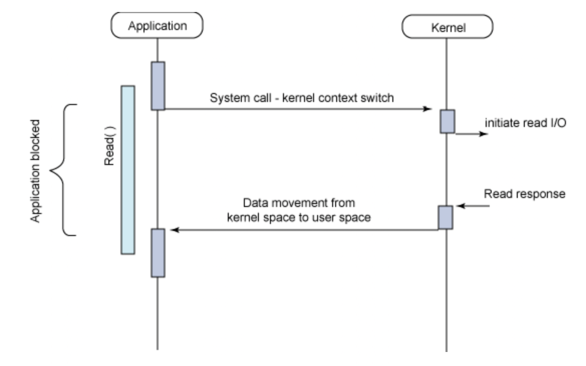
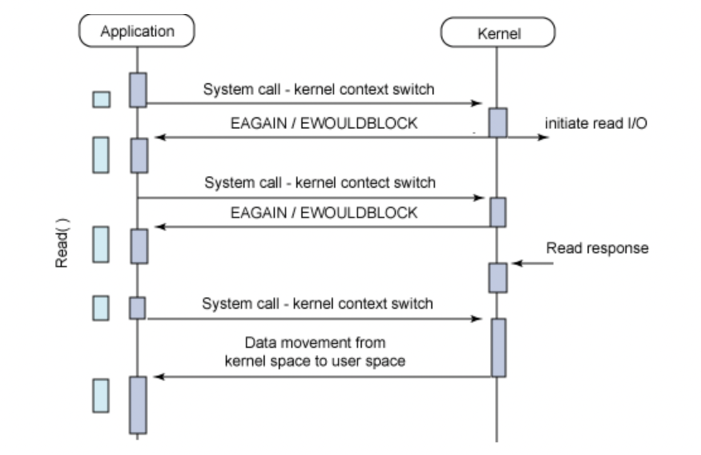
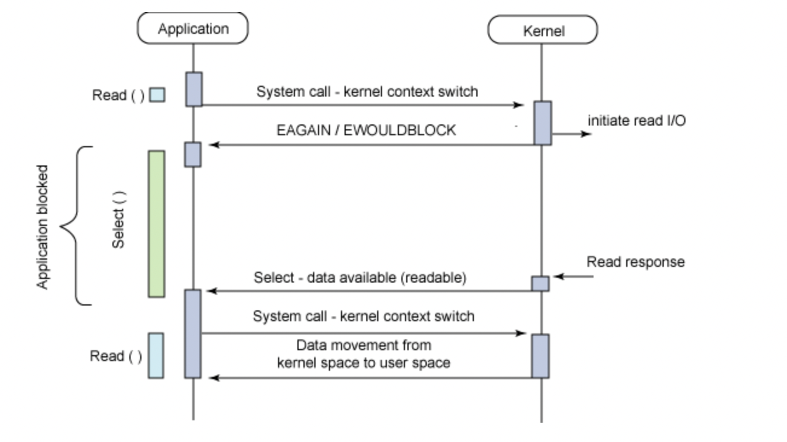
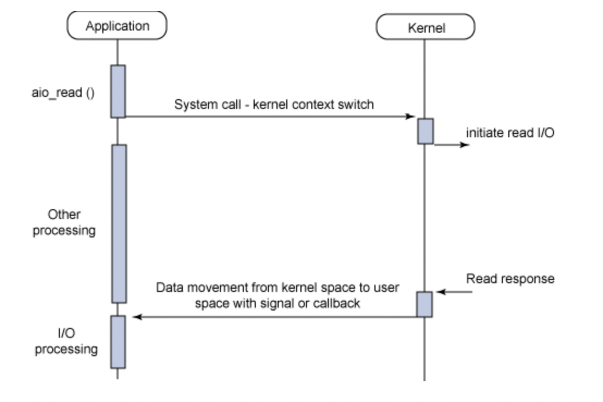
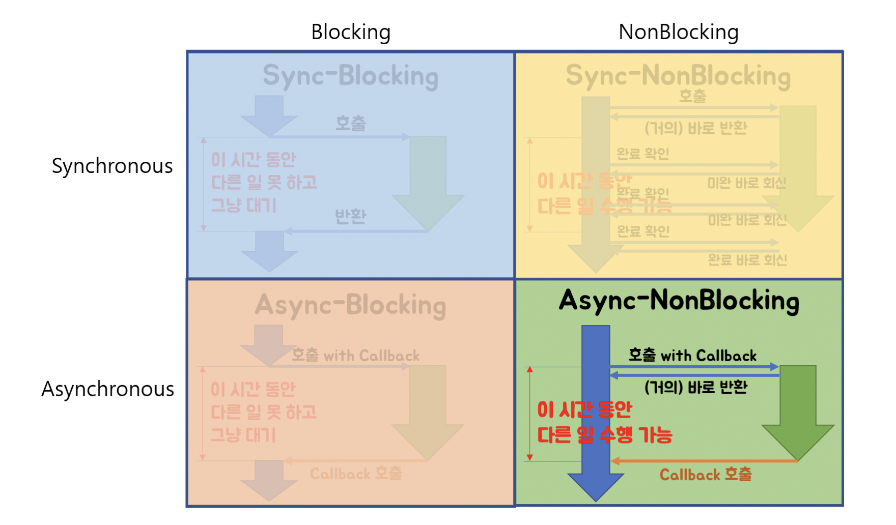

# blocking & Non blocking IO

### **sync blocking IO :**

- 시스템 콜이 들어오면, 커널은 IO 작업이 **완료되기전에는 응답을 하지않는다.**
- 즉 IO 작업이 완료되기전에는 제어권을 커널이 갖고있는다
- 그렇기에 시스템 콜을 보낸후에, 유저 프로세스는 응답을 받기 전에는 block이 되어 다른 작업을 하지못한다. 즉 **IO 작업이 완료되기 전에는 다른 작업을 수행하지 못한다.**

### **sync non-blocking IO :**

- 시스템 콜이 들어오면, 커널은 IO 작업의 완료 여부와는 무관하게 **즉시 응답을 해준다.** (완료 되지않았다면 에러코드를 응답함.)
- 이는 커널이 시스템 콜을 받자마자 제어권을 다시 유저 프로세스에게 넘겨 준다는 것이기에, **유저 프로세스는 IO 가 완료 되기 전에도 다른 작업을 할수있는 것이다.**
- 유저 프로세스는 다른 작업들을 수행하다가 중간 중간에 시스템 콜을 보내서 IO가 완료되었는지 커널에게 물어보게된다.

### **async blocking IO (이 ibm에서의 분류에 오류가 있다는 의견도 있다):**

- 이 모델에서는 IO는 non-blocking이지만, 통지(notification)는 blocking 방식으로 하도록 되어있다.
- select() 는 유저 프로세스를 block 한다.
- select() 는 데이터가 사용이 가능해지면, 통지를 받게됨. 통지를 받으면 block을 품

### **async non-blocking IO:**

- 시스템 콜이 들어오면, 커널은 IO 작업의 완료 여부와는 무관하게 **즉시 응답을 해준다.**
- **유저 프로세스는 IO 가 완료 되기 전에도 다른 작업을 할수있는 것이다.**
- IO 처리는 백그라운드에서 실행되다가, **완료되면 커널이 유저 프로세스에게 알려줌**.
    - 이는 sync non-blocking IO와의 차별점이라고 볼수있다.
    - sync nonblocking IO는 유저 프로세스가 IO 완료 여부를 커널에게 계속 물어봐야 했지만,
    - async non-blocking IO는 IO 완료가 되면 그때 커널이 유저프로세스에게 알려주는 방식이므로

### **[#](https://limdongjin.github.io/concepts/blocking-non-blocking-io.html#ibm-%E1%84%8B%E1%85%A1%E1%84%90%E1%85%B5%E1%84%8F%E1%85%B3%E1%86%AF%E1%84%8B%E1%85%A6-%E1%84%80%E1%85%B5%E1%84%87%E1%85%A1%E1%86%AB%E1%84%92%E1%85%A1%E1%86%AB-%E1%84%87%E1%85%AE%E1%86%AB%E1%84%85%E1%85%B2)IBM 아티클에 기반한 분류**

IBM 아티클에서는 blocking, non-blocking, sync, async 의 차이를 명시하지는 않았지만, 아티클의 내용에 따라서 분류해보자면 다음과 같을것 같다.

**TIP**

- blocking: 작업을 요청하면 일단 요청한 쪽은 일단 block이 되고, **작업이 완료가 된후에 응답을 받을수 있음**. 그렇기에 완료가 되기 전에는 요청한 쪽은 block이 되어 다른 작업을 수행하지 못함.
- non-blocking: **작업을 요청하면, 즉시 응답이 돌아옴**
- 동기(sync): **작업을 요청한 측**에서 작업의 **완료 여부를 체크**함.
- 비동기(async): **작업을 요청 받은 측**에서 작업의 **완료 여부를 알려줌**

## **운영체제 교재에 기반한 분류**

Operating System Concepts 라는 운영체제 교재(흔히 공룡책이라고 부르는 교재)에서도 blocking, non-blocking, async, sync의 차이를 설명하고있다.

**TIP**

- blocking: **wait queue 에 들어가고**, **시스템 콜이 완료된 후에 응답을 보냄.**
- non-blocking: **wait queue 에 들어가지 않고**, **즉시 리턴함. (응답 또는 에러코드)**
- 동기(sync): **wait queue 에 머무는게 필수가 아니고**, **시스템 콜의 완료를 기다림.**
- 비동기(async): **즉시 리턴**하고, **시스템콜의 완료을 기다리지않음**.

## **특정 블로그 자료에 따른 분류**

아래 사진은 homeoefficio 님의 자료중 일부이며, 사진을 포함한 일부 내용들은 크리에이티브 커먼즈 저작자표시-비영리-동일조건변경허락 4.0 국제 라이선스 에 의하여 인용한다.

### **`blocking` vs `non-blocking`**

**TIP**

- blocking/non-blocking은 **호출되는 함수가 바로 리턴하느냐 마느냐**가 관심사이다.
- blocking: 바로 리턴 하지 않는다.
- non-blocking: 바로 리턴 한다.

### **`sync` vs `async`**

**TIP**

- sync/async는 **호출되는 함수의 작업 완료 여부를 누가 신경쓰냐**가 관심사
- 동기(sync): 호출되는 함수의 작업 완료 여부를, **호출 하는 함수**가 신경씀.
- 비동기(async): 호출되는 함수의 작업 완료 여부를, **호출 되는 함수**가 신경씀.

### **`non-blcoking` vs `async`**

- 비동기와 non-blocking은 비교 대상이 되기 어려움. 왜냐하면 각 개념이 바라보는 관점이 다르기때문.