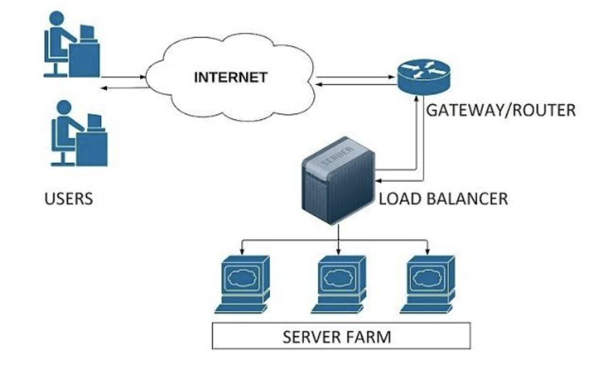
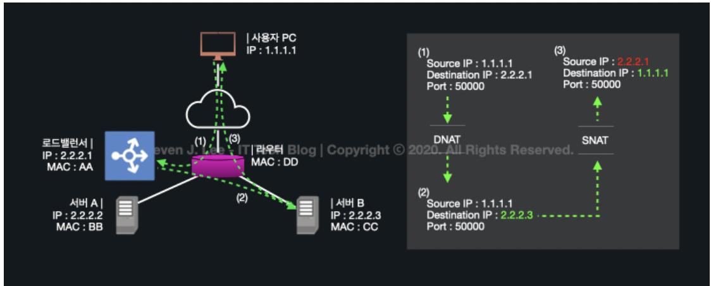
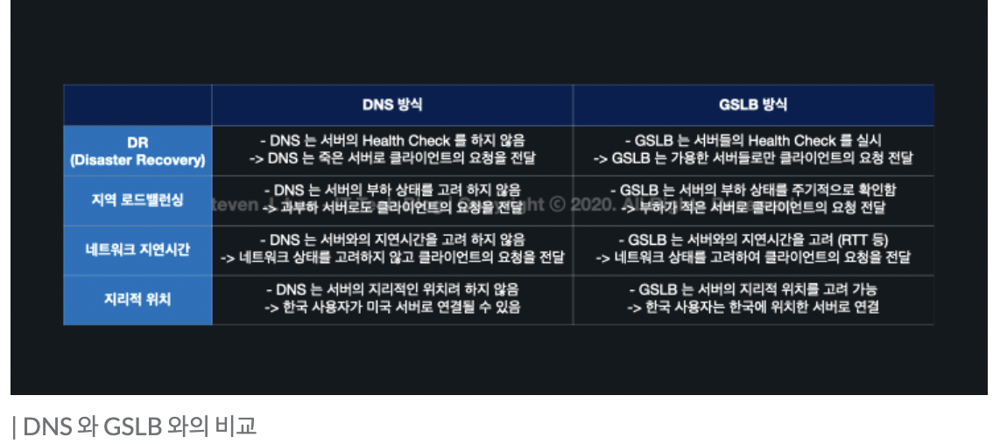
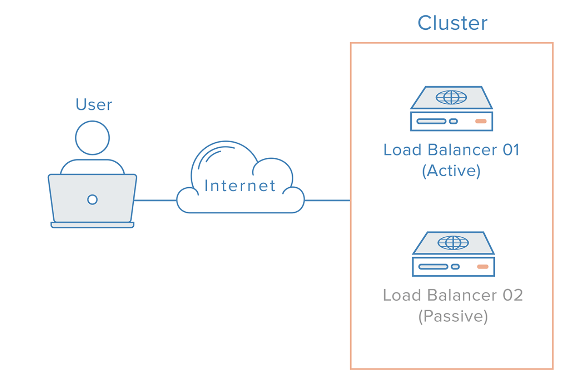

# 로드밸런싱

### 로드밸런싱이란

- 네트워크 또는 서버에 가해지는 부하를 분산해주는 기술
- 로드밸런싱 기술을 제공하는 서비스 또는 장치(로드밸런서)는 클라이언트와 네트워크 트래픽이 집중되는 서버들 또는 네트워크 허브 사이에 위치
- 스케일 아웃 방법?
    - Scale-up : Server가 더 빠르게 동작하기 위해 하드웨어의 성능을 올리는 방법.
    - Scale-out : 하나의 Server보다는 여러 대의 Server가 나눠서 일을 하는 방법.
- Scale-out의 장점
    - 하드웨어 향상하는 비용보다 서버 한대 추가 비용이 더 적습니다.
    - 여러 대의 Server 덕분에 무중단 서비스를 제공할 수 있습니다.

### 기본 동작 방식

- 대부분 아래와 같은 절차로 동작
- 절차
    1. 클라이언트의 브라우저에서 도메인 입력
    2. 클라이언트에 설정된 메인 dns 서버로 도메인의 ip 주소 문의
    3. 메인 dns 서버는 주소를 관리하는 별도의 dns 서버에 ip 주소 문의
    4. 별도 관리 dns 서버는 로드밸런서의 ip(virtual ip) 주소를 메인 dns 서버에게 알려줌
    5. 메인 dns 서버는 획득한 vip 주소로 http 요청
    6. 로드밸런서는 별도 로드밸런싱 방법을 통하여 서버에게 요청 전송
    7. 서버의 작업 결과를 받은 로드밸런서는 전달받은 http 결과를 클라이언트에게 전송

### 로드밸런서의 기본 기능

- health check
    - 서버들에 대한 주기적힌 health check를 통해 서버들의 장애 여부 판단 가능
    - 이로 인해 로드밸런서가 있을 때 서버 몇 대에 이상이 생기더라도 다른 정상 동작중인 서버로 트래픽을 보내주는 fail-over가 가능하며, 또한 TCP, UDP 분석이 가능하기 때문에 firewall의 역할도 수행 가능
    - L3 체크: ICMP를 이용하여 서버의 ip주소가 통신 가능한 상태인지 확인
    - L4 체크: TCP는 3way-handshaking을 기반으로 통신, 이러한 특성을 바탕으로 각 포트 상태를 체크
    - L7 체크: 어플리케이션 계층에서 체크, 즉 실제 웹 페이지에 통신을 시도하여 이상 유무 파악
- Tunneling
    - 인터넷상에서 눈에 보이지 않는 통로를 만들어 통신할 수 있게 하는 개념
    - 데이터를 캡슐화해서 연결된 상호 간에만 캡슐화된 패킷을 구별해 캡슐화를 해제할 수 있습니다.
- DSR(Dynamic Source Routing protocol)
    - 로드 밸런서 사용 시 서버에서 클라이언트로 되돌아가는 경우 목적지 주소를 스위치의 IP 주소가 아닌 클라이언트의 IP 주소로 전달해서 네트워크 스위치를 거치지 않고 바로 클라이언트를 찾아가는 개념입니다.
- NAT(Network Address Translation)
    - 사설 IP 주소를 공인 IP 주소로 바꾸는 데 사용하는 통신망의 주소 변조기입니다.
    - 예를 들어, 내부 네트워크에서 사용하던 사설 ip주소를 로드밸런서의 외부의 공인 ip 주소로 변경, 반대도 가능
        - 이렇게 하면 부족한 공인 ip 주소를 효율적으로 사용할 수 있지만, 로드밸런싱 관점에서는 여러개의 호스트가 하나의 공인 ip주소(vip)를 통해 접속하는 것이 주목적
    - SNAT(Source Network Address Translation)
        - 내부에서 외부로 트래픽이 나가는 경우, 내부 사설 ip주소를 외부의 공인 ip 주소로 변환하는 방식,
        - 공유기
    - DNAT(Destination Network Address Translation)
        - 외부에서 내부로 트래픽이 들어오는 경우, 외부 공인 ip주소를 내부의 사설 ip주소로 변환하는 방식
        - 로드밸런서

### 로드밸런싱 종류와 방법

### **L2**

- Mac주소를 바탕으로 Load Balancing합니다.

### **L3**

- IP주소를 바탕으로 Load Balancing합니다.

### **L4**

- 네트워크 계층(ex, ip) Transport Layer Level(TCP, UDP)의 정보를 바탕으로 로드를 분산
    - 즉 ip주소나 포트번호, mac 주소, 전송 프로토콜 등에 따라 트래픽을 나누고 분산처리 가능
- 방법
    - 라운드 로빈 기반 : 세션을 각 서버에 순차적으로 맺어주는 방식, 단순히 순서에 따라 세션을 할당하므로 경우에 따라 경로별로 같은 처리량이 보장 x
    - 최소 연결(Least connection) 기반 : 가장 적은 세션을 가진 서버로 트래픽을 보내는 방식 (가장 많이 사용)
    - 응답 시간 기반 : 가장 빠른 응답 시간을 보내는 서버로 트래픽을 우선 보내주는 방식, 서버별 스펙이 다를경우 적합
    - 해시 기반 : 특정 클라이언트는 특정 서버로만 할당시키는 방식, 예를 들어 특정 ip주소 혹은 포트의 클라이언트들은 특정 서버로만 세션이 맺어지도록 한다. 경로가 보장되며 접속자 수가 많을 수록 분산 및 효율이 높다.
    - 대역폭 기반: 서버들과의 대역폭을 고려하여 트래픽을 분산

### **L7**

