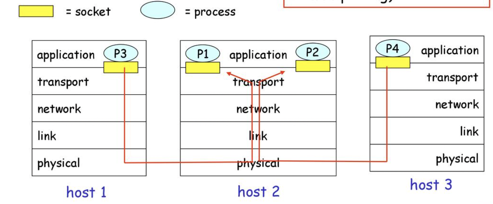
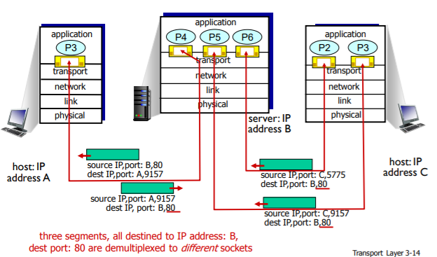

# 다중화와 역다중화

### 개요

1. 목적지 호스트에서의 트랜스 포트 계층은 바로 아래의 네트워크 계층으로부터 세그먼트를 수신
2. 트랜스포트 계층은 호스트에서 동작하는 해당 애플리케이션 프로세스에게 이 세그먼트의 데이터를 전달하는 의무를 가진다
    - 트랜스포트 계층은 실제로 데이터를 직접 프로세스로 전달 x, 중간 매개자인 소켓에게 전달
    - 각각의 소켓은 어떤 하나의 유일한 식별자를 가진다 (TCP 소켓인지 UDP 소켓인지에 따라 다름)
3. 트랜스포트 계층 세그먼트는 적절한 소켓으로 향하게 하도록 하기 위해 세그먼트에 필드 집합을 가지고 있다.
4. 수신측의 트랜스포트 계층은 수신 소켓을 식별하기 위해 이들 필드를 검사하고 해당 소켓으로 보낸다



### 비연결형(UDP) 다중화와 역다중화

- 역다중화(demultiplexing)
    - 세그먼트의 데이터를 올바른 소켓으로 전달하는 작업
- 다중화(multiplexing)
    - 출발지 호스트에서 소켓으로부터 데이터를 모으고, 이에 대한 세그먼트를 생성하기 위해서 각 데이터에 헤더 정보로 캡슐화하고, 해당 세그먼트들을 네트워크 계층으로 전달하는 작업
- 이를 위한 두가지 요구사항
    1. 소켓은 유일한 식별자를 가진다.
    2. 각 세그먼트는 세그먼트가 전달될 적절한 소켓을 가리키는 특별한 필드를 가진다.
        - 출발지 포트 번호 필드(source port number field)
            - 복귀 주소의 한 부분으로 사용됨
            - 완전한 복귀 주소는 출발지의 ip주소와 a의 출발지 포트 번호
        - 목적지 포트 번호 필드(destination port number field)

```python
// UDP 소켓 생성, 트랜스포트 계층은 포트 번호를 소켓에게 자동으로 할당
clientSocket = socket(AF_INET, SOCK_DGRAM)

// 따라서 사용하지 않는 1024~65535 사이의 포트 번호 할당
clientSocket.bind(('', 19157))

```

### 연결지향형 다중화와 역다중화

- 차이점: TCP 소켓은 4개 요소들의 집합에 의해 식별된다.
    - (출발지 ip주소, 출발지 포트번호, 목적지 ip 주소, 목적지 포트 번호)
    - 따라서 출발지 주소 또는 다른 출발지 포트 번호를 가지고 도착하는 2개의 TCP 세그먼트는 2개의 다른 소켓으로 향하게 된다.
- python example
    - TCP 서버 애플리케이션이 가지는 소켓은 포트번호 12000을 가진 TCP 클라이언트로부터 연결 설정 요청을 기다린다
    - TCP 클라이언트는 소켓을 생성하고 연결 설정 요구 세그먼트를 보낸다.

        ```python
        clientSocket = socket(AF_INET, SOCK_STREAM)
        clientSocket.connect((serverName, 12000)) 
        ```

    - 연결 설정 요청은 목적지 포트 번호 12000과 TCP 헤더에 설정된 특별한 연결 설정 비트를 가진 TCP 세그먼트에 지나지 않는다. 또한 그 세그먼트는 출발지 포트 번호를 포함하는데, 이 출발지 포트 번호는 클라이언트에 의해서 선택된 번호이다.
    - 서버 프로세스로 동작하는 컴퓨터의 호스트 운영체제가 목적지 포트 12000을 포함하는 연결 요청 세그먼트를 수신하면, 포트 번호 12000상에서 연결을 기다리고 있는 서버 프로세스를 찾는다. 그러면 그 서버는 새로운 소켓을 생성한다

        ```python
        connectionSocket, addr = serverSocket.accept()
        ```

    - 또한 서버는연결요청 세그먼트의 4가지 값을 주목한다
        1. 세그먼트 안의 출발지 포트번호
        2. 출발지 호스트의 ip 주소
        3. 세그먼트 안의 목적지 포트번호
        4. 목적지 ip주소
        - 새롭게 생성된 연결 소켓은 이들 4가지 값에 의해서 식별되며 다음에 도착하는 모든 세그먼트의 4가지 값과 일치하면, 세그먼트는 이 소켓으로 역다중화될 것이다.


