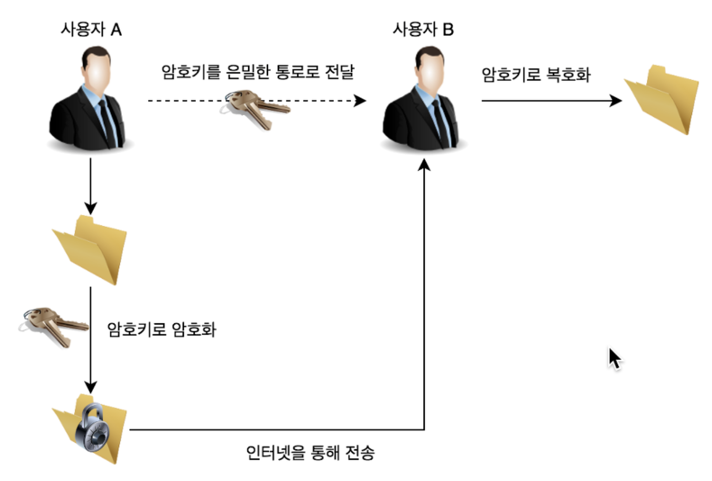
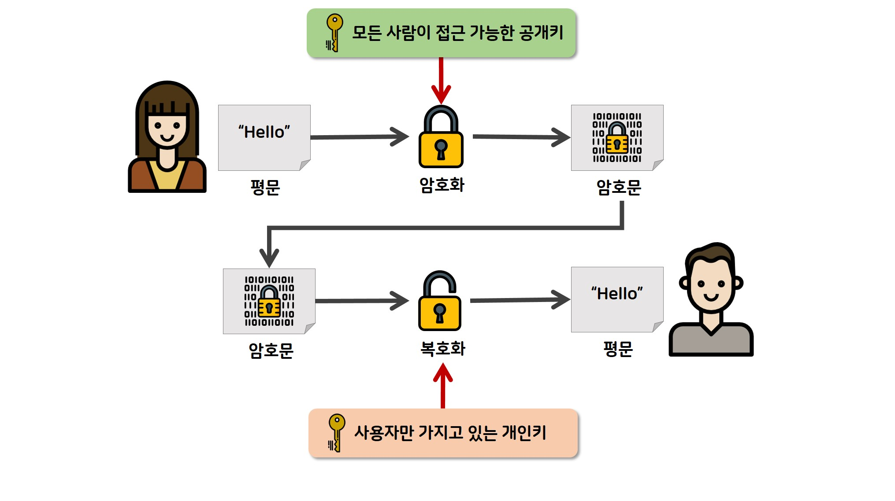

# 공개키&대칭키

### **대칭키(Symmetric Key) 암호**

- 암호화에 사용되는 키와 복호화에 사용되는 키가 동일한 암호화 기법이다.
- **키 전달 및 관리에 어려움이 있지만, 대칭키 암호화 방식은 암호화 연산 속도가 빠르기 때문에 효율적인 암호 시스템을 구축할 수 있다는 장점이 있다.**
- 하지만 대칭키 암호 방식으로 암호화한 정보를 누군가에게 보낼 때, 암호키도 함께 보내야 한다. 암호키 자체는 암호화가 되지 않은 평문으로 분실하거나 타인에게 노출되면 보안에 매우 취약할 수 있다.
- 블록 암호화, 스트림 암호화가 있다.

### **공개키(Public Key) 암호**

- 암호화와 복호화에 사용하는 암호키를 분리한 알고리즘
- 대칭키 암호화 방식의 키 전달의 취약점을 해결하기 위해 나온 방식이다. 암호화에 사용하는 키와 복호화에 사용하는 키를 분리했다. 따라서 **비대칭키 암호화**라고도 부른다.
- 자신이 가지고 있는 고유한 암호키(개인키 혹은 비밀키)로만 복호화할 수 있는 암호키(공개키)를 대중에게 공개한다.
- `공개키 암호화 방식의 진행과정`
    1. A가 웹 상에 공개된 'B의 공개키'를 이용해 평문을 암호화하여 B에게 보냄
    2. B는 자신의 비밀키로 복호화한 평문을 확인, A의 공개키로 응답을 암호화하여 A에개 보냄
    3. A는 자신의 비밀키로 암호화된 응답문을 복호화함
- 대칭키 암호화 방식의 키 전달 문제를 해결했지만 암호화, 복호화를 위해 복잡한 수학 연산을 수행하기 때문에 대칭키 방식에 비해 속도가 느리고 복잡하다는 단점이 있다.

### **대칭키와 공개키 암호화 방식을 적절히 혼합해보면?**

- SSL 탄생의 시초가 됨

    1. A가 **B의 공개키**로 암호화 통신에 사용할 **대칭키**를 암호화 하여 B에게 보낸다.

    2. B는 암호문을 받아, 자신의 **개인키**로 복호화 한다.

    3. B는 **A로 부터 받은 대칭키**로 A에게 보낼 내용을 암호화 하여 보낸다.

    4. A는 자신의 **대칭키**로 암호문을 복호화 한다.

    5. 계속해서 대칭키로 통신한다.

- 즉, 대칭키를 주고받을 때만 공개키 암호화 방식을 사용하고 이후에는 계속 대칭키 암호화 방식으로 통신하는 것!
- SSL

    1. 사이트는 **인증기관**에 **자신의 정보와 공개키**를 제출한다.

    2. 인증기관은 정보를 면밀히 검토한 후, 사이트의 정보와 공개키를 자신의 **개인키**로 암호화 한다.

    3. 인증기관은 **인증기관의 개인키**로 암호화한 **인증서(사이트의 정보와 공개키)**를 사이트에 송신한다.

    4. 개인이 브라우저를 통해 사이트에 접속하면, **인증서(암호화된 사이트의 정보와 공개키)**를 수신한다.

    5. 브라우저는 **인증기관의 공개키**(이 공개키는 브라우저에게만 제공된다)로 복호화 하여 **사이트의 공개키**를 얻는다.

    6. 브라우저가 **대칭키**를 **사이트의 공개키**로 암호화 하여 사이트에게 보낸다.

    7. 사이트는 자신의 **개인키**로 암호화된 **대칭키**를 복호화한다.

    8. 이제 개인과 사이트는 **대칭키**로 통신한다.