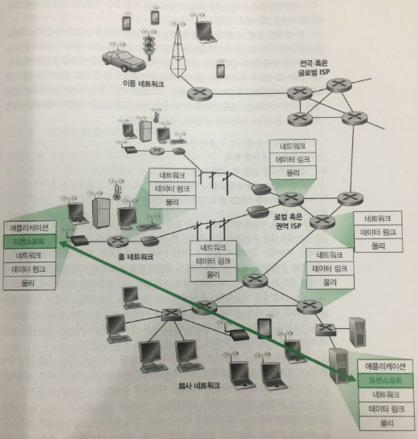

# 트랜스 포트 개요

트랜스포트 계층 프로토콜

- 서로 다른 호스트에서 동작하는 애플리케이션 프로세스들 간의 **논리적 통신**을 제공
- 논리적 통신
    - 애플리케이션의 관점에서 보면 프로세스들이 동작하는 호스트들이 직접 연결된 것처럼 보이는 것
- 애플리케이션 프로세스는 메시지 운반에 사용되는 **물리적인 하위 구조의 세부 사항에 상관없이** 메시지를 송신하기 위해 **트랜스포트 계층에서 제공하는 논리적 통신** 사용
- 즉 트랜스포트 계층 프로토콜은 네트워크 라우터가 아닌 **종단 시스템**에서 구현된다
- TCP, UDP

네트워크 계층 사이의 관계

- 트랜스포트 계층 프로토콜: 서로 다른 호스트에서 동작하는 **프로세스**들 사이의 논리적 통신을 제공
- 네트워크 계층 프로토콜: **호스트**들 사이의 논리적 통신
- ex) 사촌 형제들이 서로 편지를 주고받는 두 집이 존재, 우편담당인 앤과 빌이 사람들에게 우편물을 나눠 주는 일을 한다.
    - 애플리케이션 메시지 = 봉투안의 편지
    - 프로세스 = 사촌 형제
    - 호스트(또한 종단 시스템) = 집
    - 트랜스포트 계층 프로토콜 = '앤'과 '빌'
    - 네트워크 계층 프로토콜 = 우편 서비스(우편집배원 포함)
- 따라서 트랜스포트 계층이 제공할 수 있는 서비스는 하위 네트워크 계층 프로토콜의 서비스 모델에 의해서 제약받는다
    - ex) 네트워크 계층 프로토콜이 트랜스포트 계층 세그먼트에 대한 지연보장이나 대역폭 보장
    - 예외: 특정 서비스는 트랜스포트 프로토콜에 의해서 제공될 수 있다
        - 네트워크 프로토콜이 비신뢰적일 때

인터넷 트랜스포트 계층

- UDP(User Datagram Protocol)
    - 애플리케이션에게 비신뢰적이고 비연결형인 서비스 제공
- TCP(Transmission Control Protocol)
    - 애플리케이션에게 신뢰적이고 연결지향형 서비스를 제공
    - 순서대로 정확한 신뢰적인 데이터 전달 제공
        - 흐름제어, 순서번호, 확인응답, 타이머
        - **이처럼 IP의 비신뢰적인 서비스를 프로세스 사이의 신뢰적인 데이터 전송 서비스로 만들어준다**
    - 혼잡제어
        - 한 TCP 연결이 과도한 양의 트래픽으로 모든 통신하는 호스트들 사이의 ㅡㅅ위치와 링크를 폭주되게 하는 것을 방지하는 것
        - TCP는 혼잡한 네트워크 링크에서 각 TCP 연결이 링크의 대역폭을 공평하게 공유하여 통과하도록 해준다.
- 데이터단위: 세그먼트, 데이터 그램(UDP)
- UDP, TCP의 기본적인 기능은 종단 시스템 사이의 IP 전달 서비스를 종단 시스템에서 동작하는 두 프로세스 간의 전달 서비스로 확장하는 것
    - 호스트 <> 호스트 전달을 프로세스 <> 프로세스 전달로 확장하는 것을 트랜스포트 다중화(multiplexing)와 역다중화(demultiplexing)라고 부른다
    - UDP와 TCP는 헤더에 오류 검출 필드를 포함함으로써 무결성 검사 제공

인터넷 네트워크 계층 프로토콜(맛보기)

- 인터넷 프로토콜을 줄여서 IP
- IP 서비스 모델은 호스트들 간에 논리적 통신을 제공하는 최선형 전달 서비스(best-effort delivery service)
    - IP가 통신하는 호스트들 간에 세그먼트를 전달하기 위해서 최대한 노력하지만 어떠한 보장도 하지 않는다는 것을 의미
    - 순서대로 전달하는 것 또한 보장 x
    - 세그먼트 내부 데이터의 무결성을 보장 x
- 따라서 비신뢰적인 서비스(unreliable service)