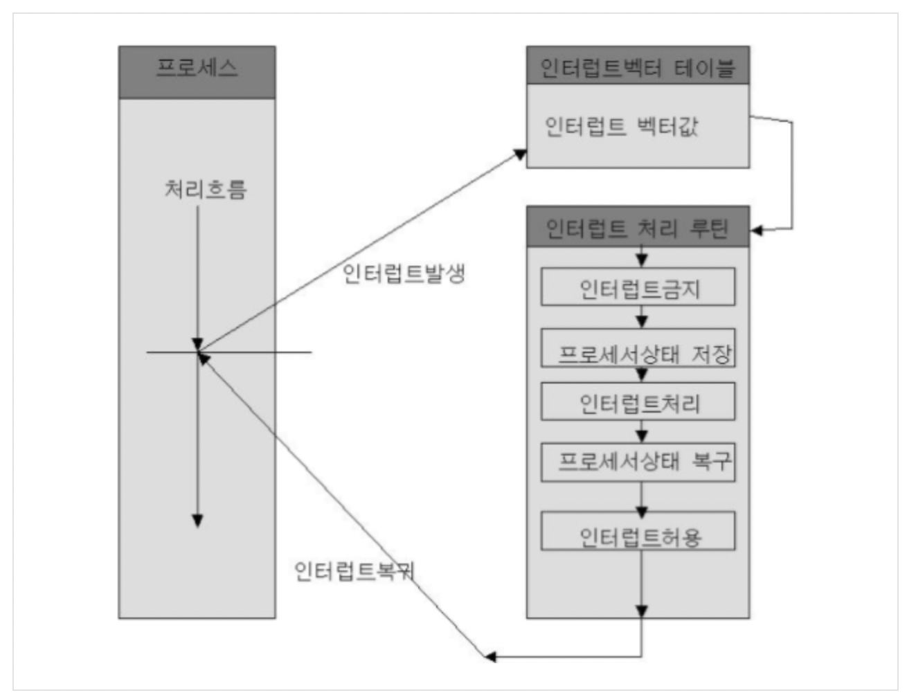
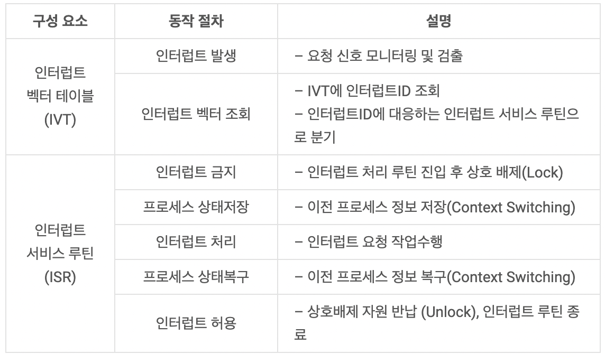
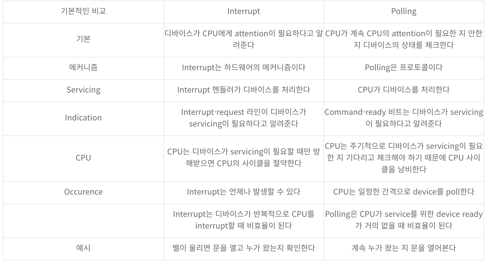

# 인터럽트

### 한문장 정리

- 프로그램을 실행하는 도중에 예기치 않은 상황이 발생할 경우 현재 실행 중인 작업을 즉시 중단하고, 발생된 상황에 대한 우선 처리가 필요함을 CPU에게 알리는 것

### 인터럽트

- 프로그램을 실행하는 도중에 예기치 않은 상황이 발생할 경우 현재 실행 중인 작업을 즉시 중단하고, 발생된 상황에 대한 우선 처리가 필요함을 CPU에게 알리는 것
- 크게 외부, 내부, 소프트웨어 인터럽트로 나뉜다.
- 우선순위를 정의한 인터럽트 벡터 정보를 IDT(Interrupt Descriptor Table) 저장, 해당 인터럽트 처리 루틴(ISR)으로 분기

### 외부 인터럽트

- 전원 이상 인터럽트(Power fail interrupt) : 말그대로 정전, 파워 이상 등
- 기계 착오 인터럽트(Machine check interrupt) : CPU의 기능적인 오류
- 외부 신호 인터럽트(External interrupt)타이머에 의한 인터럽트 : Preemptive개념을 생각하면 된다. 자원이 할당된 시간이 다 끝난 경우키보드로 인터럽트 키를 누른 경우 : 대표적으로 Control + Alt + Delete외부장치로부터 인터럽트 요청이 있는 경우 : I/O 인터럽트 아님!! 다른 개념이다
- 입출력 인터럽트(I/O Interrupt)입출력장치가 데이터 전송을 요구하거나 전송이 끝나 다음 동작이 수행되어야 할 경우입출력 데이터에 이상이 있는 경우
- 우선순위 높음

### **내부 인터럽트**

- 잘못된 명령이나 잘못된 데이터를 사용할때 발생하며 Trap이라 부른다.
- 프로그래 검사 인터럽트
    - Program check interrupt
    - Division by zero
    - OverflowUnderflow기타 Exception
- 우선순위 보통

### **소프트웨어 인터럽트(SVC : SuperVisor Call)**

- 사용자가 프로그램을 실행시키거나 감시프로그램(Supervisor)을 호출하는 동작을 수행하는 경우
    - 사용자가 SVC명령을 써서 의도적으로 호출한 경우, 복잡한 입출력 처리를 해야하는 경우, 기억장치 할당 및 오퍼레이터와 대화를 해야하는경우 발생합니다.
    - 프로그램의 시스템 콜 요청 시 발생
    - 메모리 할당/해제, 자원 요청/반납 등
- 우선순위 낮음

### 인터럽트 처리 과정

- 인터럽트 발생 시 인터럽트 벡터 테이블 조회/분기, 처리루틴 수행, 복귀 3단계 절차로 동작
- 인터럽트 종류에 따라 우선순위 부여, 처리 순서 결정 위해 우선순위 처리 방법 필요

### 폴링과 인터럽트 차이

숙제 dma