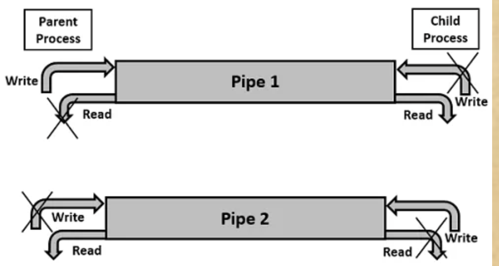
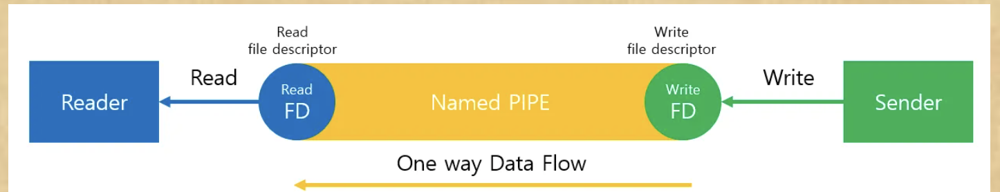
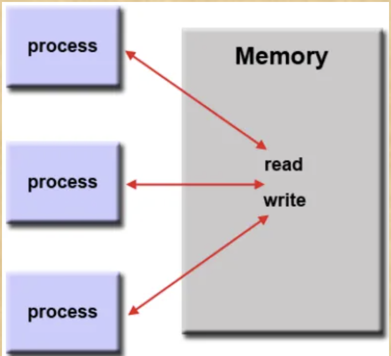
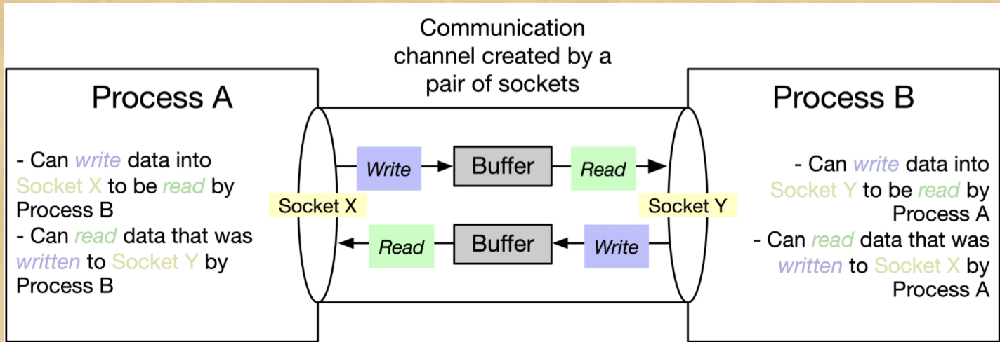
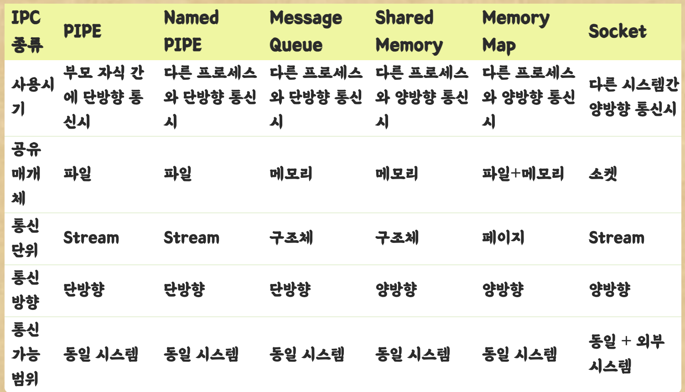

# IPC

### **IPC(Inter Process Communication)**

---

[https://camo.githubusercontent.com/ae371b6a70f7e11ebfbbd4cda052d103e6cf8c7e39b8ae3fd81e5396ef9bb9a8/68747470733a2f2f74312e6461756d63646e2e6e65742f6366696c652f746973746f72792f393944423843343935433443353730343137](https://camo.githubusercontent.com/ae371b6a70f7e11ebfbbd4cda052d103e6cf8c7e39b8ae3fd81e5396ef9bb9a8/68747470733a2f2f74312e6461756d63646e2e6e65742f6366696c652f746973746f72792f393944423843343935433443353730343137)

프로세스는 독립적으로 실행된다. 즉, 독립 되어있다는 것은 다른 프로세스에게 영향을 받지 않는다고 말할 수 있다. (스레드는 프로세스 안에서 자원을 공유하므로 영향을 받는다)

이런 독립적 구조를 가진 **프로세스 간의 통신**을 해야 하는 상황이 있을 것이다. 이를 가능하도록 해주는 것이 바로 IPC 통신이다.

프로세스는 커널이 제공하는 IPC 설비를 이용해 프로세스간 통신을 할 수 있게 된다.

***커널이란?***

> 운영체제의 핵심적인 부분으로, 다른 모든 부분에 여러 기본적인 서비스를 제공해줌

IPC 설비 종류도 여러가지가 있다. 필요에 따라 IPC 설비를 선택해서 사용해야 한다.

### 프로세스간의 통신이 필요한이유

1. 정보 공유
2. 계산 가속화
    - 특정 태스크를 빨리 실행하고자 한다면 병렬로 실행해야된다!! 그러면 서로 데이터의 공유가 필요.
3. 모듈성
    - 시스템 기능을 별도의 프로세스들 또는 스레드로 나누어, 모듈식 형태로 시스템을 구성
4. 편의성
    - 병렬로 처리 가능

### **IPC 종류**

1. **익명 PIPE**

    - 파이프는 두 개의 프로세스를 연결하고 하나의 프로세스는 데이터를 쓰기만 하고, 다른 프로세스는 데이터를 읽기만 한다
    - 부모 자식 간에 단방향 통신으로 자주 사용한다
    - 한쪽 방향으로만 통신이 가능한 PIPE의 특징 때문에 Half-Duplex(반이중) 통신 이라고도 불린다
    - PIPE는 반이중 통신이기에 하나의 통신선로는 읽기/쓰기 중 하나만 가능하므로 만약 읽기/쓰기, 즉 송/수신을 모두 하기 원한다면 두 개의 파이프를 만들어야 가능하다
    - read()와 write()가 기본적으로 block mode로 작동되기에 프로세스가 read 대기중이라면 read가 끝나기전에는 write를 할 수 없다

    장점

    - PIPE는 간단하게 사용할 수 있다는 장점이 있다. 한쪽 프로세스는 단지 읽기만하고 다른 프로세스는 단지 쓰기만 하는 단순한 데이터 흐름에 적합

    단점

    - Full-Duplex(전이중) 통신 방식으로 활용하려면 PIPE를 두개 만들어야 하는데, 구현이 꽤나 복잡해 질 수 있다 (굳이 전이중을 활용해야한다면 PIPE말고 다른 방법을 찾는게 효율적일 수 있다)
    - buffer가 상대적으로 작기때문에 overflow 될 확률이 높다 (read처리를 빨리빨리 해줘야한다)
    - 부모 자식 관계의 프로세스들 사이에서 가능
2. **Named PIPE(FIFO)**

    - Linux는 모든 것을 파일(fd)로 통하고 있다는 개념을 기억하고 보자
    - 보통 PIPE는 부모자식간에 사용하고 Named PIPE는 전혀 모르는 상태의 프로세스들 사이에서 통신할 경우 사용
    - Named PIPE는 부모프로세스와 무관하게 전혀 다른 모든 프로세스들 사이에서 통신이 가능한데, 이유는 프로세스간에 통신을 위해 이름이 있는 파일을 매개체로 사용하기 때문
    - mkfifo를 통해 Named PIPE를 생성하는데, mkfifo가 성공하면 이름이 명명된 파일이 생성되고 이를 활용해서 프로세스 간에 통신이 이루어짐

    장점

    - 기본 PIPE와 비슷

    단점

    - 읽기/쓰기가 동시에 이루어지지 않음, 단방향 통신, read-only or write-only
    - 기본 PIPE와 비슷
3. **Message Queue**

    - FIFO(First-In First-Out, 선입선출) 자료구조를 가지는 통신설비로 커널에서 관리

    입출력 방식으로보면 위에 Named PIPE와 동일하다 할 수 있다

    - 차이점이라면, Named PIPE는 데이터의 흐름이라면 Message Queue는 메모리 공간이라는 점
    - 어디서나 물건을 꺼낼 수 있는 컨테이너 벨트와 같다 보면 된다
    - Message Queue에 쓸 데이터에 번호를 붙힘으로써 다수의 프로세스가 동ㅇ시에 데이터를 쉽게 다룰 수 있다

    장점

    - 비동기 방식이기에 방대한 처리량이 있다면 큐에 넣은 후 나중에 처리 할 수 있다
    - 다수의 프로세스들이 큐에 메시지를 보낼 수 있고 다수의 프로세스들이 큐로부터 메시지를 꺼낼 수 있다
    - 분산처리 및 경쟁처리 방식에 사용할 수 있다
    - (비동기, 비동조, 탄력성, 과잉, 확장성이 있는데 이건 다른 포스트 참조해도 충분할 거 같다)

    단점

    - 메시지가 정말 잘 전달되었는지 알 수 없다
    - 큐에 데이터를 넣고 나오는 과정에서 오버헤드가 발생 할 수 있다
    - 데이터가 많이 쌓일수록 추가적인 메모리 자원이 필요하다
4. **공유 메모리**

    - 데이터 공유 방법에는 크게 2가지가 있는데,통신을 이용해서 데이터를 주고 받는 방법 (ex. PIPE, Named PIPE, Message Queue, ...)데이터를 공유, 즉 함께 사용하는 것 (ex. Shared Memory, ...)즉, 공유메모리가 데이터 자체를 공유하도록 지원하는 설비이다Shared Memory(공유 메모리)는 프로세스간 메모리 영역을 공유해서 사용할 수 있도록 허용프로세스가 공유 메모리 할당을 커널에 요청하면 커널은 해당 프로세스에 메모리 공간을 할당해 주게되고, 이후 어떤 프로세스건 해당 메모리영역에 접근 할 수 있다

        장점

        - 공유 메모리는 중개자 없이 곧바로 메모리에 접근할 수 있기 때문에 모든 IPC중에서 가장 빠르게 작동한다
        - (다시말해, 커널메모리영역에서 관리하기에 빠르게 접근 가능)

        단점

        - 메시지 전달 방식이 아니기에 데이터를 읽어야하는 시점을 알 수 없다
        - 커널 설정에 종속적이기에 사용하기전에 커널에서 허용하고 있는 공유메모리 사이즈를 확인해야 한다
5. **메모리 맵**
    - 메모리 맵도 공유 메모리와 마찬가지로 메모리를 공유한다는 측면에서는 비슷하다
    - 차이점은 메모리 맵은 열린 파일을 메모리에 맵핑시켜서 공유한다는 점
    - 파일(fd)는 리눅스의 시스템의 전역적인 자원이므로 즉, 모두 공유할수 있는 자원이므로 서로 다른 프로세스들끼리 데이터를 공유하는데 문제가 없음을 예상할 수 있다

    장점

    - 데이터가 메모리에 이미 올라와있는 것처럼 간단하게 접근 할 수 있다
    - 일반적인 파일 IO에 비해 나은 성능을 보여준다
    - 비동기 IO를 사용하지만 시스템에서 처리해주기 때문에 스레드 문제를 걱정할 필요 없다

    단점

    - 일반 파일 IO에 비해 상당히 많은 메모리를 요구
    - 많은 데이터를 얼마나 오랫동안 메모리에 둘 것인지 컨트롤할 수 없다
6. **소켓**

    - 같은 도메인 내에서 연결 될 수 있고 프로세스들 사이의 통신을 가능하게 한다
    - 서버단에서는 bind, listen, accept 진행해 소켓 연결을 위한 준비를 한다
    - 클라이언트 단에서는 connect을 통해 서버에 요청하고 연결이 수립 된 후에서는 socket에 send 함으로써 데이터를 주고 받는다.
    - 연결이 끝나면 반드시 close()로 clear 한다
    - 즉, 네트워크를 통해 프로세스간에 통신을 진행한다

    장점

    - 서버/클라이언트 환경을 구축하는데 용이하다
    - Internet Socket인 경우 데이터 유실이 발생할 수 있지만, Unix Domain소켓은 PIPE와 같은 형태로 이루어지고 같은 시스템에서 교환이 일어나므로 패킷이 유실되거나, 순서가 바뀌는 등 문제가 발생하지 않을거라 장담 할 수 있다
    - 범용적인 IPC로써 양방향 통신이 가능하다
    - 패킷 단위로 주고 받음으로 직관적으로 이해하기 쉬운 코드를 만들 수 있다

    단점

    - 찾아보자

### 세마포어

- 이러한 IPC 통신에서 프로세스 간 데이터를 동기화하고 보호하기 위해 세마포어와 뮤텍스를 사용한다. (공유된 자원에 한번에 하나의 프로세스만 접근시킬 때)

- PIPE, Named PIPE, Message Queue와 같은 다른 IPC 설비들이 대부분 프로세스간 메시지 전송을 목적으로 하는데 반해,
- Semaphore는 프로세스 간 데이터를 동기화하고 보호하는데 그 목적이 있다
- 프로세스간 메시지 전송을 하거나 공유메모리를 통해 데이터를 공유하게 될 경우 발생하는 문제가 공유된 자원에 다수의 프로세스가 동시에 접근하면 안되며 단지 하나의 프로세스만 접근가능하게 해주는것이 세마포어(Semaphore) 이다
- 즉, 운영 체계 또는 프로그램 작성 내에서 공유 자원에 대한 접속을 제어하기 위해 사용되는 신호
- 한 프로세스가 사용하고 있는 동안에 세마포어를 세워서 다른 프로세스를 대기시키고 사용이 끝나면 해제시키는 방법으로 사용
- 세마포어를 뮤텍스(Mutex)와 혼동할 수 있기에 잠깐 정리하자면,

    (한가지 예를 들자면, 화장실에 갔을때 화장실 칸을 생각하면 된다. 화장실 한 칸에 대해 관리를 하는것이 뮤텍스이고 화장실 자체를 관리하는게 세마포어가 된다)

장점

- 많은 Thread들은 크리티컬 섹션을 허락받아야 한다. 즉, 크리티컬 섹션에서 충돌이 나지 않는다

단점

- 많은 Thread들은 block을 당한다. 즉, CPU가 가만히 waiting하는 시간 낭비가 발생할 수 있다

