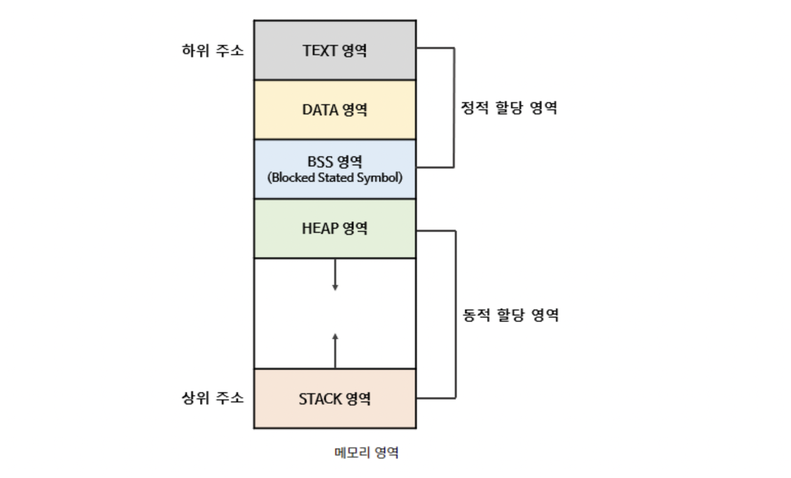

# 프로세스 주소공간

### 한문장 정리

- 프로그램이 실행되면 메모리에 할당되는 것

### **Code(Text)**

- 우리가 작성한 **소스코드**가 들어 가는 부분. 즉, 실행할 프로그램의 코드가 저장되는 영역으로 **텍스트(code)영역** 이라고도 부른다.
- 코드영역은 실행 파일을 구성하는 명령어들이 올라가는 메모리 영역으로 **함수, 제어문, 상수** 등이 여기에 지정된다.
- 컴파일 타임에 결정되고 중간에 코드를 바꿀 수 없게 **Read-Only** 로 지정돼있다.

### **Data**

- 프로그램의 전역 변수와 정적(static) 변수가 저장되는 영역이다. 즉, 프로그램이 구동되는 동안 항상 접근 가능한 변수가 저장되는 영역이다.
- 전역변수, static 값을 참조한 코드는 컴파일 하고 나면 Data 영역의 주소값을 가르키도록 바뀐다.
- 데이터 영역은 프로그램의 시작과 함께 할당되며, 프로그램이 종료되면 소멸한다.
- 실행 중도에 전역변수가 변경 될 수도 있으니 이 영역은 **Read-Write**로 지정돼있다.
- 초기화 된 데이터는 Data 영역에 저장되고,초기화 되지 않은 데이터는 BSS(Block Stated Symbol)영역에 저장된다.

### heap

- **런타임에 크기가 결정되는 메모리 영역**이다.
- 사용자에 의해 메모리 **공간이 동적으로 할당되고 해제**된다.
- 참조형의 데이터의 값이 저장된다.
- 예를 들어 클래스, 클로저가 이 부분에 해당 된다.
- Heap은 메모리의 낮은 주소에서 높은 주소의 방향으로 할당된다.
- HEAP과 STACK영역은 사실 같은 공간을 공유한다. HEAP이 메모리 위쪽 주소부터 할당되면 STACK은 아래쪽부터 할당되는 식이다. 그래서 각 영역이 상대 공간을 침범하는 일이 발생할 수 있는데 이를 각각 HEAP OVERFLOW, STACK OVERFLOW라고 칭합니다.

### **Stack**

- 함수의 호출과 관계되는 **지역 변수와 매개변수가 저장되는 영역**이다.
- Stack은 함수의 호출과 함께 할당되며, **함수의 호출이 완료되면 소멸**한다.
- 원시타입의 데이터가 값과 함께 할당된다.
- Heap 영역에 생성된 Object 타입의 데이터 참조값이 할당된다.
- 메모리의 높은 주소에서 낮은 주소의 방향으로 할당된다.
- **컴파일 타임에 크기가 결정되기 때문에 무한히 할당 할 수 없다.** 재귀함수가 너무 깊게 호출되거나 함수가 지역변수를 너무 많이 가지고 있어 stack 영역을 초과하면 **stack overflow 에러**가 발생한다.

### ***왜 이렇게 구역을 나눈건가요?***

- 최대한 데이터를 공유하여 메모리 사용량을 줄여야 합니다.
- Code는 같은 프로그램 자체에서는 모두 같은 내용이기 때문에 따로 관리하여 공유함
- Stack과 데이터를 나눈 이유는, 스택 구조의 특성과 전역 변수의 활용성을 위한 것!