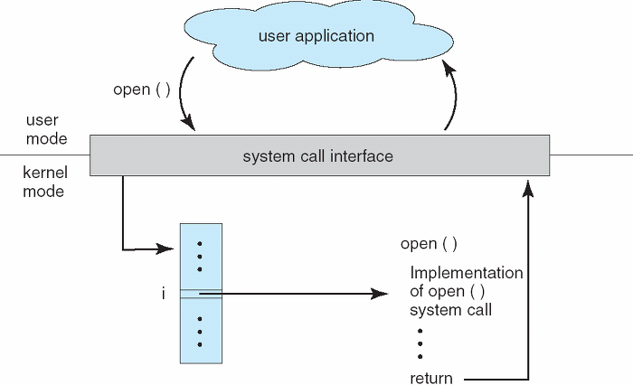
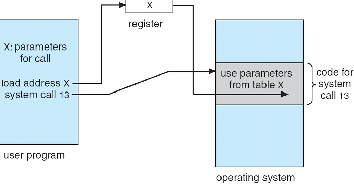

# System Call

### 한문장 정리

- 커널 영역의 기능을 응용프로그램이 사용가능 하도록 제공하는 함수 또는 인터페이스
- 커널 영역의 기능을 사용자 모드가 사용 가능하게, 즉 프로세스가 하드웨어에 직접 접근해서 필요한 기능을 사용할 수 있게 해준다.
- 주로 api 형태로 제공

### 커널 모드

- 운영체제가 CPU의 제어권을 가지고 운영 체제 코드를 실행하는 모드
- 커널 모드에서는 모든 종류의 명령을 다 실행할 수 있습니다.
- 시스템에 중요한 영향을 미치는 연산은 커널 모드에서만 실행 가능하도록 함으로써 하드웨어의 보안을 유지
- 특권 명령 : 보안이 필요한 명령으로 입출력 장치, 타이머 등 각종 장치를 접근하는 명령.(커널 모드)
- CPU 내에 모드 비트를 두어 두 명령을 수행한다.

### 사용자 모드

- 사용자 프로그램이 CPU를 사용하고 있는 모드
- 일반 명령 : 메모리에서 자료를 읽어와서 CPU에서 계산하고 결과를 메모리에 쓰는 일련의 명령들. 모든 프로그램이 수행할 수 있음. (사용자 모드)
- 사용자 프로그램이 디스크의 파일을 접근하거나, 화면에 결과를 출력하는 등의 작업이 필요한 경우가 있다. 하지만, 이러한 작업은 특권 명령의 수행을 필요로 한다.
- 이와 같은 경우, 사용자 프로그램은 스스로 특권 명령을 수행할 수 없으므로 운영체제에게 특권 명령의 대행을 요청한다. 이러한 서비스 요청은 시스템 콜이라고 부른다. (즉, 특권 명령의 대행을 요청하여 사용자 프로그램이 커널 영역의 기능을 수행하게 해준다.)

### 매개변수를 운영체제에 전달하기 위해서는 3가지 정도의 방법

1. 매개변수를 CPU 레지스터 내에 전달한다. 이 경우에 매개변수의 갯수가 CPU 내의 총 레지스터 개수보다 많을 수 있다.
2. 위와 같은 경우에 매개변수를 메모리에 저장하고 **메모리의 주소가 레지스터에 전달**된다. (아래 그림 참고)
3. 매개변수는 프로그램에 의해 **스택(stack)으로 전달(push)** 될 수도 있다.

### 시스템 콜의 유형

- **프로세스 제어(Process Control)**
    - 끝내기(end), 중지(abort)
    - 적재(load), 실행(execute)
    - 프로세스 생성(create process)
    - 프로세스 속성 획득과 설정(get process attribute and set process attribute)
    - 시간 대기(wait time)
    - 사건 대기(wait event)
    - 사건을 알림(signal event)
    - 메모리 할당 및 해제 : malloc, free
- **파일 조작(File Manipulation)**
    - 파일 생성(create file), 파일 삭제(delete file)
    - 열기(open), 닫기(close)
    - 읽기(read), 쓰기(write), 위치 변경(reposition)
    - 파일 속성 획득 및 설정(get file attribute and set file attribute)
- **장치 관리(Devide Management)**
    - 장치를 요구(request devices), 장치를 방출release device)
    - 읽기, 쓰기, 위치 변경
    - 장치 속성 획득, 장치 속성 설정
    - 장치의 논리적 부착(attach) 또는 분리(detach)
- **정보 유지(Information Maintenance)**
    - 시간과 날짜의 설정과 획득(time)
    - 시스템 데이터의 설정과 획득(date)
    - 프로세스 파일, 장치 속성의 획득 및 설정
- **통신(Communication)**
    - 통신 연결의 생성, 제거
    - 메시지의 송신, 수신
    - 상태 정보 전달
    - 원격 장치의 부착 및 분리