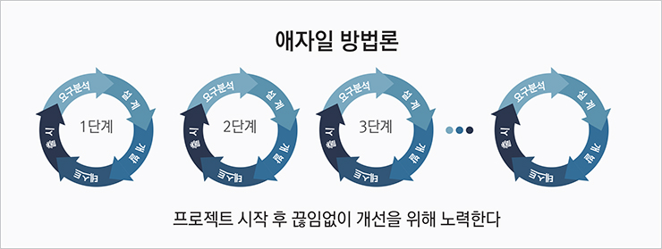
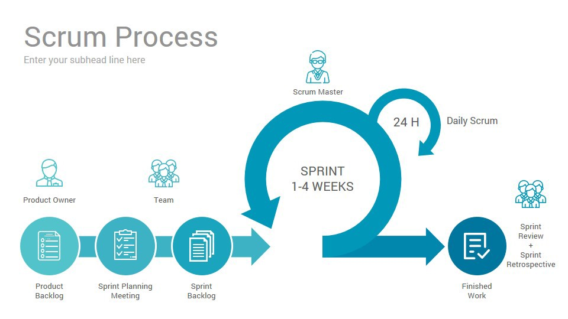
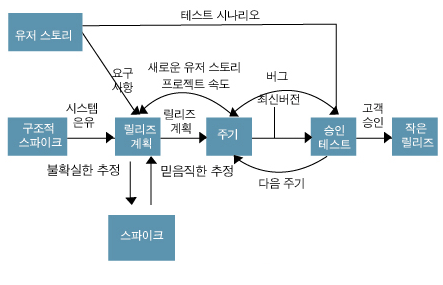

# 애자일(Agile) 정리1 / 애자일(Agile) 정리2

한 문장 정리

- 고객의 요구사항 변화에 유연하게 대응할 수 있도록 일정한 주기를 반복하면서 개발과정을 진행하는 방법
- 즉 협력과 피드백을 자주 & 잘하면서 개발을 진행하는 것

애자일 개발 방법

- 고객과의 소통에 초점
- 스프린트 또는 이터레이션이라는 불리는 짧은 주기를 반복하며 결과물에 대한 요구를 적극 수용
- 각 개발주기에는 요구사항에 우선순위를 부여하여 개발 작업 진행
- 소규모 프로젝트, 고도로 숙달된 개발자, 급변하는 요구사항 적합
- 개발 모형: 스크럼, XP, 칸반 등등

스크럼

- Agile 메서드 제품군에 속하는 점진적이고 반복적인 프로젝트 관리 프로세스
- 팀원 스스로 스크럼 팀 구성 및 스스로 해결 할 수 있어야 한다.
- 팀 구성: 제품 책임자, 스크럼 마스터, 개발팀

    **1. 제품 책임자(product owner)**

    - 요구사항을 책임지고 의사 결정할 사람, 이해관계자들의 의견 종합하여 요구사항 작성 주체
    - 요구사항이 담긴 백로그 작성 및 백로그에 대한 우선순위 지정

    **2. 스크럼 마스터(servant leader)**

    - 객관적인 시각에서 조언 해주는 가이드 역활
    - 일일 스크럼 회의 주관 및 애로사항 공론화 및 처리

    **3. 개발팀**

xp

- 고객의 요구사항에 유연하게 대응하기 위해 고객의 참여와 개발 과정을 반복하여 생산성 향상
- 짧고 반복적인 개발주기, 단순한 설계, 고객의 참여
- 소규모 인원
- 핵심 가치: 1. 의사소통, 2.단순성, 3. 용기, 4. 존중, 5. 피드백
- 스파이크: 요구사항의 신뢰성을 높이고 기술 문제에 대한 위험을 감소시키기 위해 만드는 간단한 프로그램
- 주요 실천 방법
    - pair programming
    - TDD
    - whole team
    - 계속적인 통합
    - 디자인 개선 or 리팩토링
    - 소규모 릴리즈

두 개의 차이

- xp의 주기가 보통 더 짧다
- xp의 우선순위는 고객, scrum은 po