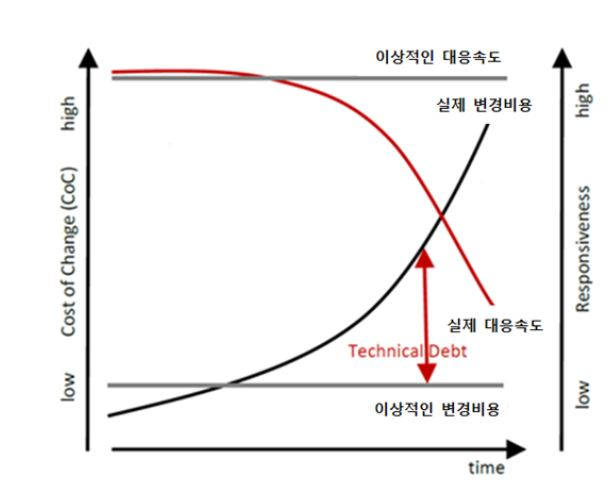
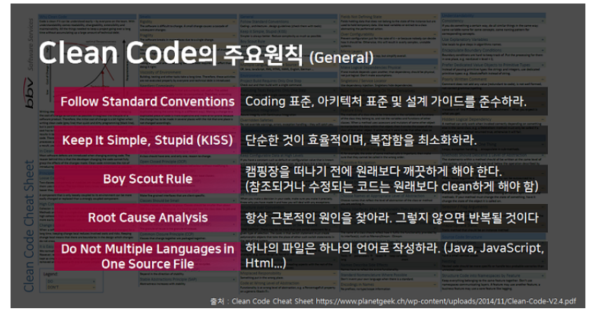
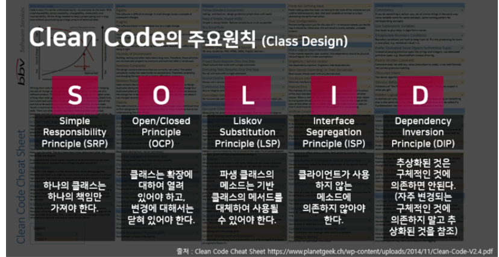

# 클린코드

### 한문장 정리

- 클린코드란 가독성이 높은 코드를 말한다.
- (추가)코드스멜이란 코드에서 더 심오한 문제를 일으킬 가능성이 있는 프로그램 소스 코드의 증상

### 클린코드

- 가독성이 높은 코드
- 단순하고 직접적이다
- 간단해서 버그가 숨어들지 못한다
- 하나의 기능만을 제공한다
- 중복이 없다
- 잘 쓴 문장처럼 읽힌다
- 짐작했던 기능을 그래도 수행한다
- 작성자가 아닌 사람도 읽기 쉽고 고치기 쉽다
- 단위 테스트와 인수 테스트가 존재한다
- 모든 테스트를 통과한다

### 클린코드가 왜 중요할까?

- 클린코드를 하지 않을 경우 Technical Debt가 발생

    

### 주요 원칙(일반적)



### 주요 원칙(객체지향 프로그래밍 및 설계)

- [https://doorbw.tistory.com/236](https://doorbw.tistory.com/236)



### 네이밍

- 의도를 밝혀라

```java
int d → int day
```

- 비슷한 이름을 사용하지 않는다

```java
XYZControllerForEfficientHandingOfStrings 와
XYZControllerForEfficientStorageOfStrings 의 차이가 한 눈에 들어오는가
```

- 변수 이름에 타입을 넣지 않는다 (헝가리안 표기법?)

```java
PhoneNumber phoneString (x)
List<Integer> accountList (x) → accounts
```

- 클래스 이름은 명사나 명사구가 좋다 , 동사구는 사용x

```java
Customer, Account, WikiPage 같은 이름은 좋다
Manager, Proccesor, Data, Info 같은 이름은 피한다
```

- 메서드 이름은 동사나 동사구가 좋다

```java
접근자, 변경자, 조건자는 javabean 표준에 따라 get, set, is를 붙인다.
```

- 일관성 있는 어휘를 사용해라

```java
역할이 비슷한 메서드에 클래스마다 get, fetch, retrieve라고 제각각 부르지 마라
```

- 의미 있는 맥락을 추가하라, 클래스, 함수, 이름 공간, 접두어

### 함수

- 작게 만들어라
- 한 가지 일만 해라
- 함수 당 추상화 수준은 하나로
- 위에서 아래로 코드읽기, 내려가기 규칙(한 함수 다음에는 추상화 수준이 한단계 낮은 함수)
- 서술적인 이름 사용
- 함수 인수는 적을수록 좋다
- 플래그 인수는 추하다, 함수가 여러 가지를 처리한다고 공표하는 셈
- 인수 객체를 사용해라
- try-catch 분리하라, 오류 처리도 한가지 작업이다

    ```java
    try {
      deletePage(page);
      registry.deleteReference(page.name);
      configKeys.deleteKey(page.name.makeKey());
    } catch(Exception e) {
      logger.log(e.getMessage());
    }

    위 코드 보다는 아래가 좋다.

    public void delete(Page page) {
        try {
            deletePageAndAllReferences(page);
        } catch(Exception e) {
            logError(e);
        }
    }

    private void deletePageAndAllReferences(Page paage) throws Exception {
        deletePage(page);
      registry.deleteReference(page.name);
      configKeys.deleteKey(page.name.makeKey());
    }

    private void logError(Exception e) {
        logger.log(e.getMesssage());
    }
    ```

    - 중복 제거해라

    ### 주석

    - 가급적이면 코드로 표현
    - TODO,  중요성을 강조하는 주석, 결과를 경고하는 주석은 바람직할 수 있다.

    ### 클래스

    - 작게 만들어라
    - 단일 책임 원칙
    - 인스턴스 변수가 작게 유지함으로써 응집도를 높여라
    - 응집도를 유지하면 작은 클래스 여럿이 나온다
    - 추상화된 것에 의존하여 변경으로부터 격리하라