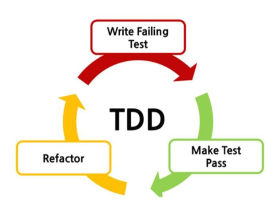

# TDD(test driven development)

### 한문장 정리

- 말그대로 테스트가 개발을 주도하는 소프트웨어 개발 방법론 중 하나

### TDD

- Test-Driven Development(TDD)는 매우 짧은 개발 사이클의 반복에 의존하는 소프트웨어 개발 프로세스
- 짧은 개발 주기의 반복에 의존하는 개발 프로세스이며 애자일 방법론 중 하나인
- **eXtream Programming(XP)의 'Test-First'** 개념에 기반을 둔 단순한 설계를 중요시한다
- 3가지 절차
    - 일반 개발 방식 : 디자인 - 코드개발 - 테스트 (디자인 수정)
    - 실패 - 성공 - 리팩토링

    ### **장점**

    - **보다 튼튼한 객체 지향적인 코드 생산**
        - TDD는 코드의 재사용 보장을 명시하므로 TDD를 통한 소프트웨어 개발 시 기능 별 철저한 모듈화가 이뤄진다. 이는 종속성과 의존성이 낮은 모듈로 조합된 소프트웨어 개발을 가능하게 하며 필요에 따라 모듈을 추가하거나 제거해도 소프트웨어 전체 구조에 영향을 미치지 않게 된다.
    - **재설계 시간의 단축**
        - 테스트 코드를 먼저 작성하기 때문에 개발자가 지금 무엇을 해야하는지 분명히 정의하고 개발을 시작하게 된다. 또한 테스트 시나리오를 작성하면서 다양한 예외사항에 대해 생각해볼 수 있다. 이는 개발 진행 중 소프트웨어의 전반적인 설계가 변경되는 일을 방지할 수 있다.
    - **디버깅 시간의 단축**
        - 이는 유닛 테스팅을 하는 이점이기도 하다. 예를 들면 사용자의 데이터가 잘못 나온다면 DB의 문제인지, 비즈니스 레이어의 문제인지 UI의 문제인지 실제 모든 레이러들을 전부 디버깅 해야하지만, TDD의 경우 자동화 된 유닛테스팅을 전재하므로 특정 버그를 손 쉽게 찾아낼 수 있다.
    - **테스트 문서의 대체 가능**
        - 주로 SI 프로젝트 진행 과정에서 어떤 요소들이 테스트 되었는지 테스트 정의서를 만든다. 이것은 단순 통합 테스트 문서에 지나지 않는다. 하지만 TDD를 하게 될 경우 테스팅을 자동화 시킴과 동시에 보다 정확한 테스트 근거를 산출할 수 있다.
    - **추가 구현의 용이함**
        - 개발이 완료된 소프트웨어에 어떤 기능을 추가할 때 가장 우려되는 점은 해당 기능이 기존 코드에 어떤 영향을 미칠지 알지 못한다는 것이다. 하지만 TDD의 경우 자동화된 유닛 테스팅을 전제하므로 테스트 기간을 획기적으로 단축시킬 수 있다.

    ### **단점**

    - **가장 큰 단점은 바로 생산성의 저하이다.**
        - 개발 속도가 느려진다고 생각하는 사람이 많기 때문에 TDD에 대해 반신반의 한다.왜냐하면 처음부터 2개의 코드를 짜야하고, 중간중간 테스트를 하면서 고쳐나가야 하기 때문이다.TDD 방식의 개발 시간은 일반적인 개발 방식에 비해 대략 10~30% 정도로 늘어난다. SI 프로젝트에서는 소프트웨어의 품질보다 납기일 준수가 훨씬 중요하기 때문에 TDD 방식을 잘 사용하지 않는다.
    - **이제까지 자신이 개발하던 방식을 많이 바꿔야 한다.**
        - 몸에 체득한 것이 많을 수록 바꾸기가 어렵다. 오히려 개발을 별로 해보지 않은 사람들에겐 적용하기가 쉽다.
    - **TDD는 이렇게 해야된다는 이미지/틀이 있다.**
        - 반드시 툴(단위 테스트 프레임워크)을 써서 개발해야 된다. 라고 생각한다. 이러한 규칙에 얽매이는 것은 애자일 방식이 아니다. 결국엔 규칙에 얽매여 똑같은 테스트를 copy&paste 한다. 도구/규칙에 집착하다 보니, TDD가 어려워지는 것이다.

        ### TDD를 잘하는 방법

        - 테스트 비용을 낮출 수 있도록 항상 생각