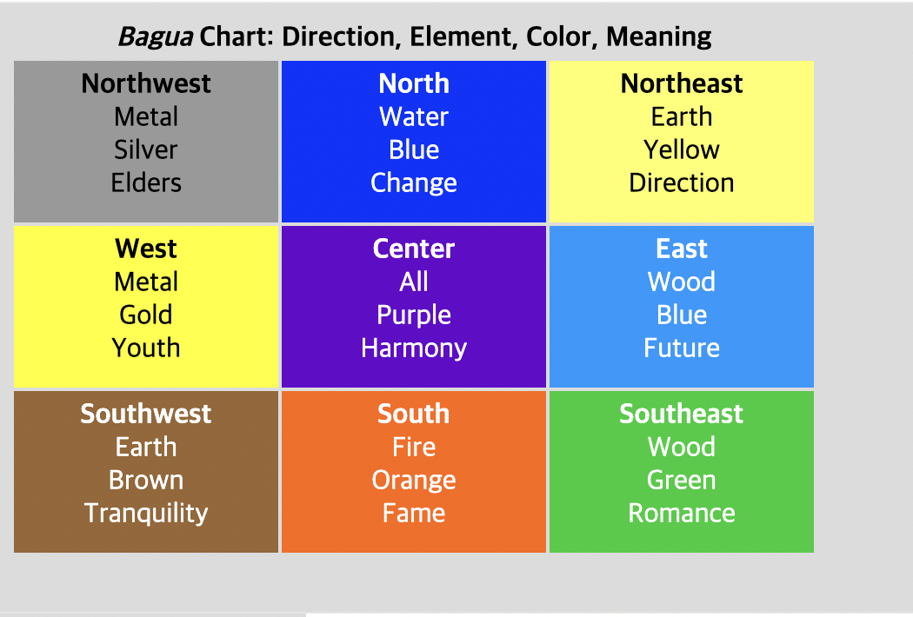

# Event delegation

- 캡처링과 버블링을 활용하면 강력한 이벤트 핸들링 패턴인 *이벤트 위임(event delegation)* 을 구현할 수 있습니다.
- 이벤트 위임은 비슷한 방식으로 여러 요소를 다뤄야 할 때 사용됩니다.
- 이벤트 위임을 사용하면 요소마다 핸들러를 할당하지 않고, 요소의 공통 조상에 이벤트 핸들러를 단 하나만 할당해도 여러 요소를 한꺼번에 다룰 수 있습니다.
- 공통 조상에 할당한 핸들러에서 `event.target`을 이용하면 실제 어디서 이벤트가 발생했는지 알 수 있습니다. 이를 이용해 이벤트를 핸들링합니다.
- 예제를 살펴봅시다. 다음은 고대 중국 철학에서 유래한 [팔괘도(Ba-Gua diagram)](http://en.wikipedia.org/wiki/Ba_gua) 입니다.

그림을 보시죠.

HTML은 대략 다음과 같습니다.



```html
<table>
  <tr>
    <th colspan="3"><em>Bagua</em> Chart: Direction, Element, Color, Meaning</th>
  </tr>
  <tr>
    <td class="nw"><strong>Northwest</strong><br>Metal<br>Silver<br>Elders</td>
    <td class="n">...</td>
    <td class="ne">...</td>
  </tr>
  <tr>...2 more lines of this kind...</tr>
  <tr>...2 more lines of this kind...</tr>
</table>
```

- 지금 보는 표에는 9개의 칸이 있습니다. 하지만 칸이 99개이든 9,999개이든 상관없습니다.
- **지금 해야 할 작업은 `<td>`를 클릭했을 때, 그 칸을 강조하는 것입니다.**
- 각 `<td>`마다 `onclick` 핸들러를 할당하는 대신, ‘모든 이벤트를 잡아내는’ 핸들러를 `<table>` 요소에 할당해 보겠습니다.
- `<table>` 요소에 할당하게 될 핸들러는 `event.target`을 이용해 어떤 요소가 클릭 되었는지 감지하고, 해당 칸을 강조하게 됩니다.

코드는 아래와 같습니다.

```jsx
let selectedTd;

table.onclick = function(event) {
  let target = event.target; // 클릭이 어디서 발생했을까요?

  if (target.tagName != 'TD') return; // TD에서 발생한 게 아니라면 아무 작업도 하지 않습니다,

  highlight(target); // 강조 함
};

function highlight(td) {
  if (selectedTd) { // 이미 강조되어있는 칸이 있다면 원상태로 바꿔줌
    selectedTd.classList.remove('highlight');
  }
  selectedTd = td;
  selectedTd.classList.add('highlight'); // 새로운 td를 강조
```

- 이렇게 코드를 작성하면 테이블 내 칸의 개수는 고민거리가 되지 않습니다. 강조기능을 유지하면서 `<td>`를 언제라도 넣고 뺄 수 있게 됩니다.
- 하지만 단점도 있습니다.
- 위와 같이 구현하면 클릭 이벤트가 `<td>`가 아닌 `<td>` 안에서 동작할 수 있습니다.
- 팔괘도의 HTML을 살펴봅시다. `<td>`안에 중첩 태그 `<strong>`이 있는 것을 확인할 수 있습니다.

```jsx
<td>
  <strong>Northwest</strong>
  ...
</td>
```

- `<strong>`을 클릭하면 `event.target`에 `<strong>`에 해당하는 요소가 저장됩니다.
- 따라서 `table.onclick` 핸들러에서 `event.target`을 이용해 클릭 이벤트가 `<td>`안쪽에서 일어났는지 아닌지를 알아내야 합니다.
- 이런 단점을 반영하여 기능을 향상한 코드는 아래와 같습니다.

```jsx
table.onclick = function(event) {
  let td = event.target.closest('td'); // (1)

  if (!td) return; // (2)

  if (!table.contains(td)) return; // (3)

  highlight(td); // (4)
};
```

설명:

1. `elem.closest(selector)` 메서드는 `elem`의 상위 요소 중 `selector`와 일치하는 가장 근접한 조상 요소를 반환합니다. 위 코드에선 이벤트가 발생한 요소부터 시작해 위로 올라가며 가장 가까운 `<td>` 요소를 찾습니다.
2. `event.target`이 `<td>`안에 있지 않으면 그 즉시 `null`을 반환하므로 아무 작업도 일어나지 않습니다.
3. 중첩 테이블이 있는 경우 `event.target`은 현재 테이블 바깥에 있는 `<td>`가 될 수도 있습니다. 이런 경우를 처리하기 위해 `<td>`가 팔괘도 안에 있는지를 확인합니다.
4. 이제 진짜 td를 강조해 줍니다.

이렇게 구현하면 `<td>`의 개수에 상관없이 원하는 `<td>`를 강조해주는 코드를 빠르고 효율적으로 구현할 수 있습니다.

# [이벤트 위임 활용하기](https://ko.javascript.info/event-delegation#ref-377)

- 이벤트 위임을 다른 식으로도 활용할 수 있습니다.
- ‘저장하기’, ‘불러오기’, ‘검색하기’ 등의 버튼이 있는 메뉴를 구현해야 한다고 가정해봅시다. 각 버튼의 기능과 관련된 메서드 `save`, `load`, `search`가 있는 객체도 이미 구현한 상태입니다. 이럴 때 버튼과 메서드를 어떻게 연결할 수 있을까요?
- 가장 먼저 버튼 각각에 독립된 핸들러를 할당하는 방법이 떠오를 겁니다. 하지만 이 방법보다 더 우아한 해결책이 있습니다. 메뉴 전체에 핸들러를 하나 추가해주고, 각 버튼의 `data-action` 속성에 호출할 메서드를 할당해 주는 방법 말이죠.

# [‘행동’ 패턴](https://ko.javascript.info/event-delegation#ref-378)

- 이벤트 위임은 요소에 *선언적 방식으로* '행동(behavior)'을 추가할 때 사용할 수도 있습니다. 이때는 특별한 속성과 클래스를 사용합니다.
- 행동 패턴은 두 부분으로 구성됩니다.
    1. 요소의 행동을 설명하는 커스텀 속성을 요소에 추가합니다.
    2. 문서 전체를 감지하는 핸들러가 이벤트를 추적하게 합니다. 1에서 추가한 속성이 있는 요소에서 이벤트가 발생하면 작업을 수행합니다.