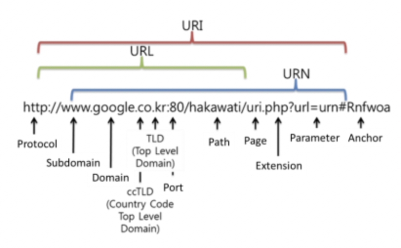

# Rest API

### api 란?

- Application Programming Interface, 응용 프로그램에서 사용할 수 있도록, 운영 체제나 프로그래밍 언어가 제공하는 기능을 제어할 수 있게 만든 인터페이스를 뜻한다.
- API는 프로그램들이 서로 상호작용하는 것을 도와주는 매개체

### api 역할

- **API는 서버와 데이터베이스에 대한 출입구 역할을 한다.**
    - API는 이를 방지하기 위해 여러분이 가진 서버와 데이터베이스에 대한 출입구 역할을 하며, 허용된 사람들에게만 접근성을 부여해줍니다.
- **API는 애플리케이션과 기기가 원활하게 통신할 수 있도록 한다.**
    - API는 애플리케이션과 기기가 데이터를 원활히 주고받을 수 있도록 돕는 역할을 합니다.
- **API는 모든 접속을 표준화한다.**
    - API는 모든 접속을 표준화하기 때문에 기계/ 운영체제 등과 상관없이 누구나 동일한 액세스를 얻을 수 있습니다. 쉽게 말해, API는 범용 플러그처럼 작동한다고 볼 수 있습니다.

### **API유형**

- **private API**
    - private API는 내부 API로, 회사 개발자가 자체 제품과 서비스를 개선하기 위해 내부적으로 발행한다. 따라서 제 3자에게 노출되지 않는다.
- **public API**
    - public API는 개방형 API로, 모두에게 공개된다. 누구나 제한 없이 API를 사용할 수 있는 게 특징
- **partner API**
    - partner API는 기업이 데이터 공유에 동의하는 특정인들만 사용할 수 있다. 비즈니스 관계에서 사용되는 편이며, 종종 파트너 회사 간에 소프트웨어를 통합하기 위해 사용된다.

### **REST(Representational State Transfer)**

- 월드 와이드 웹과 같은 분산 하이퍼미디어 시스템을 위한 소프트웨어 아키텍처의 한 형식(스타일)
- 웹에 존재하는 모든 자원(이미지, 동영상, DB 자원)에 고유한 URI를 부여해 활용하는 것으로, 자원을 정의하고 자원에 대한 주소를 지정하는 방법론을 의미
- 구성요소
    1. 자원(Resource) : URI, 모든 자원은 고유한 ID를 가지고 ID는 서버에 존재하고 클라이언트는 각 자원의 상태를 조작하기 위해 요청을 보낸다. HTTP에서 이러한 자원을 구별하는 ID는 ‘Students/1’ 같은 HTTP URI 이다.
    2. 행위(Verb): Method, 클라이언트는 URI를 이용해 자원을 지정하고 자원을 조작하기 위해 Method를 사용한다. HTTP 프로토콜에서는 GET , POST , PUT , DELETE 같은 Method를 제공한다.
    3. 표현(Representation): 클라이언트가 서버로 요청을 보냈을 때 서버가 응답으로 보내주는 자원의 상태를 Representation이라고 한다. REST에서 하나의 자원은 JSON , XML , TEXT , RSS 등 여러형태의 Representation으로 나타낼수 있다.
- 6가지 제약
    1. **균일한 인터페이스**
        - 요청된 리소스가 식별 가능하며 클라이언트에 전송된 표현과 분리되어야 합니다.
        - 수신한 표현을 통해 클라이언트가 리소스를 조작할 수 있어야 합니다(이렇게 할 수 있는 충분한 정보가 표현에 포함되어 있기 때문).
        - 클라이언트에 반환되는 자기 기술적(self-descriptive) 메시지에 클라이언트가 정보를 어떻게 처리해야 할지 설명하는 정보가 충분히 포함되어야 합니다.
        - 하이퍼미디어: 클라이언트가 리소스에 액세스한 후 하이퍼링크를 사용해 현재 수행 가능한 기타 모든 작업을 찾을 수 있어야 합니다.(HATEOAS)
    2. **클라이언트-서버 분리**
        - 클라이언트와 서버는 독립적으로 작동해야합니다. 요청과 응답을 통해서만 서로 상호 작용해야합니다.
    3. **Statelessness**
        - 서버 측 세션이 없어야합니다. 각 요청에는 서버가 알아야하는 모든 정보가 포함되어야합니다.
    4. **캐시 가능한 리소스**
        - 서버 응답에는 보내는 데이터가 캐시 가능한지 여부에 대한 정보가 포함되어야합니다. 캐시 가능한 리소스는 클라이언트가 동일한 데이터를 두 번 이상 요청하지 않도록 버전 번호와 함께 도착해야합니다.
    5. **계층화 된 시스템**
        - 클라이언트와 응답을 반환하는 서버 사이에 여러 계층의 서버가있을 수 있습니다. 이것은 요청이나 응답에 영향을 미치지 않아야합니다.
    6. **요청시 코드 [선택 사항]**
        - 필요한 경우 응답에 클라이언트가 실행할 수있는 실행 코드 (예 : HTML 응답 내의 JavaScript)가 포함될 수 있습니다.

    ### rest(restful) api

    - REST 기반으로 서비스 API를 구현한 것

    ### REST API 설계 규칙

    - uri 기본 원칙
        1. 마지막 문자로 ‘/’ 를 포함하지 않는다.
        2. 가독성을 높이는 데에는 ‘-’를 사용한다.
        3. 소문자만 사용
        4. URI 에는 확장자를 넣지 않는다.
    - 리소스 형식 (Resource Type)
        - 도큐먼트 ( Document ):
            - 가장 기본이 되는 리소스 형식
            - 데이터 베이스의 레코드와 같은 것
            - ex) [http://api.your-service-books.com/books/1](http://api.your-service-books.com/books/1)
        - 컬렉션 ( Collection )
            - 도큐먼트의 디렉터리 리소스
            - 도큐먼트의 리스트
            - ex) [http://api.your-service-books.com/books](http://api.your-service-books.com/books)
        - 스토어 ( Store )
            - 클라이언트가 특별히 관리하는 형태를 갖는 것
            - favorites, mark, done
            - ex) [http://api.your-service-books.com/users/1/favorites](http://api.your-service-books.com/users/1/favorites)
        - 컨트롤러 ( Controller )
            - CRUD 이외의 것
            - ex) [http://api.your-service-books.com/books/1/buy](http://api.your-service-books.com/books/1/buy)
    - 명명 규칙 (Conventional Naming Rules)
        - CRUD 는 URI 에 표시 X
        - 도규먼트 : 단수
        - 컬렉션 : 복수
        - 스토어 : 복수
        - 컨트롤러 : 동사/동사구
        - 리소스 간에는 연관 관계가 있는 경우
            - /리소스명/리소스 ID/관계가 있는 다른 리소스명
        - Query : 선택 사항
            - 페이지네이션
            - 타입
            - 소팅

    ### **장점**

    1. **쉬운 사용:** HTTP 프로토콜 인프라를 그대로 사용하므로 별도의 인프라를 구축할 필요가 없다.
    2. **클라이언트-서버 역할의 명확한 분리:** 클라이언트는 REST API를 통해 서버와 정보를 주고받는다. REST의 특징인 Stateless에 따라 서버는 클라이언트의 Context를 유지할 필요가 없다.
    3. **특정 데이터 표현을 사용가능:** REST API는 헤더 부분에 URI 처리 메소드를 명시하고 필요한 실제 데이터를 ‘body’에 표현할 수 있도록 분리시켰다. JSON , XML 등 원하는 Representation 언어로 사용 가능하다.

    ### **단점**

    1. **메소드의 한계:** REST는 HTTP 메소드를 이용하여 URI를 표현한다. 이러한 표현은 쉬운 사용이 가능하다는 장점이 있지만 반대로 메소드 형태가 제한적인 단점이 있다.
    2. **표준이 없음:** REST는 설계 가이드 일 뿐이지 표준이 아니다. 명확한 표준이 없다.

    cf) soap api 숙제

    cf) URI vs URL vs URN

