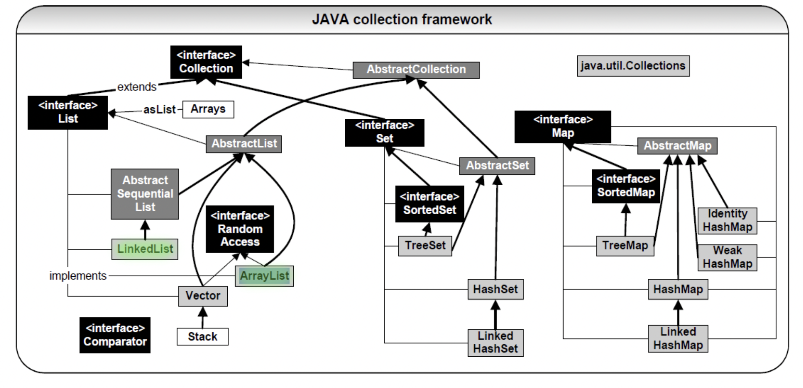
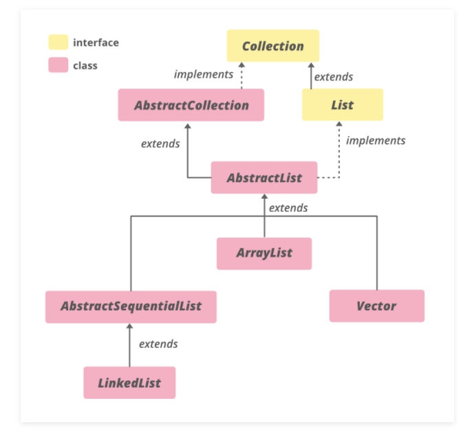
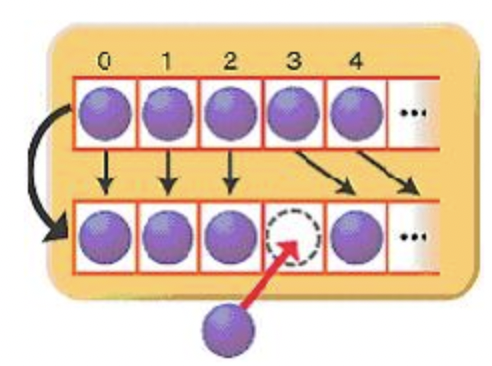
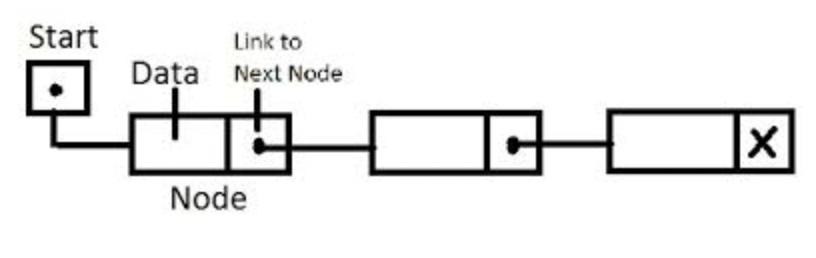

# Array&ArrayList&LinkedList

# 한 문장 정리‼️

### Array

개념 : **여러 개의 데이터가 같은 성격을 가진 데이터일 경우, 하나의 이름을 갖는 변수로 여러 데이터를 그룹핑해서 관리**하는 것을 **array(배열)라 함.**

기술 : **인덱스가 유일한 식별자**인 **연속적인 공간**을 가지는 **자료구조**. 연속적인 공간이기에 데이터 조회 성능이 유리함.

### ArrayList

ArrayList는 내부적으로 **데이터를 배열(Array)에서 관리**하며 데이터의 **추가, 삭제를 위해** 아래와 같이 **임시 배열을 생성해 데이터를 복사 하는 방법**을 사용 하고 있음.

### LinkedList

[List] : 배열이 가지고 있는 인덱스라는 장점을 버리고 **빈틈없이 데이터를 적재**라는 장점을 취한 자료 구조.

[LinkedList] : 양방향 연결 리스트로 구현되어 있으며, 다음노드와 이전노드의 주소 값을 가지는 node 로 구성되어 있다. 삽입/삭제 성능이 유리

---

# Array & ArrayList & LinkedList의 서론

**JAVA Collection Framework**



**LinkedList and ArrayList in JCF**



**LinkedList**와 **ArrayList**는 모두 Java에서 제공하는 **List 인터페이스**를 구현한 **Collection 구현체**임.

하지만 인터페이스만 같을 뿐 내부 동작은 다르다.

상황에 맞게 LinkedList 와 ArrayList를 잘 선택해서 사용해야 함. 

### LinkedList,ArrayList가 나오기 전 JAVA의 초기버전인 1.0

Java 에서는 **기본형**(Primitive Types) 또는 **인스턴스**(Reference Type)를 저장하기 위해 보통 배열을 사용한다. 하지만 배열의 **초기 길이를 지정해야 하며 생성된 배열의 길이는 동적으로 변경할 수 없다는 점** 때문에 상황에 맞게 사용해야 함.

얼마나 많은 데이터를 사용하게 될지 **예상하기** **힘들** **뿐** 아니라 **가변적으로** 리스트의 개수를 늘려야 할 때도 있기 때문임.

### 배열과 Vector를 이용한 데이터 관리

Java의 초기 버전인 1.0에서는 이러한 문제를 해소하기 위해 주로 Vector를 사용 하고는 했음. 

하지만 Vector 역시 인스턴스 생성시에 **capacity가 디폴트로 10개**로 정해져 리스트의 개수가 capacity 이상이 되면 **두배 씩 늘려** 나아가는 전략을 택하고 있음.

**다수의 Thread에 대한 접근**에 **동기화를 보장**하는 등 성능 이슈로 인해 **Java 1.2 이후 부터는 호환성을 위해 제공**하는 정도이며 **List 인터페이스를 구현한 리스트로 대체**하여 사용하고 있다.

### 동기화 이슈

Java 1.0 의 Vector 클래스는 **다수의 Thread에 대해 동기화를 보장**한다고 함.

**LinkedList와 ArrayList는 Thread-safe**를 개발자가 고려해야 하며 필요하다면 아래와 같이 **Collections** 클래스를 통해 **동기화를 제공하는 List를 생성**할 수 있음.

`Collections.synchronizedList(List<T> list);`

**Vector and Array Code**

```java
public class ListTest {
	public String[] array = new String[10];
	public Vector<String> vector = new Vector<String>();
	
	@Test
	public void collectionsTest() {
		System.out.println("Array = " + array.length);
		System.out.println("Vector = " + vector.capacity());
	}
}
```

**List Interface** 

```java
package java.util;

import java.util.function.UnaryOperator;

public interface List<E> extends Collection<E> {
    
    int size();

    boolean isEmpty();
    
    boolean contains(Object o);
   
    Iterator<E> iterator();
    
    Object[] toArray();

    <T> T[] toArray(T[] a);

    boolean add(E e);
    
    boolean remove(Object o);

    boolean containsAll(Collection<?> c);

    E get(int index);
   
    E set(int index, E element);

    void add(int index, E element);

    E remove(int index);
    
    ...
 
}
```

## 0. Array

보통 하나의 데이터를 위해 저장을 위한 변수를 선언하여 사용한다. 하지만 프로그래밍을 하다보면 여러개의 데이터를 위해 각각의 변수를 따로 선언하여 사용하는 것은 되게 비효율적임. 그래서 **여러 개의 데이터가 같은 성격을 가진 데이터일 경우, 하나의 이름을 갖는 변수로 여러 데이터를 그룹핑해서 관리**하는 것을 **array(배열)**를 통해서 할 수 있다. 

- 기능이 없음
- 삭제해도 공간이 사라지지 않음.
- 연속적인 공간임.
- 배열 인덱스는 유일무이한 식별자임.

## 1. ArrayList

기본 자료구조인 Array에는 기능이 없음. 그 **기능을 구현해놓은게 ArrayList**라고 생각하면 됨.

ArrayList는 내부적으로 **데이터를 배열에서 관리**하며 데이터의 **추가, 삭제를 위해** 아래와 같이 **임시 배열을 생성해 데이터를 복사 하는 방법**을 사용 하고 있음.



대량의 자료를 추가/삭제 하는 경우에는 그만큼 **데이터의 복사가 많이 일어나게 되어 성능 저하**를 일으킬 수 있음.

**데이터 추가/제거 시 절차.** 

1. 원하는 길이의 배열을 따로 할당
2. 기존 배열에서의 데이터의 복사 
3. 기존 배열의 삭제

반면 각 데이터는 **인덱스**를 가지고 있기 때문에 한번에 참조가 가능해 **데이터의 검색에는 유리한 구현체임.**

## 2. LinkedList

 LinkedList는 데이터를 저장하는 각 노드가 **이전 노드(양방향일 때)**와 **다음 노드(단방향일때)**의 상태만 알고 있다고 보면 됨.



ArrayList와 같이 **데이터의 추가, 삭제**시 불필요한 **데이터의 복사가 없어** 데이터의 추가, 삭제시에 **유리**한 반면

데이터의 **검색시**에는 처음부터 **노드를 순회**해야 하기 때문에 **성능상 불리.**

## 3. ArrayList vs LinkedList 시간복잡도

**시간 복잡도** 

조회 → ArrayList : $O(1)$ LinkedList : $O(N)$

삽입, 삭제 → ArrayList : $O(N)$ LinkedList : $O(1)$

---

# 참고 자료

[Java의 LinkedList와 ArrayList에 대한 비교](https://www.holaxprogramming.com/2014/02/12/java-list-interface/)

[자료구조: Linked List 대 ArrayList](https://www.nextree.co.kr/p6506/)