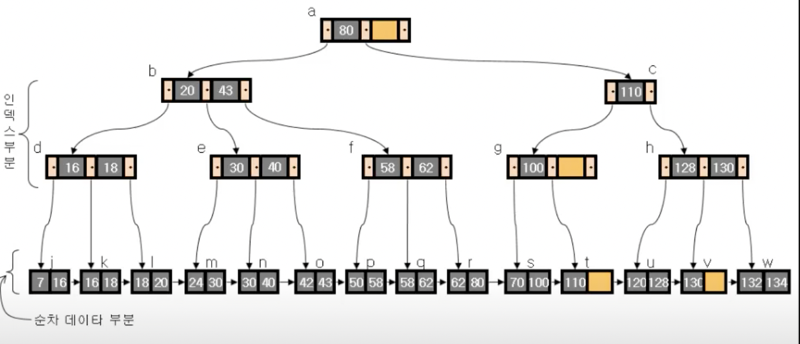

# B-Tree & B+Tree

# 한 문장 정리‼️

### B Tree(Balanced Tree)

이진트리의 균형이 맞지 않을 경우 검색 효율이 선형 검색과 같아지는 현상을 방지하기 위해 이진 트리 구조 간 균형을 유지하는 이진 트리 입니다.

---

# 0. Balance Tree

삽입과 삭제시 필요하면 스스로 균형을 유지함.

- AVL Tree
- Red-Black Tree
- B-Tree

항상 **Log(N)의 검색 성능**을 보임.

# 1. B-Tree

- 하나의 노드에 **여러가지가 배치**되는 트리구조
- **한 노드에 M개의 자료**가 배치되면 M차 B-Tree
    - M이 짝수냐 홀수냐에 따라 알고리즘이 다름
- 데이터베이스, 파일 시스템에서 널리 사용되는 트리 자료구조의 일종
- 이진 트리를 확장해서, **트리의 균형을 맞춰주는 것이 B Tree의 핵심 기능**
- **2개 이상 더 많은 수의 자식을 가질 수 있도록 일반화된 특징**
- 예시
    - 하나의 노드가 1 바이트인 경우와 1024 바이트인 경우
        - 둘 다 같은 입출력 비용이 발생함.
        - 그러므로 하나의 노드에 많은 메모리를 담는게 유리
- 이 장점을 토대로 데이터베이스의 인덱스 저장 방식으로 사용됨.
- 규칙
    - 노드의 자료수가 N이면, 자식 수는 N+1이어야 함
    - 각 노드의 자료는 정렬된 상태여야함
    - 루트 노드는 적어도 2개 이상의 자식을 가져야함
    - 루트 노드를 제외한 모든 노드는 적어도 M/2개의 자료를 가지고 있어야함
    - 외부 노드로 가는 경로의 길이는 모두 같음.
    - 입력 자료는 중복 될 수 없음

# 2. B+ Tree

데이터의 빠른 접근을 위한 **인덱스 역할만 하는 비단말 노드(not Leaf)**가 추가로 있음

(기존의 B-Tree와 데이터의 연결리스트로 구현된 색인구조)

B-Tree의 변형 구조로,

- **index 부분**과 **leaf 노드로 구성된 순차 데이터 부분**으로 이루어짐.
- 인덱스 부분의 key 값은 leaf에 있는 key 값을 직접 찾아가는데 사용함.

- 장점
    - 블럭 사이즈를 더 많이 이용할 수 있음(key 값에 대한 하드디스크 엑세스 주소가 없기 때문)
    - leaf 노드끼리 연결 리스트로 연결되어 있어서 범위 탐색에 매우 유리함.
- 단점
    - B-tree의 경우 최상 케이스에서는 루트에서 끝날 수 있지만, B+tree는 무조건 leaf 노드까지 내려가야 함.

# 3. **B Tree & B+Tree**

- B-tree
    - 각 노드에서 key와 data 모두 들어갈 수 있고,
    - data는 disk block으로 포인터가 될 수 있음
- B+tree
    - 각 노드에서 key만 들어감. 따라서 data는 모두 leaf 노드에만 존재
    - B+tree는 add와 delete가 모두 leaf 노드에서만 이루어짐

---

### 참고자료

[B-Tree & B+ Tree 자료구조 알아보기](https://sdesigner.tistory.com/79)
