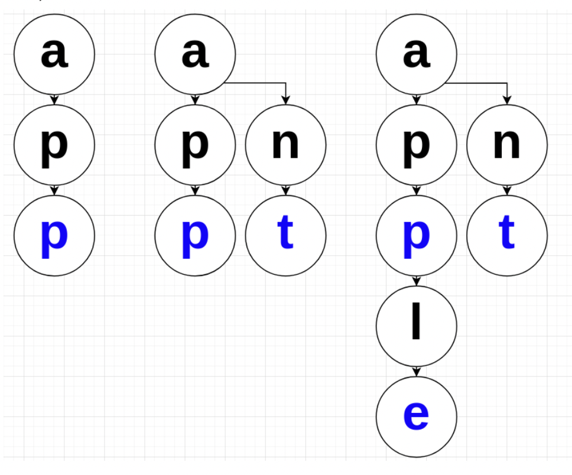

# 트라이(Trie)

# 한 문장 정리‼️

### Trie

트라이(Trie)란 문자열을 저장하고 효율적으로 탐색하기 위한 트리 형태의 자료구조입니다.

한 단어의 접두사(접두어)를 모두 저장하여 Radix tree / Prefix tree 라고도 불림.

---

# 0. Trie란

트라이(Trie)란 문자열을 저장하고 효율적으로 탐색하기 위한 트리 형태의 자료구조

한 단어의 접두사(접두어)를 모두 저장하여 Radix tree / Prefix tree 라고도 불림.

# 1. Trie 원리

현재 까지의 모든 단어의 자취를 저장함.

- 단어의 각 글자마다
    - 존재하지 않으면 → 새로만듬.
    - 존재한다면 → 그 글자로 들어가는 동작을 수행.
- 단어의 끝에는 표시를 함.
- 만약 app, ant, apple 단어를 저장한다고 했을 떄 트라이 구조



# 2. Python을 통한 Trie 구현

```python
class Trie:
    def __init__(self):
        self.root = {}

		def insert(self, s):
		    cur_node = self.root # 처음 루트로 잡아준다
		    for c in s: # 받은 문자열 하나하나에 대해서
		        if c not in cur_node: # 현재 노드에 그 문자가 있으면 들어가고, 그렇지 않으면 새로 만든다
		            cur_node[c] = {}
		        cur_node = cur_node[c]
		    cur_node["*"] = s # "*" 노드를 만들어 '단어의 끝' 표시를 해 준다.
		
		def search(self, s):
		    cur_node = self.root
		    for c in s:
		        if c in s:
		            cur_node = cur_node[c]
		        else:
		            return False
		    return "*" in cur_node # "*" 가 해당 노드에 있으면 그 글자로 끝나는 단어가 있다는 것이다.
```

```python
trie = Trie()
trie.insert("apple")
print(trie.root)
trie.insert("appleboy")
print(trie.root)

# 결과 
# {'a': {'p': {'p': {'l': {'e': {'*': 'apple'}}}}}}
# {'a': {'p': {'p': {'l': {'e': {'*': 'apple', 'b': {'o': {'y': {'*': 'appleboy'}}}}}}}}}

```

# 3. Trie 시간 복잡도

트라이는 문자열 길이 N에 대해서 삽입과 검색을 O(N)에 수행함.

삽입 → 문자열의 각 문자에 대해서 노드가 있으면 그 노드로 들어가고, 없으면 새로운 노드를 현재 노드의 자식으로 넣음.

---

### 참고자료

[[파이썬 | Python] 트라이 (Trie) 자료구조](https://blog.hoony.me/4)

[[Algorithm] 트라이(Trie) 개념과 기본 문제](https://twpower.github.io/187-trie-concept-and-basic-problem)
