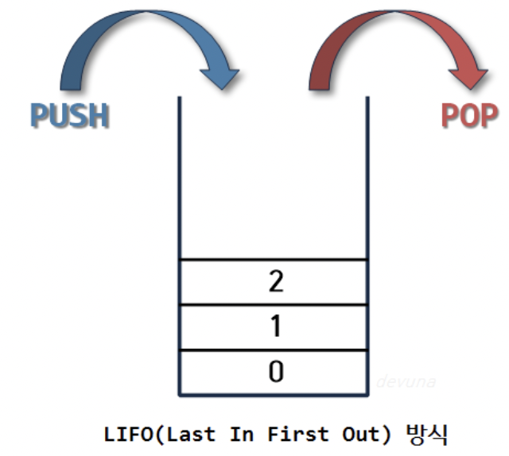
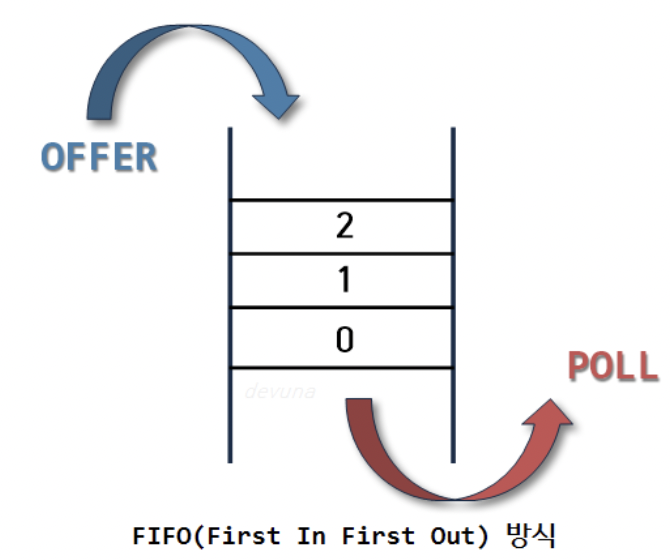
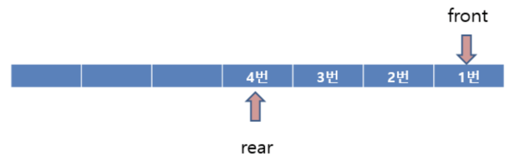
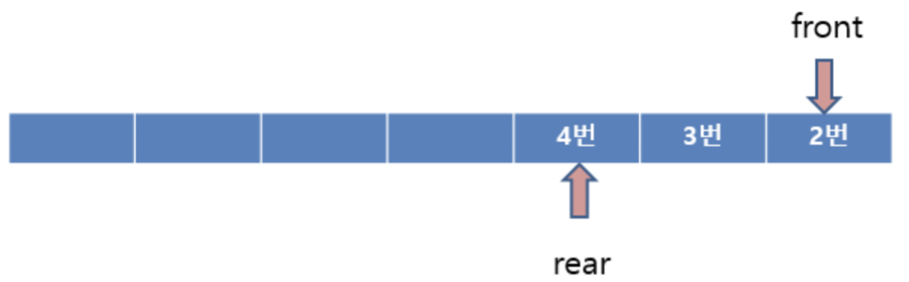
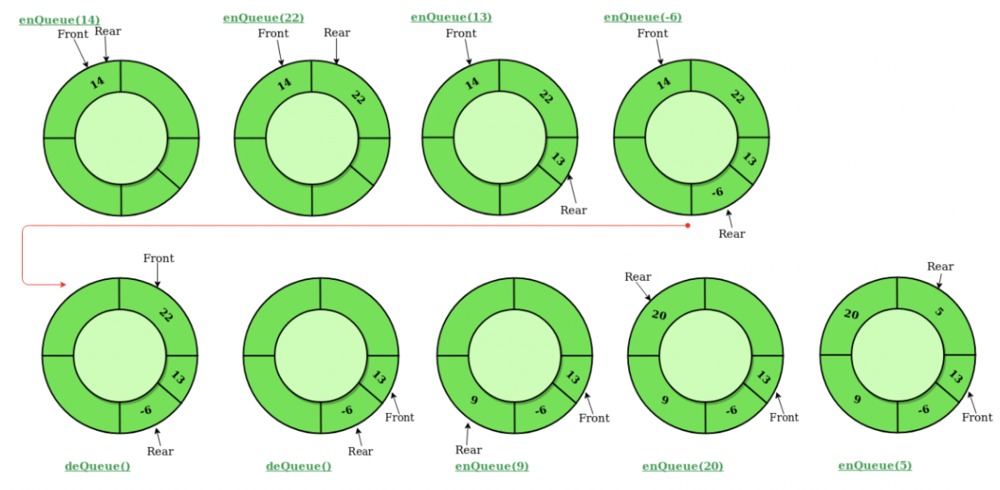
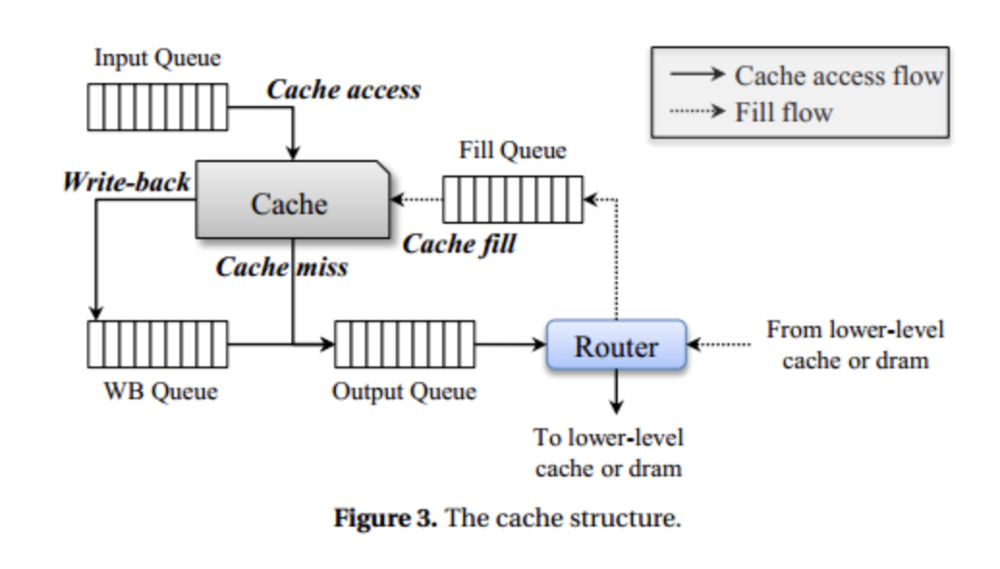
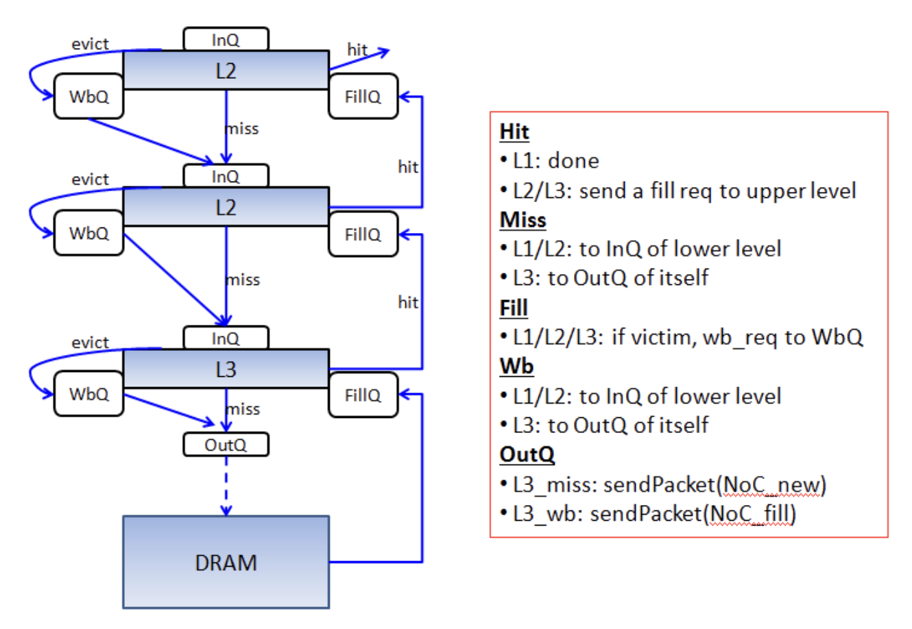

# 스택(Stack) & 큐(Queue)

# 한 문장 정리‼️

### 스택(Stack)

스택(Stack)은  **데이터를 쌓아올리는 형태의 자료구조**이며 **후입선출**의 특징을 가짐.

### 큐(Queue)

큐(Queue)는 **먼저 들어간 데이터가 먼저 나가는 구조의 형태를 가지는 자료구조**이며 **선입선출**의 특징을 가짐.

---

# 0. 스택의 개념

스택(Stack)은 '쌓아올린다'라는 뜻을 가지며, 단어의 뜻 그대로 **데이터를 쌓아올리는 형태의 자료구조**이다.

- 같은 구조와 같은 크기의 데이터를 정해진 방향으로 쌓을 수 있음.
- top으로 정한 곳을 통해서만 접근 가능.
- 삽입/삭제도 top에서만 이루어짐.
- 삽입 → top 에서의 push()
- 삭제 → top 에서의 pop()

가장 **마지막**에 **삽입**된 자료가 가장 **먼저** **삭제**된다.

⇒  **후입선출(LIFO, Last-In-First-Out) 구조**

### 스택 용어

1. 스택 언더플로우(Stack Underflow) : 비어있는 스택에서 원소를 추출할려고 할 때.
2. 스택 오버플로우(Stack Overflow) : 스택이 꽉차있는 상태에서 원소를 삽입할려고 할 때.
3. top : 가장 최근에 들어온 원소의 위치를 가리키는 포인터.

### 스택의 활용 예시

스택의 특징인 LIFO를 활용할 수 있는 분야에서 많이 사용됨.

- 웹 브라우저 방문기록 (뒤로 가기) : 가장 나중에 열린 페이지부터 다시 보여준다.
- 역순 문자열 만들기 : 가장 나중에 입력된 문자부터 출력한다.
- **실행 취소 (undo)** : 가장 나중에 실행된 것부터 실행을 취소한다.
- **후위 표기법** 계산
- 수식의 **괄호 검사** (연산자 우선순위 표현을 위한 괄호 검사)

# 1. 큐의 개념

큐(Queue)는 '~을 기다리는 줄, 줄을 기다리는 것'의 의미를 가지며, 줄을 먼저 선 사람이 무언가를 먼저 할 수 있듯이 **먼저 들어간 데이터가 먼저 나가는 구조의 형태를 가지는 자료구조**이다.

- 한쪽 끝에서 삽입 작업이, 다른 쪽 끝에서 삭제 작업이 양쪽으로 이루어짐.
- **삭제**연산만 수행되는 곳을 **프론트**(front)
- **삽입**연산만 이루어지는 곳을 **리어**(rear)라고 함.
- 큐의 리어에서 이루어지는 삽입연산을 **인큐(enQueue)**
- 큐의 프론트에서 이루어지는 삭제연산을 **디큐(dnQueue)**

가장 **먼저** **삽입**된 자료가 가장 **먼저 삭제**된다.

**⇒ 선입선출(FIFO, First In First Out) 구조** 

### 큐 용어 정리

- front**:** 큐의 가장 첫 원소, 삭제 연산을 수행.
- rear: 가장 끝 원소, 삽입 연산을 수행.
- enQueue: 큐의 리어에서 이루어지는 삽입연산.
- DnQueue: 큐의 프론트에서 이루어지는 삭제연산.

### 큐의 활용 예시

큐는 주로 데이터가 **입력된 시간 순서**대로 **처리**해야 할 필요가 있는 상황에 이용함.

- **우선순위**가 **같은** 작업 예약 (프린터의 **인쇄 대기열**)
- **은행 업무**
- **콜센터** 고객 대기시간
- **프로세스 관리**
- **너비 우선 탐색**(BFS, Breadth-First Search) 구현
- **캐시**(Cache) 구현
- **스트리밍**

# 2. 큐의 종류

### 1. Linear Queue(선형 큐)

기본적인 큐의 형태로서, **막대 모양**으로 된 큐로, 크기가 제한되어 있고 빈 공간을 사용하려면 모든 자료를 꺼내거나 자료를 한칸씩 옮겨야 한다는 단점이 있음.

**Enqueue**

큐에 데이터를 삽입시키는 기능을 수행.

Front는 고정되어 있고 rear만 가장 나중에 들어온 데이터를 가리킴.

**Dequeue**

큐에서 데이터를 내보내는 기능을 수행.

일반적으론 front의 인덱스를 증가시키지만, 아래 그림처럼 front를 고정시키고 rear인덱스를 줄인채로 **뒤에 데이터를 앞으로 당겨오는 방식**을 이용하기도 함.

해당 방식은 나중에 rear이 큐의 마지막 인덱스를 가르키고 있을 때 **앞의 공간을 활용하기 위해서**임.

**선형 큐의 문제점**

일반적인 선형 큐는 rear이 마지막 index를 가르키면서 데이터의 삽입이 이루어짐.

문제는 **rear이 배열의 마지막 인덱스**를 가르키게 되면 앞에 남아있는 (삽입 중간에 Dequeue 되어 비어있는 공간) **공간을 활용 할 수 없게 됨.**

이 **방식을 해결**하기 위해서는 Dequeue를 할때 front를 고정 시킨 채 뒤에 남아있는 **데이터를 앞으로 한 칸씩 당기는 수밖에 없다**. 

그래서 이를 보안하기 위해 나온 것이 **원형 큐**

### 2. Circular Queue(원형 큐)

선형 큐의 문제점을 보완하고자 나온 것이며, 배열의 마지막 인덱스에서 다음 인덱스로 넘어갈 때

 `(index+1) % 배열의 사이즈`  → **나머지**를 이용.

를 이용하여 **Out of Bounds Exception** 이 일어나지 않고 인덱스 0으로 순환되는 구조를 가짐.

**Enqueue**

큐에 데이터를 삽입시키는 기능을 수행.

`rear = (rear +1)%size` 하여 데이터를 추가.

**IsEmpty**

`**rear == front` 이면 비어있는 것이라고 판단.**

**IsFull**

`**(rear + 1) % SIZE) == front` 이면 꽉 차있다고 판단함.**

**Dequeue**

큐에서 데이터를 내보내는 기능을 수행.

`front = (front + 1) % size` 하여 데이터를 삭제. 

### IsEmpty 와 IsFull

IsFull은 EnQuqueue 연산 시 검사하며, 만약 True일 경우, (rear==Front)는 되지 않음. 즉 둘의 조건이 겹치는 경우가 발생하지 않음‼️

### 3. Priority Queue(우선순위 큐)

우선순위 큐(Priority Queue)는 **들어가는 순서에 관계없이** 큐에서 **dequque 될 때, 우선순위에 맞게 나감.**

- 우선순위 큐의 logarithmic(로그)한 성능을 보장하기 위해 항상 **이진 트리의 균형**을 맞추어야 함
- **완전 이진 트리(Complete Binary Tree)의 구조**를 이용하여 **트리의 균형**을 맞춤

**구현 방법** 

- 배열 기반 구현 : 데이터 삽입/삭제시 데이터를 뒤로 밀거나 당기는 연산 수행 및  삽입 위치를 찾기 위한 우선순위 비교 연산 필요 → 성능 저하
- 연결리스트 기반 구현 : 삽입 위치를 찾기 위한 우선순위 비교 연산 필요 → 성능 저하
- **Heap(힙)을 이용한 구현 - 모든 부모와 자식 간의 비교만 이루어짐**

---

### 캐시 구조

---

# 참고 자료

[[자료구조] 스택 (STACK), 큐(QUEUE) 개념/비교 /활용 예시](https://devuna.tistory.com/22)

[A General View of Cache Workflow based on MacSim (draft)](https://cinwell.wordpress.com/2013/09/23/a-general-view-of-cache-workflow-based-on-macsim-draft/#more-133)

[자료구조 - Queue](https://velog.io/@misun9283/Queue)

[[자료구조] 큐(Queue)와 원형큐(Circular Queue) 개념과 구현](https://reakwon.tistory.com/30)