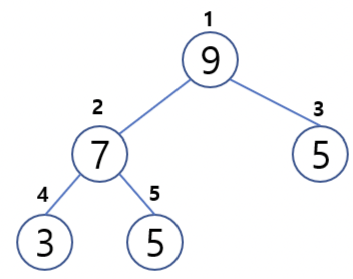

# 힙(Heap)

# 한 문장 정리‼️

### 힙 : 완전 이진 트리 형태를 가지며, 최댓값과, 최소값을 찾아내는 연산을 쉽게 수행하기 위한 자료형

---

# 0. 힙이란?

힙은 **최댓값, 최솟값을 찾아내는 연산을 쉽게하기 위해** 고안된 자료형임.

힙(Heap)은 각 노드의 키(Key)값이 그 자식의 키값보다 작지않거나(**최대 힙**), 그 자식의 키값보다 크지 않은(**최소 힙**) **완전 이진 트리**임.

### 최대 힙(Max Heap)

각 노드의 키 값이 그 자식노드의 키값보다  큰 힙

### 최소 힙(Min Heap)

각 노드의 키 값이 그 자식노드의 키갑보다 작은 힙

### 특징

- 느슨한 정렬 상태( 반정렬 상태)
- 중복값을 허용 ( 최대,최소 값 조회에 최적화)

### 시간 복잡도

삽입과 삭제 모두 연산 자체는 $O(1)$ 이지만, heapify(힙 재구조화)의 과정을 거치기 때문에 $O(logN)$ 의 시간 복잡도를 가짐.

---

# 참고 자료

[자료구조 - 힙(Heap)이란?](https://galid1.tistory.com/485)