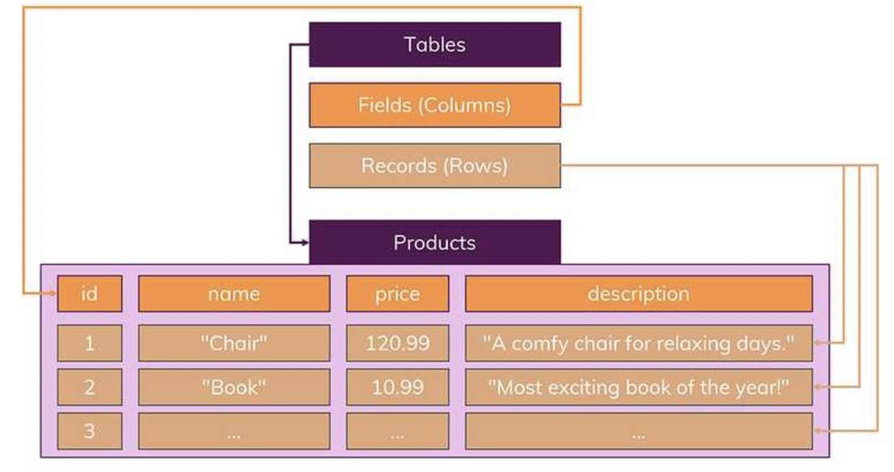
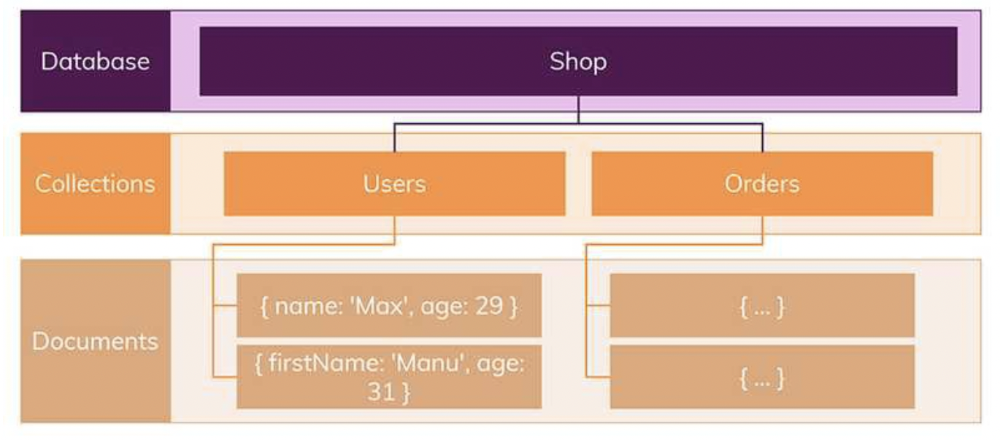
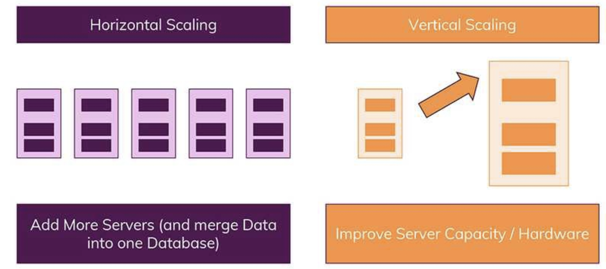

# SQL Injection

# 한 문장 정리‼️

악의적인 사용자가 보안상의 취약점을 이용해, 임의의 SQL 문을 주입하여 데이터베이스에 비정상적인 동작을 하도록 하는 행위.

---

# 0. SQL Injection이란?

악의적인 사용자가 보안상의 취약점을 이용하여, 임의의 SQL 문을 주입하고 실행되게 하여 데이터베이스가 비정상적인 동작을 하도록 조작하는 행위.

- OWASP Top10 중 첫 번째에 속해 있으며, 공격이 비교적 쉬운 편이고 공격에 성공할 경우 큰 피해를 입힐 수 있는 공격임.

# 1. 공격 종류 및 방법

### 1) Error based SQL Injection

논리적 에러를 이용한 SQL Injection은 가장 많이 쓰이고, 대중적인 공격 방법.

### 2) Union based SQL Injection

SQL에서 Union 키워드는 두 개의 쿼리문에 대한 결과를 통합해서 하나의 테이블로 보여주게 하는 키워드임.

**Union Injection 성공조건**

- Union 하는 두 테이블의 컬럼 수가 같아야함.
- 데이터형이 같아야함.

### 3) Blind SQL Injection

- **Boolean based SQL**

데이터베이스로부터 특정한 값이나 데이터를 전달받지 않고, 단순히 참과 거짓의 정보만 알 수 있을 때 사용함.

- **Time based SQL**

서버로부터 특정한 응답 대신에 참 혹은 거짓의 응답을 통해서 데이터베이스의 정보를 유추하는 기법. 사용되는 함수는 MySQL 기준으로 Sleep 과 Benchmark임.

### 4) Stored Procedure SQL Injection

저장 프로시저(Stored Procedure)은 일련의 쿼리들을 모아 하나의 함수처럼 사용하기 위한 것임.

공격에 사용되는 대표적인 저장 프로시저는 MS-SQL에 있는 xp_cmdshell로 윈도우 명령어를 사용할 수 있게 됨. 

단, 공격자가 시스템 권한을 획득 해야 하므로 공격난이도가 높으나, 공격에 성공한다면 서버에 직접적인 피해를 입힐 수 있는 공격임.

### 5) Mass SQL Injection

다량의 SQL 삽입 공격으로 한 번의 공격으로 다량의 데이터베이스가 조작되어 큰 피해를 입히는 것을 의미함. 

# 2. 대응 방안

### 1) 입력 값에 대한 검증

SQL 삽입에서 사용되는 기법과 키워드는 엄청나게 많음.

사용자의 입력 값에 대한 검증이 필요한데, 서버 단에서 화이트리스트 기반으로 검증해야함. 블랙리스트 기반으로 검증하게 되면 수많은 차단리스트를 등록해야 하고, 하나라도 빠지면 공격에 성곡하게 때문임. 

공백으로 치환하는 방법도 많이 쓰이는데, 이 방법도 취약한 방법임. 

예를 들어 SE**SELECT**LECT라고 입력 시 중간의 SELECT가 공백으로 치환이 되면 SELECT라는 키워드가 완성되게 됨.

공백 대신에 의미없는 단어로 치환되어야 함.

### 2) Prepared Statement 구문 사용

Prepared Statement 구문을 사용하게 되면, 사용자의 입력값이 데이터베이스의 파라미터로 들어가기 전에 DBMS가 미리 컴파일 하여 실행하지 않고 대기함. 그 후 사용자의 입력 값을 문자열로 인식하게 하여 공격 쿼리가 들어간다고 하더라도, 사용자의 입력은 의미 없는 단순 문자열 이기 때문에 전체 쿼리문도 공격자의 의도대로 작동하지 않음.

### 3) Error Message 노출 금지

공격자가 SQL Injection 을 수행하기 위해서는 데이터베이스의 정보(테이블명, 컬럼명)가 필요함. 데이터베이스 에러 발생시 따로 처리를 해주지 않았다면, 에러가 발생한 쿼리문과 에러에 관한 내용을 반환함. 여기서 테이블 명 및 컬럼명 그리고 쿼리문이 노출될 수 있기 때문에, 데이터 베이스에 대한 오류 발생시 사용자에게 보여줄 수 있는 페이지를 제작하거나 메시지박스를 띄우도록 하여야 함.

### 4) 웹 방화벽 사용

웹 공격 방어에 특화되어 있는 웹 방화벽을 사용하는 것도 하나의 방법임.

웹 방화벽은 소프트웨어 형, 하드웨어 형 , 프록시 형 이렇게 세가지 종류로 나눌 수 있는데 소프트웨어 형은 직접 설치하는 방법이고, 하드웨어 형은 네트워크 상에서 서버 앞 단에 직접 하드웨어 장비로 구성하는 것이며, 프록시형은 DNS 서버 주소를 웹 방화벽으로 바꾸고 서버로 가는 트래픽이 웹 방화벽을 먼저 거치도록 하는 방법임.

---

### 참고문서

[SQL Injection 이란? (SQL 삽입 공격)](https://noirstar.tistory.com/264)
