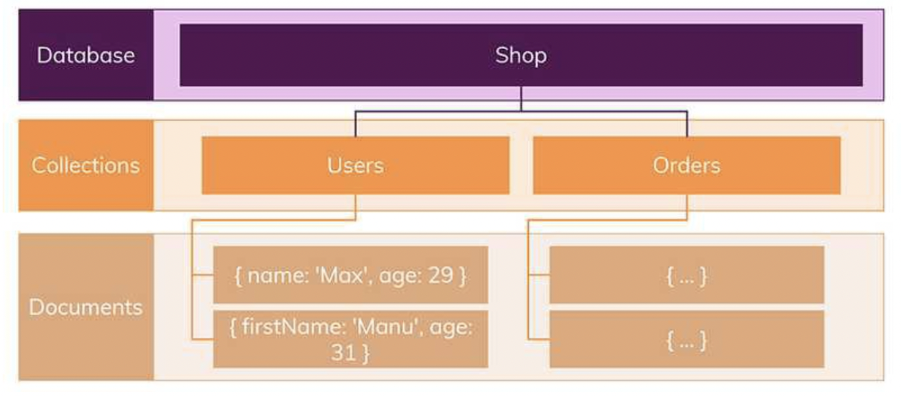
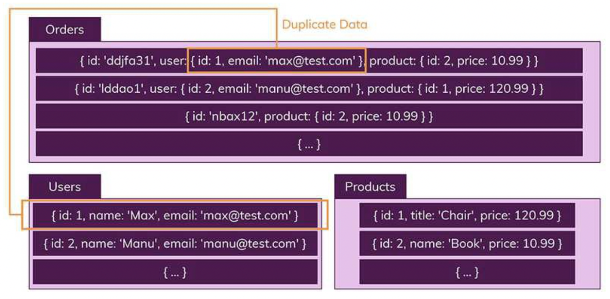

# SQL vs NoSQL

# 한 문장 정리‼️

### SQL을 사용할 때

관계를 맺고 있는 데이터가 자주 변경되는 애플리케이션일 경우,

변경될 여지가 없고, 명확한 스키마가 사용자와 데이터에게 중요한 경우

### NoSQL을 사용할 때

정확한 데이터 구조를 알 수 없거나 변경/확장 될 수 있는 경우

읽기read 처리를 자주하지만, 데이터를 자주 변경update하지 않는 경우(즉, 한번의 변경으로 수 십개의 문서를 업데이트 할 필요가 없는 경우) 

데이터베이스를 수평으로 확장해야 하는 경우 (즉, 막대한 양의 데이터를 다루어야 하는 경우)

---

# 0. SQL vs NoSQL

웹 개발할 때 고민하는 점.

→ MySQL 과 같은 SQL을 사용할까, 아니면 MongoDB같은 NoSQL을 사용할까

# 1. SQL (관계형 데이터베이스)

SQL은 '구조화 된 쿼리 언어(Structured Query Language)'임.

그러므로 데이터베이스 자체를 나타내는 것이 아니라 ,특정 유형의 데이터베이스와 상호 작용하는데 사용하는 쿼리언어임.

SQL을 사용하면 관계형 데이터베이스 관리 시스템(RDBMS)에서 데이터를 저장, 수정, 삭제 및 검색 할 수 있음.

이러한 관계형 데이터베이스에서 두 가지 주요 특징이 있음.

- 데이터는 **정해진 데이터 스키마를 따라 데이터베이스 테이블에 저장됨.**
- 데이터는 **관계** 를 통해서 연결된 **여러 개의 테이블에 분산됨.**

### 1) 엄격한 스키마

데이터는 테이블(table)에 레코드(record)로 저장되며, 각 테이블에는 명확하게 정의된 구조(structure)가 있음.

구조란? 어떤 데이터가 테이블에 들어가고 어떤 데이터가 그렇지 않을지를 정의하는 필드(field) 집합을 가르킴

구조(structure)는 필드의 이름과 데이터 유형으로 정의.

(관계형 데이터베이스에서) 스키마를 준수하지 않은 레코드는 추가할 수 없음.

### 2) 관계

SQL 기반 데이터베이스의 또 다른 중요 부분은 관계임.

데이터들을 여러개의 테이블에 나누어서, 데이터들의 중복을 피할 수 있음. 

하나의 테이블에서 중복없이 하나의 데이터만을 관리하기 때문에, 다른 테이블에서 부정확한 데이터를 다룰 위험이 없음.

# 2. NoSQL(비관계형 데이터베이스)

NoSQL은 기본적으로 SQL(관계형 데이터베이스)와 반대되는 접근방식을 따르기 때문에 지어진 이름임.

- 스키마 없음
- 관계 없음

NoSQL 세상에서는 레코드를 문서(documents)라고 부름.

이것은 단순히 이름만 다른 것이 아니라, 핵심적인 차이점이 있음.

SQL 세상에서는 정해진 스키마를 따르지 않는다면 데이터를 추가 할 수 없지만, NoSQL에서는 다른 구조의 데이터를 같은 **컬렉션**(= SQL에서의 테이블)에 추가할 수 있음.

문서는 JSON 데이터와 비슷한 형태를 가지고 있음. 스키마에 대해서는 신경 쓸 필요가 없음. 

따라서 여러 테이블/콜렉션에 조인할 필요 없이 이미 필요한 모든 것을 갖춘 문서를 작성하게 됨. 

대신 컬렉션을 통해 **데이터를 복제**하여 각 컬렉션 일부분에 속하는 데이터를 정확하게 산출함.

# 3. 수직적&수평적 확장(Scaling)

두 종류의 데이터베이스를 비교 할 때 살펴 봐야할 또 하나의 중요한 개념은 **확장(Scaling)임.**

확장은 **수직적(vertical) 확장**과 **수평적(horizontal) 확장**으로 구별 할 수 있음.

- **수직적 확장**이란 단순히 데이터베이스 서버의 성능을 향상시키는 것
- **수평적 확장**은 더 많은 서버가 추가되고 데이터베이스가 전체적으로 분산됨을 의미함.

데이터가 저장되는 방식 때문에 **SQL 데이터베이스는 일반적으로 수직적 확장만**을 지원함.

**수평적 확장은 NoSQL데이터베이스에서만** 가능함.

# 4. 장단점

### 장점!

**SQL 장점**

- 명확하게 정의 된 스키마, **데이터 무결성 보장**
- 관계는 각 데이터를 **중복없이 한번만 저장**

**NoSQL의 장점**

- 스키마가 없기때문에, **훨씬 더 유연**
    - 즉, 언제든지 저장된 데이터를 조정하고 새로운 "필드"를 추가 할 수 있음.
- 데이터는 **애플리케이션이 필요로 하는 형식**으로 저장
    - 이렇게 하면 데이터를 읽어오는 속도가 빨라짐.
- 수직 및 **수평 확장**이 가능하므로 데이터베이스가 애플리케이션에서 발생시키는 **모든 읽기 / 쓰기 요청을 처리** 할 수 있음.

### 단점!

**SQL의 단점**

- 상대적으로 덜 유연.
    - 데이터 스키마는 사전에 계획되고 알려져야 함.
        - 나중에 수정하기가 번거롭거나 불가능 할 수 도 있음.
- 관계를 맺고 있기 때문에, JOIN문이 많은 매우 복잡한 쿼리가 만들어 질 수 있음.
- 수평적 확장이 어렵고, 대체로 수직적 확장만 가능
    - 즉 어떤 시점에서 (처리 할 수 있는 처리량과 관련하여) 성장 한계에 직면함.

**NoSQL의 단점**

- 유연성 때문에, 데이터 구조 결정을 하지 못하고 미루게 될 수 있음.
- 데이터가 **여러 컬렉션에 중복되어 있기 때문**에, **수정(update)를 해야 하는 경우 모든 컬렉션에서 수행해야 함을 의미**

---

### 참고문서

[SQL vs NoSQL (MySQL vs. MongoDB)](https://siyoon210.tistory.com/130)
