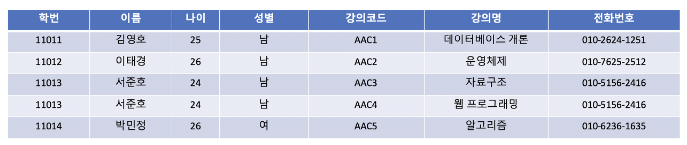

# 이상(Anomaly)

# 한 문장 정리‼️

### 이상

릴레이션에서 일부 **속성**들의 **종속**이나 **데이터의 중복**으로 인해 데이터 조작시 불일치가 발생하는 것을 말합니다. 정규화로 이를 해결할 수 있습니다. 

---

# 0. 이상(Anomaly)

이상(Anomaly)이란 **릴레이션에서 일부 속성들의 종속이나 데이터의 중복으로 인해 데이터 조작시 불일치가 발생하는 것**을 말함.

→ 테이블을 설계할 때 잘못 설계하여 데이터를 삭제,수정,삽입할 때 논리적으로 오류가 생기는 것.

→ 대부분의 경우 이상현상은 데이터의 중복성 때문에 발생.

→ 이를 제거하는 과정 → **정규화**

# 1. 이상의 종류

삽입이상, 삭제이상, 갱신이상

1. 삽입 이상
    - 자료를 삽입할 때 **의도하지 않은 자료까지 삽입해야만 자료를 테이블에 추가가 가능**한 현상.
    - 학생 한명이 강의를 수강하지 않았으면 강의코드 속성에 null 값이 들어가야 되는 문제 발생
2. 갱신 이상
    - 중복된 데이터 중 **일부만 수정되어 데이터 모순**이 일어나는 이상
    - 강의코드가 "AAC3"인 서준호의 전화번호를 수정하게 되면 3번째 튜플만 수정되고 4번째 튜플은 같은 사용자의 데이터임에도 전화번호가 다르게 됨.
3. 삭제 이상
    - 어떤 정보를 삭제하면, **유용한 다른 정보까지 삭제**되어버리는 이상.
    - 강의코드가 "AAC1"인 데이터베이스 개론 강의를 삭제하게 되면 김영호 학생의 데이터까지 삭제되어 버림.

---

### 참고자료

[[데이터베이스] 이상(Anomaly)](https://kosaf04pyh.tistory.com/294)
