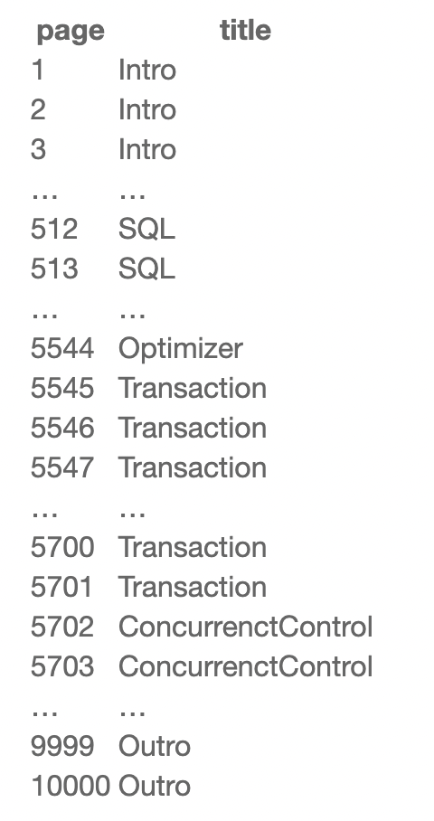
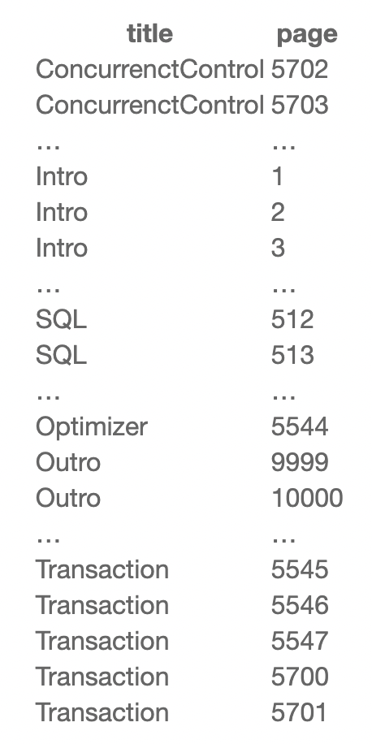
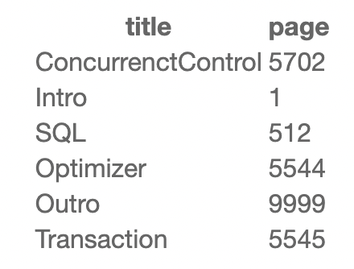
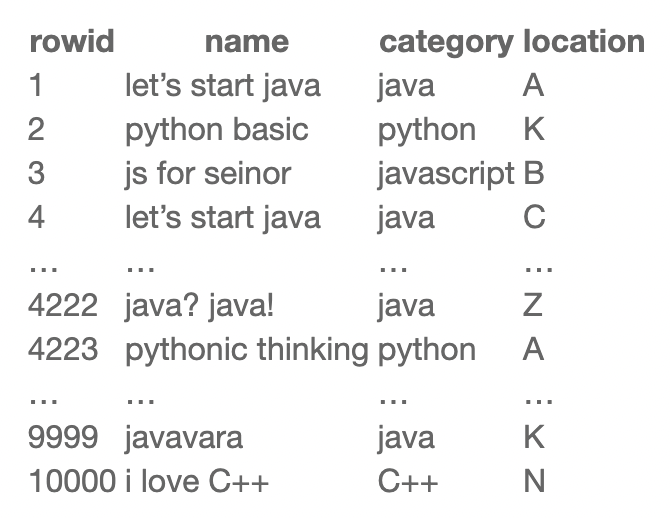
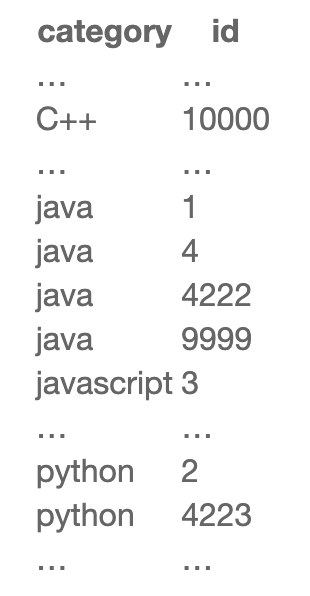

# 인덱스(Index)

# 한 문장 정리‼️

### 인덱스(Index)

많은 데이터가 있는 테이블에서 **조회의 시간을 단축시키기 위해** 특정 속성 기준으로 데이터의 주소 값을 저장하는 테이블을 마련하는 것입니다.

---

# 0. 인덱스(index)

### 개념

인덱스는 책의 첫 장에 있는 '목차'에 비유됨.

- 만약 책의 총페이지가 10페이지라면?
    - 불필요할 수 있음. 왜냐하면 책의 총페이지가 적기 때문에
- 10000 페이지라면?
    - 만약 목차가 없다면 찾고자하는 페이지를 찾기 어려울 것.
- 책의 목차는 책의 내용 순, 주요 타이틀을 기준으로 이루어짐
- 만약 가나다 순으로 정리한 목록이 있다면?
    - 원하는 특정 내용을 더 찾기 쉬울 것임.
    - 어느 정도 두꺼운 책에서는 색인이라는 것을 제공
    - 이 때, 색인은 영어로 Index
    - DB의 그것과 완전히 동일한 역할을 함.

### 예시 1

앞서 언급한 10000 페이지 데이터베이스 서적의 테이블이 다음과 같을 때



Transaction 파트는 5545 페이지부터 5701 페이지 까지라는 것을 알 수 있음.

검색 방식을 쿼리로 표현하면 다음과 같음. (테이블 명은 db_book이라 가정)

```sql
SELECT page
FROM db_book
WHERE title = 'Transaction';
```

db_book이라는 테이블에서 title이 ‘Transaction’ 이라는 page를 찾는 Query

- 해당 페이지를 찾으려면 1번 페이지부터 5545번 페이지 까지 전부 확인해보고 나서야 Transaction 파트를 찾을 수 있음
- 그리고 DB 입장에서는 5545번 페이지 뿐 아니라 더 뒤쪽에도 ‘Transaction’ 이라는 키워드가 있을 수 있음.
- 결국 DB는 10000건의 데이터를 전체 검색하는 full scan을 수행
    - full scan은 말그대로 테이블의 전체 데이터를 몽땅 순회
- 물론 사람의 경우라면 5545번 페이지를 찾고 검색을 중단하겠지만, 컴퓨터는 생각보다 그렇게 똑똑하지 않음.
- 고생하는 DB를 위해 인덱스를 만들자!!
    - 인덱스도 결국엔 **하나의 테이블**
    - index_title 이라는 이름의 테이블을 만들면 다음과 같음.



여기서 해당 내용의 가장 첫 번째 페이지만 남기고 중복된 내용을 삭제하면 



이렇게 되면 더욱 빠르게 'Transaction'이라는 문자열의 위치를 찾을 수 있음.

### 예시 2

10000권의 책이 있고, A-Z까지 랜덤한 위치에 진열되어 있음.



여기서 카테고리가 java인 책의 이름과 위치를 전부 찾을려고 한다면?

(테이블의 이름은 book_store)

```sql
SELECT name, location
FROM book_store
WHERE category = 'java'
```

마찬가지로 인덱스가 없기 때문에 , 10000개의 데이터를 모두 조회해서 결과를 찾았을 것임 → Full scan 

이번에도 불쌍한 DB를 위해서 인덱스를 만들어 주면? 



인덱스는 문자열 순서대로 정렬되어 있기 때문에, 'java'라는 문자열을 계속 검색하다가 'javascript'라는 문자열을 만나는 순간 탐색을 종료함.

게다가 내부적으로 **데이터를 B-Tree라는 구조**에 저장하기 때문에, 'java'라는 문자열을 찾아낼 때 맨 처음부터 순차적으로 조회하는 것보다 훨씬 빠름.

- 순차적으로 조회하는 것은 Linked List에서의 조회 처럼 인덱스를 1씩 증가하면서 찾는 것이다. 시간 복잡도 : O(N)
- B-Tree 구조를 사용하게 되면 시간복잡도를 O(logN)을 갖기 때문에 좀 더 빠르게 찾을 수 있음!

[[데이터베이스] B-Tree 인덱스 구조](https://beelee.tistory.com/37)

[이진검색트리의 원칙을 이용한 AVL트리, B-트리, T-트리 등의 이해](https://m.blog.naver.com/PostView.naver?isHttpsRedirect=true&blogId=jvioonpe&logNo=220235136325)

인덱스에서 찾아낸 rowid 값은 1,4,4222,9999 이므로 다음과 같이 검색하면 됨.

```sql
SELECT name, location
FROM book_store
WHERE rowid IN (1, 4, 4222, 9999)
```

어라? 근데 이거랑 category='java'랑 무슨 차이지? 결국 rowid가 9999를 만날 때까지 조회하는 거 아니야??!

- rowid는 사실 데이터를 삽입할 때 DB 내부에서 자동적으로 생성하는 값으로, 해당 row(행)의 고유한 주소 값을 가리침.
- 따라서 rowid가 주어지면 DB는 해당 데이터의 위치가 어디있는지 일일이 찾지 않아도 rowid를 통해 바로 접근할 수 있음.
- **rowid: DB에서 가장 빠르게 데이터를 찾아낼 수 있는 검색 방법**

[[Oracle] ROWID란?](https://itprogramming119.tistory.com/entry/Oracle-ROWID란)

- 즉, 인덱스를 만드는 이유는 바로 이 rowid를 기준으로 데이터를 탐색할 수 있도록 유도해서 쿼리의 성능을 향상시키기 위함.
- 실제 사용시에는 이러한 일련의 과정을 사용자가 직접 입력할 필요 없이 다음과 같이 인덱스를 생성해 놓으면 내부적으로 알아서 작동함.

```sql
CREATE INDEX index_category ON book_store(category)
```

위와 같이 book_store 테이블의 category 컬럼에 index category 라는 인덱스를 생성한 후 , 기존과 똑같이 사용하면 됨.

```sql
SELECT name, location
FROM book_store
WHERE category = 'java'
```

---

### 참고자료

[[database] DB 인덱스(INDEX)란?](https://itholic.github.io/database-index/)
